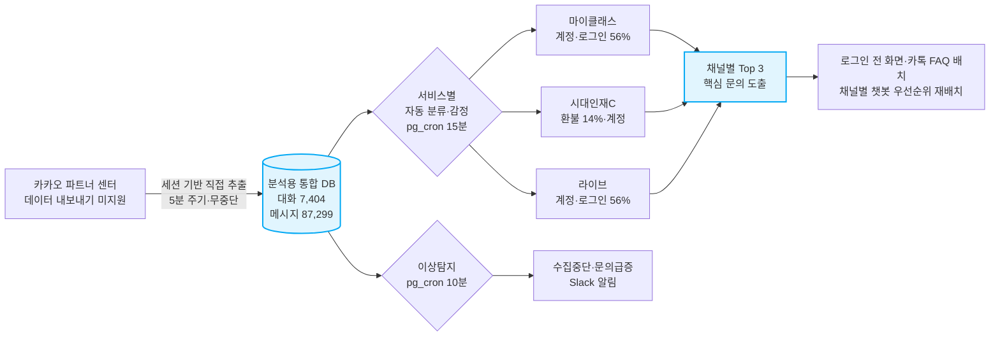
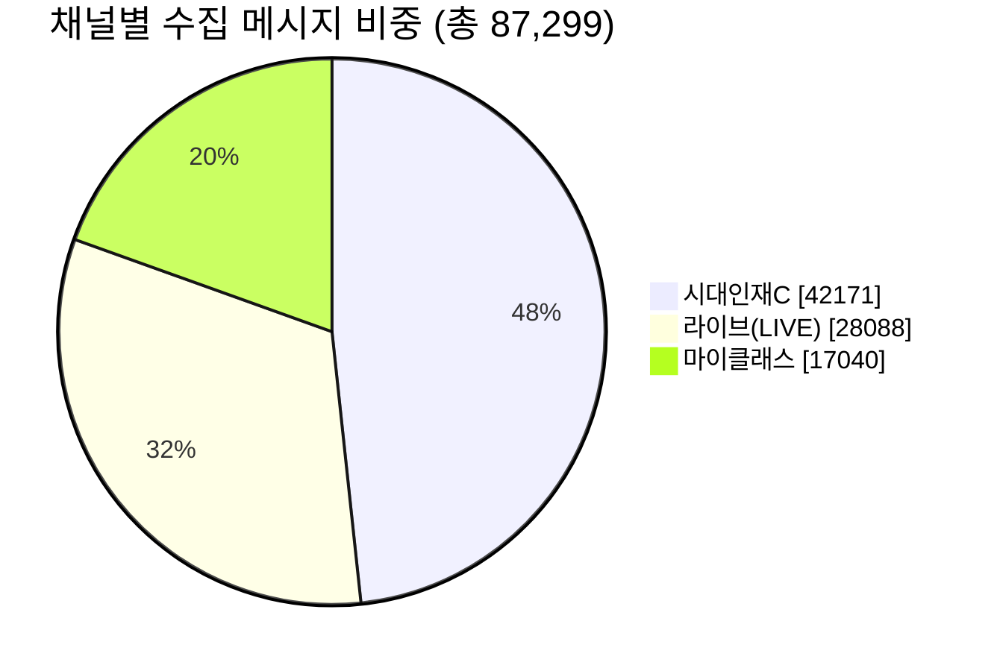

# 카카오 상담 채널 데이터 수집 파이프라인 · 구축 과정과 성과

> **한 줄 요약**: **학생·학부모(고객)와 학원 간 카카오 상담을 사람 손 없이 5분마다 자동으로 분석용 데이터베이스에 쌓는 무중단 파이프라인**을 직접 설계·구축했습니다. **마이클래스·라이브·시대인재C 3개 서비스 채널을 분리 수집**해 현재 **대화 7,404건 / 메시지 87,299건**(2023‑12 ~ 2026‑07)을 적재했고, 이어서 **분류·감정분석·이상탐지까지 사람 개입 0으로 자동화**했습니다. 이 데이터로 채널별·전화/웹 교차분석을 해 *"디지털 채널 문의의 절반이 계정·로그인이고, 채널마다 문의 성격이 다르다"* 는 전략 인사이트를 도출했습니다.

> 📎 **1장 요약 인포그래픽**: `카카오상담수집_인포그래픽.png` (첨부 이미지, 발표/공유용)

---

## 0. 한눈에 보기

| 항목 | 내용 |
|---|---|
| **무엇을** | 카카오 비즈니스 채팅(학생·학부모↔학원 상담)을 자동 수집. **마이클래스·라이브·시대인재C 3개 서비스 채널** |
| **어떻게** | Supabase Edge Function(항상 켜진 서버) + 스케줄러(pg_cron), **5분 주기 완전 자동** |
| **수집량(2026‑07‑02 재검수)** | 메시지 **87,299건** · 대화 **7,404건** · 채널 **3개** |
| **데이터 기간** | 2023‑12‑27 ~ 2026‑07‑02 (약 2.5년치) |
| **운영 상태** | **무중단** (수집·분류·이상탐지·일일요약 pg_cron 4개 전부 정상 작동 확인) |
| **사람 개입** | **0** (완전 자동) · GitHub 유료 자원 사용 **0분** |
| **개인정보** | **수집 단계에서 자동 마스킹**(이름·전화·카드·주민번호·이메일) |

### 전체 흐름 (수집 → 분류·감정 → 이상탐지 → 활용)



> Confluence에서는 **Mermaid 매크로**(또는 코드블록 언어 `mermaid`)로 위 코드가 그대로 렌더됩니다. 매크로가 없으면 같은 폴더의 이미지(`카카오상담수집_흐름도.png`)를 첨부하세요.

---

## 1. 왜 이 작업을 제안했는가 · 배경과 문제의식

학원에는 매일 **학생·학부모(고객)** 상담이 쏟아집니다. **전화 상담은 상담실장이 AMS에 '상담 내역'으로 기록**하기 때문에 집계·분석이 가능하지만(월 7~8만 건 규모), 카카오 상담은 **카카오 상담 채널 플랫폼(카카오 비즈니스 파트너센터) 안에 쌓이기만 할 뿐, 그 플랫폼이 데이터를 외부로 내보내는 기능(다운로드·연동 API)을 제공하지 않아** 모아서 분석할 방법이 없었습니다.

> 비유하자면, 전화 상담은 장부로 받아볼 수 있는데 **카톡 상담은 남의 건물(카카오 플랫폼) 안 금고에 차곡차곡 쌓이는데, 정작 그 건물엔 "내보내기" 버튼이 없는** 상태였습니다. 데이터는 분명히 있는데 **꺼낼 공식 통로가 없었던 것**이 핵심 문제였습니다.

"어떤 문의가 가장 많은가? 무엇을 챗봇·FAQ로 줄일 수 있는가?" 같은 질문에 **데이터로** 답하려면, 흩어진 카톡 상담을 **한 곳(분석용 보관함)에 자동으로 모으는 일**이 먼저 필요했습니다. 전화·웹과 **같은 잣대로 비교**하기 위한 마지막 퍼즐이기도 했습니다.

→ 그래서 **"카카오 채팅을 자동으로 수집해 분석 DB에 쌓자"** 를 제안했습니다.

---

## 2. 어떻게 결과물을 도출했는가 · 과정과 프로세스

### 2‑1. 수집 경로 설계
카카오 상담 채널 플랫폼은 **데이터를 외부로 내보내는 공개 기능(다운로드·연동 API)을 제공하지 않습니다.** 그래서 운영자가 로그인한 세션(쿠키)으로 **플랫폼 내부 통신을 호출해 상담 데이터를 직접 추출**하는 방식을 설계했습니다. 한 번 돌 때의 흐름:

```
인증 확인 → 마지막 수집 지점(커서) 불러오기 → 대화 목록 조회
        → "바뀐 대화만" 메시지 재수집 → 분석 DB에 적재(덮어쓰기) → 상태 기록
```

### 2‑2. "정확히 5분마다, 그리고 절대 안 멈추게" · 인프라 의사결정
수집 주기는 **5분**으로 잡았습니다(빠른 반영 ↔ 서버 부담의 균형). 단, "5분마다"를 **실제로 지키고** 멈추지 않게 만드는 과정에서 두 가지 문제를 차례로 해결했습니다. *(간격 숫자 5분은 끝까지 동일하고, 바꾼 것은 "누가 5분을 재고, 어디서 실행하느냐"입니다.)*

**문제 ① · GitHub 스케줄러가 "5분"을 지키지 못함**
- 1차 구현은 GitHub Actions의 cron(`*/5`)에 맡겼는데, 무료 러너 부하 때문에 **첫 실행이 수십 분에서 수 시간 지연되거나 아예 건너뛰어** "5분마다"가 보장되지 않았습니다.
- **해결**: 항상 켜져 있고 분 단위로 정확한 **Supabase pg_cron(데이터베이스 내장 스케줄러)** 이 5분마다 수집을 깨우도록 **트리거를 교체** → 5분 주기가 실제로 지켜짐.

**문제 ② · GitHub 무료 실행시간이 매달 소진**
- 그래도 수집 '실행'은 여전히 GitHub Actions에서 돌았는데, 비공개 저장소 무료시간(월 약 2,000분)이 5분 간격 실행으로 **매달 중순 소진** → 수집이 **매달 멈췄습니다**(2026‑06 실제 발생).
- **해결**: 수집 로직 자체를 **Supabase Edge Function(항상 켜진 서버)** 으로 옮김. 이제 pg_cron이 Edge Function을 직접 호출 → **GitHub 자원 0, 영구 무중단**.

```
(1차) GitHub cron(*/5) → Actions 러너 → 스크립트         : 5분이 지연/누락(불안정)
(2차) pg_cron(*/5) → GitHub workflow_dispatch → 스크립트  : 5분은 정확해졌으나 Actions 시간 소진
(현재) pg_cron(*/5) → 직접 HTTP 호출 → Edge Function       : 정확한 5분 + GitHub 자원 0, 영구 무중단
```

> **결과: "5분마다"가 실제로 지켜지면서, 매달 멈추던 수집이 영구 무중단이 되었고 GitHub 유료 자원 사용은 0이 되었습니다.** (기존 GitHub Actions 경로는 만일을 위한 *수동 폴백*으로만 남겨 장애 대비.)

### 2‑3. 데이터 정합성 · 중복도 누락도 0
- **증분 수집**: 대화마다 "마지막 메시지 위치"를 커서로 기억해, **바뀐 대화만** 다시 읽습니다(불필요한 재수집 제거).
- **멱등 적재(idempotent)**: 같은 메시지를 여러 번 받아도 고유 ID 기준으로 덮어쓰기 → **중복 0**.
- **시간 제한 방어**: 한 번 호출에 채널별 처리 상한을 두고, 초과분은 커서를 보존해 **다음 호출에서 이어받습니다** → 영구 누락 없음.

### 2‑4. 개인정보 보호 (Privacy by Design)
수집하는 **바로 그 순간**, 이름·휴대폰·유선번호·카드번호·주민번호·이메일을 **자동 마스킹**합니다. 원문 개인정보는 분석 DB에 **저장하지 않습니다.**

> 예: 이름 `홍길동 → 홍*동`, 전화 `010-1234-5678 → 010-****-5678`

### 2‑5. 운영 안정성
- 로그인 쿠키는 **회사 자산 맥 스튜디오(상시 가동)의 Chrome이 6시간마다 자동 갱신·배달**하고, 함수는 별도 토큰으로 보호합니다.
- 인증 만료·오류를 감지하고, **heartbeat(생존 신호)** 로 시스템이 살아있는지 추적해 문제 발생 시 즉시 식별합니다.

### 2‑6. 서비스(채널)별 분리 수집
한 덩어리로 모으지 않고 **3개 서비스 채널을 채널 ID로 구분해 따로** 적재합니다. 채널마다 들어오는 문의 성격이 다르기 때문입니다(근거는 4장).

| 채널(서비스) | 대화 | 메시지 | 데이터 시작 |
|---|---:|---:|---|
| **C (시대인재C · 통합회원)** | 3,418 | 42,171 | 2025‑09 |
| **LIVE (라이브)** | 2,305 | 28,088 | 2023‑12 |
| **마이클래스** | 1,681 | 17,040 | 2025‑12 |
| **합계** | **7,404** | **87,299** | |



> 발신자는 **학부모만이 아닙니다.** 마이클래스·라이브·C는 학생이 직접 쓰는 디지털 서비스라 **학생·학부모가 섞여** 문의합니다(특히 "앱·로그인" 문의는 앱을 직접 쓰는 학생 비중이 큽니다).

---

## 3. 우리 팀·프로젝트에 어떤 의미가 있는가

- **카톡 상담이 처음으로 "분석 가능한 자산"이 되었습니다.** (이전엔 카카오 상담 채널 플랫폼 안에 쌓이기만 하고, 반출 기능이 없어 꺼낼 수 없던 데이터)
- 전화(약 42만 건)·카톡·웹(GA4)을 **같은 분류 체계로 교차비교**하는 3채널 분석의 기반이 마련됐습니다.
- 이 데이터가 **마이클래스 챗봇 기획의 우선순위 의사결정**(어떤 메뉴를 앞에 둘지, 무엇을 셀프 해결로 돌릴지)을 **근거 기반**으로 바꿨습니다.

---

## 4. 실제 분석으로 본 인사이트 · 채널마다 문의가 다르다

수집 데이터를 자동 분류한 결과, **채널(서비스)마다 들어오는 문의 성격이 뚜렷이 다릅니다.** (의미 있는 **상위 3순위**만 표기하고, '기타'는 분류 보류분이라 비중만 별도 표기)

| 채널 | 1순위 | 2순위 | 3순위 | ('기타' 비중) |
|---|---|---|---|---|
| **마이클래스** | 계정·로그인·앱 **56.5%** | 입반·등록 6.0% | 출결·보강 5.6% | 12.5% |
| **LIVE(라이브)** | 계정·로그인·앱 **56.2%** | 라이브 수강 14.8% | 입반·등록 4.8% | 14.6% |
| **C(시대인재C)** | 환불 **14.4%** | 계정·로그인·앱 13.6% | 교재·배송 9.7% | 45.5% |

**한눈에 보는 "앱에 못 들어감(계정·로그인)" 비중** (디지털 서비스에서만 압도적):

| 채널 | 계정·로그인 비중 | |
|---|---:|:--|
| 마이클래스 | 56.5% | ████████████████████████████ |
| 라이브 | 56.2% | ████████████████████████████ |
| 시대인재C | 13.6% | ███████ |
| (참고) 전화 채널 | 0.2% | ▏ |

*(막대 1칸 ≈ 2%. 전화는 출결·입반이 지배하고 계정 문의는 거의 없어, 계정·로그인은 디지털 채널에서만 터지는 수요입니다.)*

**이 결과가 의미하는 것:**

1. **디지털 서비스의 진입 장벽은 "로그인"이다.** 마이클래스·라이브 둘 다 **문의의 절반 이상(약 56%)이 계정·로그인·앱**입니다. 사용자가 가장 많이 막히는 지점은 콘텐츠가 아니라 *"앱에 못 들어가는 것"*입니다. 그런데 챗봇·인앱 도움말은 *로그인한 다음* 화면에 사는데 이 수요는 *로그인 전*에 터지므로 **그 사용자에겐 챗봇이 닿지 않습니다.** ⇒ **계정·로그인 도움은 로그인 화면·카카오 채널 자체에 배치**해야 효과가 있습니다. (전화 채널엔 계정 문의가 0.2%뿐이라, 디지털에서만 폭발하는 수요이고 카카오 수집이 없었으면 아예 못 봤을 사실입니다.)

2. **C(통합회원) 채널은 성격이 완전히 다르다(결제·환불·교재).** C는 계정보다 **환불(14.4%)·교재·배송(9.7%)·미납·결제** 등 *정산·물류성* 문의가 두드러집니다(통합회원이 결제·구매의 중심이라서). ⇒ 같은 카카오라도 **마이클래스=로그인 가이드 / C=환불·결제·교재 안내**처럼 **채널별로 다른 FAQ·자동응답·응대 스크립트**가 필요합니다.

3. **합쳤으면 안 보였을 차이를, 분리 수집했기에 봤다.** 세 채널을 뭉뚱그리면 "계정 OO% + 환불 OO% …" 평균에 묻혀 **채널별 우선순위가 사라집니다.** 서비스별로 나눠 모았기에 *"마이클래스·라이브는 로그인, C는 환불"* 이라는 **채널 맞춤 대응 우선순위**가 드러났습니다. (= 서비스별 분리 수집의 직접적 시너지)

4. **전화(42만) + 카카오 3채널 = 같은 잣대 교차비교.** 전화는 *출결·입반 등 운영 처리성*이 지배(학부모 92%)하고, 디지털은 *계정·로그인*이 지배합니다. **채널마다 사는 문의가 다르다**는 게 데이터로 확인되어, "무엇을 / 어디에 자동화할지"를 채널 특성에 맞춰 배치할 근거를 확보했습니다.

> **한계 · 다음 과제**: C 채널은 '기타'가 45.5%로 높습니다. 통합회원 채널 특유의 짧은 확인성 문의(가입·정보변경 등)를 현 분류 체계가 아직 못 담는 부분입니다. **분류 기준 고도화는 6장(2026‑07‑02)에서 자동 파이프라인으로 구현·가동**했습니다. 다만 7장‑4에 정직하게 적었듯, 규칙 기반 재분류만으로는 '기타'가 실질적으로 줄지 않았고(전체 28.3% 불변), 문맥을 읽는 LLM 분류를 켜야 실제로 내려갑니다.

---

## 5. 주요 성과

| 성과 | 근거 |
|---|---|
| ✅ **무중단 자동 수집 파이프라인 구축** | 사람 개입 0 · 5분 주기 · 대화 7,404 / 메시지 87,299건(3채널·약 2.5년치) 적재, 무중단 동작 중 |
| ✅ **운영 리스크 제거 + 비용 절감** | 매달 멈추던 수집을 인프라 이전으로 **영구 무중단화**, GitHub 유료 자원 사용 0분 |
| ✅ **개인정보 안전 설계** | 수집 단계 PII 자동 마스킹으로 컴플라이언스 리스크 차단 |
| ✅ **전략 인사이트 도출** | 3채널 교차분석으로 **"디지털 채널 최대 수요 = 계정·로그인(대화 3건 중 2건에 등장)"** 발견. 나아가 *챗봇은 로그인 후 화면에 사는데 그 수요는 로그인 전에 발생 → 정작 그 사용자엔 못 닿는다* 는 **구조적 함정**까지 규명 → 챗봇 메뉴 우선순위 재배치에 직접 반영 |
| ✅ **분석·운영 자동화** (07‑02) | 분류·감정분석을 pg_cron 자동 파이프라인으로 전환(미분류 0건 수렴). 수집중단·문의급증 이상탐지를 Slack 알림으로 연결. 매일 상태·분석 요약 자동 발송 |

> **적용 범위 · 한계**: 챗봇은 현재 프로토타입(미배포) 단계로, "문의 N% 감소" 같은 인과 효과는 본 보고의 성과에 포함하지 않았습니다. 본 성과는 **① 데이터 인프라 구축 ② 그 데이터에 기반한 의사결정 ③ 분석·운영 자동화**에 한정합니다.

---

## 6. 후속 고도화 · 분류·감정·이상탐지 자동화 (2026‑07‑02)

> 4장의 "한계·다음 과제"에 적어둔 **"분류 기준 고도화를 다음 과제로 진행 중"** 을 실제로 착수·가동했습니다. 수집(2장)에 이어, **분류·감정분석·이상탐지도 사람 개입 0으로 상시 자동 실행**되도록 만들었습니다.

### 6‑1. 발견 · 수집은 됐는데, 그다음이 멈춰 있었다

| 지표 | 발견 당시 상태(2026‑07‑02) |
|---|---|
| 분류 최종 실행일 | **2026‑06‑17 단 하루**만 실행, 이후 약 20일 정지 |
| 미분류 채팅 | 207건 방치 |
| 감정분석(sentiment) | 사용자 메시지 40,261건 중 **0건** |
| 분류기 원본 코드 | 저장소에 **없음**(재현 불가능한 레거시) |

### 6‑2. 해결 · 수집과 동일한 방식으로 확장

```
pg_cron(15분) → Edge Function kakao-classify → 카테고리·감정 자동 분류
pg_cron(10분) → Edge Function kakao-alert    → 수집중단·문의급증 감지 → Slack 알림
```

- 분류 기준을 **대화의 마지막 메시지(상담원 인사말)** 에서 **고객의 첫 문의 메시지**로 교정.
- AI API 키가 있으면 AI 분류, 없으면 규칙 기반 분류로 **자동 전환**(둘 다 무인 동작, 재배포 불필요).
- 이상탐지는 기존에 검증해둔 SQL을 그대로 Slack 발송까지 연결, 중복 알림 방지·복구 알림 포함.

### 6‑3. 검증 결과 (실측)

| 지표 | 자동화 이전 | 배포 직후 1회 실행 | 2026‑07‑02 최종 재검수 |
|---:|---:|---:|---:|
| 미분류 채팅 | 207건 | 108건 | **0건** |
| 감정분석 처리 | 0건 | 150건 | **1,650건**(계속 증가) |
| 레거시 '기타' 재검토 큐 | 2,038건 | 1,958건 | **1,158건**(계속 감소 중) |

실제로 이상탐지가 켜지자마자 "라이브" 채널의 16시간 무메시지 상태를 감지했고, Slack 웹훅 등록 후 **실제 Slack 채널에 알림이 도착한 것까지 화면으로 확인**했습니다.

### 6‑4. 의미

- 그동안 대시보드·보고서 숫자의 근거였던 분류 로직이 **저장소에 없는 레거시**였다는 걸 발견해, 이제는 **버전 관리되고 재현 가능한 코드**로 교체했습니다.
- "사람이 기억해서 실행해야 하는" 마지막 수동 단계를 없애, 수집·분류·감정분석·이상탐지 **전 과정이 사람 개입 0으로 상시 자동 운영**됩니다.
- 운영 사고(수집 중단·문의 급증)를 **분·시간 단위로 조기 감지**할 수 있게 됐습니다.

*(수치는 2026‑07‑02 라이브 DB 실측 및 실제 배포·실행 결과.)*

---

## 7. Slack 연동 확장 · 즉시조회 시도, 일일요약, 데이터 분석, 완료 알림 (2026‑07‑02, 같은 날 이어서)

> 6장이 "이상이 있을 때만 알린다"였다면, 7장은 "평소에도 상태를 볼 수 있게" + "운영 지표뿐 아니라 실제 상담 내용 분석까지" 확장한 기록입니다.

### 7‑1. 계획 변경 · 관리자 승인 장벽을 우회 경로로

슬랙 슬래시 명령(`/카카오상태`)으로 즉시 조회하는 기능을 먼저 만들었으나, 슬랙 워크스페이스에 새 권한을 추가하는 변경이라 **관리자 승인이 필요**했고 즉시 승인되지 않았습니다. 이미 승인 없이 열려 있던 **수신 웹훅 경로**로 "물어보면 답한다" 대신 **"매일 09:00(KST)에 알아서 온다"** 방식으로 전환해 관리자 승인 없이 즉시 가동했습니다. 이후 **승인 가능성이 현실적으로 낮다고 판단**해 슬래시 명령 코드·인증 토큰은 완전히 삭제했습니다(내부 조회 로직 `kakao_status_summary` RPC만 일일 요약이 계속 사용 중이라 유지).

### 7‑2. 확장한 내용 3가지

| # | 확장 | 근거 |
|---|---|---|
| 1 | **오늘의 상담 분석**: 최근 24시간 카테고리 Top5·감정 분포를 일일 요약에 추가 | 기존 대시보드용 RPC(`get_chat_category_distribution`·`get_sentiment_trend`) 재사용, 새 분석 로직 없이 기존 자산 재활용 |
| 2 | **이력 저장**: 매일의 요약을 `kakao_partner_daily_snapshot` 테이블에 날짜별 보관 | 이전엔 슬랙 메시지 자체가 유일한 기록이라 "며칠 전엔 어땠는지" 조회 불가했음 |
| 3 | **어제 대비 비교**: 재검토 큐·감정분석 처리량 증감을 자동 계산해 표시 | 1·2번 이력 테이블을 즉시 활용, 첫 실행은 "어제 기록 없음"으로 우아하게 처리 확인 |

추가로, 6장의 재분류 큐가 0건으로 수렴하면 **05번 문서가 예측한 '기타' 개선폭의 최종 실측치를 Slack으로 1회 자동 통지**하는 마일스톤 알림도 붙였습니다(기존 `kakao_partner_alert_state` 재사용).

### 7‑3. 검증 결과

- 일일 요약 실제 발송 확인: `{"sent":true,"slack_configured":true,"snapshot_saved":true}`.
- "오늘의 상담 분석" 샘플(2026‑07‑02, 최근 24시간): 계정·로그인·앱 14.3% · 미납·결제 11.4% · 환불 11.4% · 교재·배송 8.6% 등 실제 수치로 채워져 발송됨.
- 어제 대비 비교: 이력이 없는 최초 실행 경로("어제 기록 없음")가 정확히 동작함을 확인. 실제 증감 비교는 다음 실행부터 나타남.
- 완료 알림: 최종 재검수 시점(재검토 큐 1,158건 남음)까지는 조건이 충족되지 않아 **실제 발송은 아직 관찰하지 못했습니다.** 코드·중복방지 로직만 배포·검토 완료.

### 7‑4. ★ 정직한 한계: 규칙 재분류만으로는 '기타'가 안 줄어든다

> 이 부분은 성과를 부풀리지 않기 위해 특히 명확히 적습니다.

| 지표 | 자동화 착수 시 | 2026‑07‑02 최종 재검수 |
|---:|---:|---:|
| 레거시 '기타' 재분류 처리(rule_v2) | 0건 | **1,089건** 재분류함 |
| 그런데 '기타' 비중(전체) | 28.3% | **28.3%** (2,098 / 7,404, 사실상 불변) |

레거시 '기타' 1,089건을 규칙으로 다시 분류했는데도 **'기타' 비중은 거의 그대로**입니다. 이건 실패가 아니라 05번 분석 문서가 이미 예측한 결과입니다. '기타'의 절반가량은 "감사합니다 / 상담 종료하겠습니다" 같은 **의도 없는 종료 멘트**여서 규칙으로는 회수가 안 되고(규칙이 다시 봐도 여전히 '기타'), 나머지 절반을 실제로 줄이려면 문맥을 읽는 **LLM 분류**가 필요합니다.

- **지금 완성된 것**: 분류·감정·이상탐지 파이프라인이 사람 손 없이 스스로 도는 자동화 구조.
- **아직 안 된 것**: "'기타' 28% → 12~18%" 목표. `ANTHROPIC_API_KEY`를 Edge Function 시크릿에 등록하면 다음 실행부터 자동으로 LLM 분류로 격상되고, 그때 실제 개선폭이 나옵니다. 등록 전까지는 목표 미달성 상태입니다.

*(수치는 2026‑07‑02 라이브 DB 전수 재검수.)*

### 7‑5. 알림 채널별·원인별·진단형 고도화 (2026‑07‑02, 이어서)

초기 알림을 실제로 받아 보니 **"문제의 원인·해결을 유추할 수 없다"** 는 한계가 있었습니다. 세 가지를 실측 근거로 고쳤습니다.

- **저트래픽 오탐 제거**: 라이브는 30일 평균 하루 0.8건이라 무메시지 공백이 정상인데, 고정 6시간 임계로 "수집 중단"을 오판하고 쿠키 재발급을 잘못 권했습니다. 임계를 **채널별 평소 유입 간격의 상대값**(라이브 72h·마이클래스 13h·시대인재C 6h)으로 바꿔 오탐을 없앴습니다.
- **급증 채널 분해**: "환불 급증"만이 아니라 어느 채널에 몰렸는지(실측: 시대인재C 3건·마이클래스 2건, 60%)와 점검 대상까지 함께 안내합니다.
- **원인별 정확한 조치**: 인증만료(쿠키 재발급)·수집기지연(함수 점검)·유입없음(쿠키 문제 아님) 셋으로 원인을 갈라 각각 맞는 조치를 안내합니다.
- **채널별 일일 분석**: 일일 요약에 채널별 최근 7일 문의 Top3·부정 감정률 + 이상 징후 진단 섹션을 넣어, 채널마다 무슨 문의가 늘고 어디에 주의할지 한눈에 보이게 했습니다.
- **응답 현황(SLA)**: 채널별 "지금 답 기다리는 학부모 수"와 첫 응답 중앙값. 최근 48시간·중앙값 기준으로 정제해 옛 종료 대화·소수 outlier 왜곡을 제거(첫 원자료의 "대기 255시간"은 오집계였음을 확인하고 교정).
- **주간 추세**: 채널별 지난주 대비 상승 카테고리(실측: 시대인재C 환불 5→16, 계정 3→10 / 마이클래스 계정 9→15). 하루 급증 이전의 완만한 상승을 조기 포착.
- **감정 악화 경보**: 채널별 부정 감정률이 높으면(표본 20건 이상·8% 초과) 사전 경고. 감정분석 커버리지가 오르면 주간 추세 비교로 확장 예정.

라이브 배포 후 실호출로 개선된 메시지 발송을 확인했습니다(라이브 오탐 사라짐, 환불 급증 채널 분해 발송, 채널별·SLA·주간추세 포함 일일 요약 발송).

*(근거 RPC: `kakao_collection_health`·`kakao_category_spike`·`kakao_channel_analysis`, 마이그레이션 `20260702_kakao_channel_analytics.sql`.)*

---

## 8. 최종 검증 상태 한눈에 (2026‑07‑02 전수 재검수)

> 라이브 데이터베이스·Edge Function·스케줄러를 마지막으로 전부 재검수한 확정 상태입니다.

| 구성요소 | 상태 | 근거 |
|---|---|---|
| 수집(kakao-collect) | ✅ 정상 | pg_cron 5분, 최근 2시간 24회 전부 succeeded |
| 분류·감정(kakao-classify) | ✅ 정상 | pg_cron 15분, 미분류 0건 수렴·감정 1,650건 처리 |
| 이상탐지(kakao-alert) | ✅ 정상·고도화 | pg_cron 10분. 채널별 상대 임계로 저트래픽 오탐 제거, 급증 시 채널 분해(환불=시대인재C 집중)·원인별 조치 안내 |
| 일일요약(kakao-daily-summary) | ✅ 정상·고도화 | pg_cron 매일 09시(KST). 채널별 7일 문의 Top·감정 + 이상 징후 진단 섹션. 실발송·이력저장 확인 |
| 즉시조회(kakao-status) | ⛔ 폐기 | 워크스페이스 관리자 승인 불가로 코드·토큰 삭제 |
| '기타' 비중 개선 | ⏳ 미달성 | 규칙 재분류로 28.3% 불변, LLM 키 등록 시 개선 예정 |
| 완료 마일스톤 알림 | ⏳ 미관찰 | 재검토 큐 수렴 전이라 실제 발송 미관찰(코드만 검증) |
| 개인정보 | ✅ 유지 | 수집 순간 자동 마스킹, 원문 미저장 |

---

## 별첨 A. 쉬운 용어 풀이 (비전문가용)

> 본문에 나온 기술 용어를 **비유로** 풀었습니다. 이 표만 봐도 본문이 읽힙니다.

| 용어 | 한 줄 뜻 | 비유 |
|---|---|---|
| **카카오 파트너센터** | 학원이 카카오 상담을 받는 관리자 화면(플랫폼) | 상담이 쌓이는 *남의 건물* |
| **데이터 내보내기(반출) 미지원** | 그 플랫폼이 데이터를 다운로드/연동으로 빼주는 기능이 없음 | 건물 안에 자료는 있는데 *"내보내기" 버튼이 없음* |
| **세션·쿠키** | 로그인한 상태임을 증명하는 출입증 | 한 번 로그인하면 받는 *출입 팔찌* (시간 지나면 만료) |
| **API(연동)** | 프로그램끼리 데이터를 주고받는 공식 통로 | 자료 요청용 *민원 창구* (여기선 그 창구가 없어 우회) |
| **Edge Function(엣지 함수)** | 항상 켜진 클라우드에서 도는 작은 프로그램 | 24시간 켜진 *자판기 속 미니 일꾼* |
| **pg_cron(스케줄러)** | 데이터베이스에 내장된 자동 알람시계 | 정해진 시각마다 울리는 *알람* |
| **트리거(trigger)** | 무언가를 자동으로 시작시키는 신호 | 알람이 누르는 *방아쇠* |
| **증분 수집 · 커서(cursor)** | 어디까지 읽었는지 기억해 바뀐 것만 가져오기 | 읽던 곳에 꽂아두는 *책갈피* |
| **멱등(idempotent)·upsert** | 같은 걸 여러 번 넣어도 결과가 한 번과 같음(중복 안 쌓임) | 도장을 두 번 찍어도 *한 번 찍힌 것과 동일* |
| **heartbeat(생존 신호)** | 시스템이 살아있다고 주기적으로 보내는 신호 | 사람의 *맥박* |
| **PII 마스킹** | 개인정보(이름·전화 등)를 별표로 가리는 처리 | `홍길동 → 홍*동` 처럼 *가림막* |
| **자동 분류(category)** | 문의를 유형별로 자동으로 묶는 것 | 우편물을 *분류함*에 자동 분류 |
| **감정분석(sentiment)** | 메시지가 긍정/중립/부정 중 어느 톤인지 판정 | 대화의 *온도계* |
| **LLM 분류** | 단어가 아니라 문맥·뜻을 읽어 분류하는 AI 방식 | 규칙표 대신 *글을 읽고 이해하는 사람* |
| **GitHub Actions 무료시간** | 코드 자동실행 서비스의 월 무료 사용량 한도 | 매달 채워지는 *선불 충전* (다 쓰면 멈춤) |
| **수신 웹훅(Incoming Webhook)** | "이 주소로 보내면 슬랙 채널에 뜬다"는 고정 주소 하나 | 채널로 바로 통하는 *우편함 투입구* (추가 승인 없이 씀) |
| **슬래시 명령(Slash Command)** | 슬랙에서 `/이름`을 치면 실행되는 명령어 | 슬랙 안의 *단축키* (새로 등록하려면 관리자 승인 필요) |
| **워크스페이스 관리자 승인** | 슬랙 앱에 새 권한을 추가할 때 필요한 관리자 확인 절차 | 사내 시스템에 새 프로그램 깔 때 *IT 승인* 받는 것과 동일 |
| **마일스톤(milestone) 알림** | "특정 목표 달성 시 1회만" 보내는 알림 | 프로젝트 *완료 축하 메시지* (매번 안 오고 딱 한 번만) |

---

### 참고 · 시스템 구성요소
- 수집 함수: `supabase/functions/kakao-collect/index.ts` (pg_cron 5분)
- 분류·감정분석 함수: `supabase/functions/kakao-classify/index.ts` (pg_cron 15분)
- 이상탐지·알림 함수: `supabase/functions/kakao-alert/index.ts` (pg_cron 10분)
- 일일요약 함수: `supabase/functions/kakao-daily-summary/index.ts` (pg_cron 매일 09:00 KST)
- 즉시조회 함수: 시도했으나 관리자 승인 필요로 삭제(`kakao-status`, 2026‑07‑02). 조회 로직(`kakao_status_summary` RPC)만 일일요약 함수가 재사용 중
- 스케줄러 전환: `supabase/migrations/20260625_kakao_collect_edge_function.sql`
- 자동화 마이그레이션: `supabase/migrations/20260702_kakao_classify_pipeline.sql`·`20260702_kakao_alert_pipeline.sql`·`20260702_kakao_daily_summary.sql`·`20260702_kakao_daily_snapshot.sql`
- 수동 폴백: `.github/workflows/kakao-collect.yml`
- 적재 테이블: `kakao_partner_chats`(대화) · `kakao_partner_messages`(메시지) · `kakao_partner_stream_state`(생존 상태) · `kakao_partner_alert_state`(알림 중복방지) · `kakao_partner_daily_snapshot`(일일 요약 이력)
- 3채널 교차분석 전문: `analysis/myclass-chatbot/DATA_ANALYSIS.md`

*(수치는 2026‑07‑02 라이브 DB 전수 재검수 기준. 개인정보 원문은 저장소·문서에 미반입.)*
