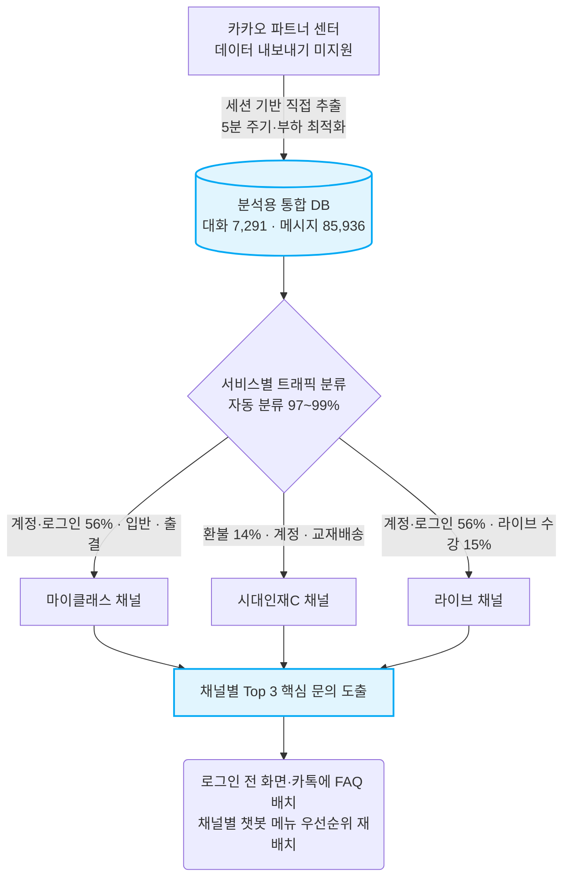

# 카카오 상담 채널 데이터 수집 파이프라인 — 구축 과정과 성과

> **한 줄 요약** — **학생·학부모(고객)와 학원 간 카카오 상담을 사람 손 없이 5분마다 자동으로 분석용 데이터베이스에 쌓는 무중단 파이프라인**을 직접 설계·구축했습니다. **마이클래스·라이브·시대인재C 3개 서비스 채널을 분리 수집**해 현재 **대화 7,291건 / 메시지 85,936건**(2023‑12~2026‑06)을 적재했고, 이 데이터로 채널별·전화/웹 교차분석을 해 *"디지털 채널 문의의 절반이 계정·로그인이고, 채널마다 문의 성격이 다르다"* 는 전략 인사이트를 도출했습니다.

---

## 0. 한눈에 보기

| 항목 | 내용 |
|---|---|
| **무엇을** | 카카오 비즈니스 채팅(학생·학부모↔학원 상담)을 실시간 수집 — **마이클래스·라이브·시대인재C 3개 서비스 채널** |
| **어떻게** | Supabase Edge Function(항상 켜진 서버) + 스케줄러(pg_cron), **5분 주기 완전 자동** |
| **수집량(현재)** | 메시지 **85,936건** · 대화 **7,291건** · 채널 **3개** |
| **데이터 기간** | 2023‑12‑27 ~ 2026‑06‑26 (약 2.5년치) |
| **운영 상태** | **무중단** (마지막 정상 동작 2026‑06‑30 00:16) |
| **사람 개입** | **0** (완전 자동) · GitHub 유료 자원 사용 **0분** |
| **개인정보** | **수집 단계에서 자동 마스킹**(이름·전화·카드·주민번호·이메일) |

### 전체 흐름 (수집 → 서비스별 분류 → 활용)



> Confluence에서는 **Mermaid 매크로**(또는 코드블록 언어 `mermaid`)로 위 코드가 그대로 렌더됩니다. 매크로가 없으면 같은 폴더의 이미지(`카카오상담수집_흐름도.png`)를 첨부하세요.

---

## 1. 왜 이 작업을 제안했는가 — 배경과 문제의식

학원에는 매일 **학생·학부모(고객)** 상담이 쏟아집니다. **전화 상담은 따로 집계**되지만(월 7~8만 건 규모), 카카오 상담은 **카카오 상담 채널 플랫폼(카카오 비즈니스 파트너센터) 안에 쌓이기만 할 뿐, 그 플랫폼이 데이터를 외부로 내보내는 기능(다운로드·연동 API)을 제공하지 않아** 모아서 분석할 방법이 없었습니다.

> 비유하자면, 전화 상담은 장부로 받아볼 수 있는데 **카톡 상담은 남의 건물(카카오 플랫폼) 안 금고에 차곡차곡 쌓이는데, 정작 그 건물엔 "내보내기" 버튼이 없는** 상태였습니다. 데이터는 분명히 있는데 **꺼낼 공식 통로가 없었던 것**이 핵심 문제였습니다.

"어떤 문의가 가장 많은가? 무엇을 챗봇·FAQ로 줄일 수 있는가?" 같은 질문에 **데이터로** 답하려면, 흩어진 카톡 상담을 **한 곳(분석용 보관함)에 자동으로 모으는 일**이 먼저 필요했습니다. 전화·웹과 **같은 잣대로 비교**하기 위한 마지막 퍼즐이기도 했습니다.

→ 그래서 **"카카오 채팅을 자동으로 수집해 분석 DB에 쌓자"** 를 제안했습니다.

---

## 2. 어떻게 결과물을 도출했는가 — 과정과 프로세스

### 2‑1. 수집 경로 설계
카카오 상담 채널 플랫폼은 **데이터를 외부로 내보내는 공개 기능(다운로드·연동 API)을 제공하지 않습니다.** 그래서 운영자가 로그인한 세션(쿠키)으로 **플랫폼 내부 통신을 호출해 상담 데이터를 직접 추출**하는 방식을 설계했습니다. 한 번 돌 때의 흐름:

```
인증 확인 → 마지막 수집 지점(커서) 불러오기 → 대화 목록 조회
        → "바뀐 대화만" 메시지 재수집 → 분석 DB에 적재(덮어쓰기) → 상태 기록
```

### 2‑2. "정확히 5분마다, 그리고 절대 안 멈추게" — 인프라 의사결정 ⭐
수집 주기는 **5분**으로 잡았습니다(빠른 반영 ↔ 서버 부담의 균형). 단, "5분마다"를 **실제로 지키고** 멈추지 않게 만드는 과정에서 두 가지 문제를 차례로 해결했습니다. *(간격 숫자 5분은 끝까지 동일 — 바꾼 것은 "누가 5분을 재고, 어디서 실행하느냐"입니다.)*

**문제 ① — GitHub 스케줄러가 "5분"을 지키지 못함**
- 1차 구현은 GitHub Actions의 cron(`*/5`)에 맡겼는데, 무료 러너 부하 때문에 **첫 실행이 수십 분~수 시간 지연되거나 아예 건너뛰어** "5분마다"가 보장되지 않았습니다.
- **해결**: 항상 켜져 있고 분 단위로 정확한 **Supabase pg_cron(데이터베이스 내장 스케줄러)** 이 5분마다 수집을 깨우도록 **트리거를 교체** → 5분 주기가 실제로 지켜짐.

**문제 ② — GitHub 무료 실행시간이 매달 소진**
- 그래도 수집 '실행'은 여전히 GitHub Actions에서 돌았는데, 비공개 저장소 무료시간(월 ~2,000분)이 5분 간격 실행으로 **매달 중순 소진** → 수집이 **매달 멈췄습니다**(2026‑06 실제 발생).
- **해결**: 수집 로직 자체를 **Supabase Edge Function(항상 켜진 서버)** 으로 옮김. 이제 pg_cron이 Edge Function을 직접 호출 → **GitHub 자원 0, 영구 무중단**.

```
(1차) GitHub cron(*/5) → Actions 러너 → 스크립트        ← 5분이 지연/누락(불안정)
(2차) pg_cron(*/5) → GitHub workflow_dispatch → 스크립트  ← 5분은 정확해졌으나 Actions 시간 소진
(현재) pg_cron(*/5) → 직접 HTTP 호출 → Edge Function      ← 정확한 5분 + GitHub 자원 0, 영구 무중단
```

> **결과: "5분마다"가 실제로 지켜지면서, 매달 멈추던 수집이 영구 무중단이 되었고 GitHub 유료 자원 사용은 0이 되었습니다.** (기존 GitHub Actions 경로는 만일을 위한 *수동 폴백*으로만 남겨 장애 대비.)

### 2‑3. 데이터 정합성 — 중복도 누락도 0
- **증분 수집**: 대화마다 "마지막 메시지 위치"를 커서로 기억해, **바뀐 대화만** 다시 읽습니다(불필요한 재수집 제거).
- **멱등 적재(idempotent)**: 같은 메시지를 여러 번 받아도 고유 ID 기준으로 덮어쓰기 → **중복 0**.
- **시간 제한 방어**: 한 번 호출에 채널별 처리 상한을 두고, 초과분은 커서를 보존해 **다음 호출에서 이어받습니다 → 영구 누락 없음**.

### 2‑4. 개인정보 보호 (Privacy by Design)
수집하는 **바로 그 순간**, 이름·휴대폰·유선번호·카드번호·주민번호·이메일을 **자동 마스킹**합니다. 원문 개인정보는 분석 DB에 **저장하지 않습니다.**

> 예: 이름 `홍길동 → 홍*동`, 전화 `010-1234-5678 → 010-****-5678`

### 2‑5. 운영 안정성
- 로그인 쿠키는 사내 맥북 Chrome이 **6시간마다 자동 갱신·배달**, 함수는 별도 토큰으로 보호.
- 인증 만료·오류를 감지하고, **heartbeat(생존 신호)** 로 시스템이 살아있는지 추적 → 문제 발생 시 즉시 식별.

### 2‑6. 서비스(채널)별 분리 수집
한 덩어리로 모으지 않고 **3개 서비스 채널을 채널 ID로 구분해 따로** 적재합니다 — 채널마다 들어오는 문의 성격이 다르기 때문입니다(근거는 §4).

| 채널(서비스) | 대화 | 메시지 | 데이터 시작 |
|---|---:|---:|---|
| **C (시대인재C · 통합회원)** | 3,350 | 41,348 | 2025‑09 |
| **LIVE (라이브)** | 2,301 | 28,041 | 2023‑12 |
| **마이클래스** | 1,640 | 16,547 | 2025‑12 |
| **합계** | **7,291** | **85,936** | |

> 발신자는 **학부모만이 아닙니다.** 마이클래스·라이브·C는 학생이 직접 쓰는 디지털 서비스라 **학생·학부모가 섞여** 문의합니다(특히 "앱·로그인" 문의는 앱을 직접 쓰는 학생 비중이 큽니다).

---

## 3. 우리 팀·프로젝트에 어떤 의미가 있는가

- **카톡 상담이 처음으로 "분석 가능한 자산"이 되었습니다.** (이전엔 카카오 상담 채널 플랫폼 안에 쌓이기만 하고, 반출 기능이 없어 꺼낼 수 없던 데이터)
- 전화(약 42만 건)·카톡·웹(GA4)을 **같은 분류 체계로 교차비교**하는 3채널 분석의 기반이 마련됐습니다.
- 이 데이터가 **마이클래스 챗봇 기획의 우선순위 의사결정**(어떤 메뉴를 앞에 둘지, 무엇을 셀프 해결로 돌릴지)을 **근거 기반**으로 바꿨습니다.

---

## 4. 실제 분석으로 본 인사이트 — 채널마다 문의가 다르다

수집 데이터를 자동 분류(97~99% 분류)한 결과, **채널(서비스)마다 들어오는 문의 성격이 뚜렷이 다릅니다.** (의미 있는 **상위 3순위** — '기타'는 분류 보류분이라 제외하고 비중만 별도 표기)

| 채널 | 1순위 | 2순위 | 3순위 | ('기타' 비중) |
|---|---|---|---|---|
| **마이클래스** | 계정·로그인·앱 **56.5%** | 입반·등록 6.0% | 출결·보강 5.6% | 12.5% |
| **LIVE(라이브)** | 계정·로그인·앱 **56.2%** | 라이브 수강 14.8% | 입반·등록 4.8% | 14.6% |
| **C(시대인재C)** | 환불 **14.4%** | 계정·로그인·앱 13.6% | 교재·배송 9.7% | 45.5% |

**이 결과가 의미하는 것:**

1. **디지털 서비스의 진입 장벽은 "로그인"이다** — 마이클래스·라이브 둘 다 **문의의 절반 이상(약 56%)이 계정·로그인·앱**. 사용자가 가장 많이 막히는 지점은 콘텐츠가 아니라 *"앱에 못 들어가는 것"*입니다. 그런데 챗봇·인앱 도움말은 *로그인한 다음* 화면에 사는데 이 수요는 *로그인 전*에 터지므로 **그 사용자에겐 챗봇이 닿지 않습니다.** ⇒ **계정·로그인 도움은 로그인 화면·카카오 채널 자체에 배치**해야 효과. (전화 채널엔 계정 문의가 0.2%뿐 — 디지털에서만 폭발하는 수요라, 카카오 수집이 없었으면 아예 못 봤을 사실.)

2. **C(통합회원) 채널은 성격이 완전히 다르다 — 결제·환불·교재** — C는 계정보다 **환불(14.4%)·교재·배송(9.7%)·미납·결제** 등 *정산·물류성* 문의가 두드러집니다(통합회원이 결제·구매의 중심이라서). ⇒ 같은 카카오라도 **마이클래스=로그인 가이드 / C=환불·결제·교재 안내**처럼 **채널별로 다른 FAQ·자동응답·응대 스크립트**가 필요합니다.

3. **합쳤으면 안 보였을 차이를, 분리 수집했기에 봤다** — 세 채널을 뭉뚱그리면 "계정 OO% + 환불 OO% …" 평균에 묻혀 **채널별 우선순위가 사라집니다.** 서비스별로 나눠 모았기에 *"마이클래스·라이브는 로그인, C는 환불"* 이라는 **채널 맞춤 대응 우선순위**가 드러났습니다. (= 서비스별 분리 수집의 직접적 시너지)

4. **전화(42만) + 카카오 3채널 = 같은 잣대 교차비교** — 전화는 *출결·입반 등 운영 처리성*이 지배(학부모 92%), 디지털은 *계정·로그인*이 지배. **채널마다 사는 문의가 다르다**는 게 데이터로 확인되어, "무엇을 / 어디에 자동화할지"를 채널 특성에 맞춰 배치할 근거를 확보했습니다.

> **분석 정직성** — C 채널은 '기타'가 45.5%로 높습니다. 통합회원 채널 특유의 짧은 확인성 문의(가입·정보변경 등)를 현 분류 체계가 아직 못 담는다는 신호로, **분류 기준 고도화를 다음 과제**로 잡고 있습니다. (한계를 숨기지 않고 다음 작업으로 연결.)

---

## 5. 보고할 수 있는 성과

| 성과 | 근거 |
|---|---|
| ✅ **무중단 자동 수집 파이프라인 구축** | 사람 개입 0 · 5분 주기 · 현재 대화 7,291 / 메시지 85,936건(3채널·2.5년치) 적재, 무중단 동작 중 |
| ✅ **운영 리스크 제거 + 비용 절감** | 매달 멈추던 수집을 인프라 이전으로 **영구 무중단화**, GitHub 유료 자원 사용 0분 |
| ✅ **개인정보 안전 설계** | 수집 단계 PII 자동 마스킹으로 컴플라이언스 리스크 차단 |
| ✅ **전략 인사이트 도출** | 3채널 교차분석으로 **"디지털 채널 최대 수요 = 계정·로그인(대화 3건 중 2건에 등장)"** 발견. 더 나아가 *챗봇은 로그인 후 화면에 사는데 그 수요는 로그인 전에 발생 → 정작 그 사용자엔 못 닿는다* 는 **구조적 함정**까지 규명 → 챗봇 메뉴 우선순위 재배치에 직접 반영 |

> **정직성 노트** — 챗봇은 아직 프로토타입(미배포) 단계라, "문의 N% 감소" 같은 **인과 성과는 현재 귀속하지 않습니다.** 본 문서의 성과는 **① 데이터 인프라 구축 ② 그 데이터에 기반한 의사결정**에 한정합니다. (이 원칙 자체가 분석의 신뢰도를 지키는 장치입니다.)

---

### 참고 — 시스템 구성요소
- 수집 함수: `supabase/functions/kakao-collect/index.ts`
- 스케줄러 전환: `supabase/migrations/20260625_kakao_collect_edge_function.sql`
- 수동 폴백: `.github/workflows/kakao-collect.yml`
- 적재 테이블: `kakao_partner_chats`(대화) · `kakao_partner_messages`(메시지) · `kakao_partner_stream_state`(생존 상태)
- 3채널 교차분석 전문: `analysis/myclass-chatbot/DATA_ANALYSIS.md`

*(수치는 2026‑06‑30 기준 라이브 DB 실측. 개인정보 원문은 저장소·문서에 미반입.)*
