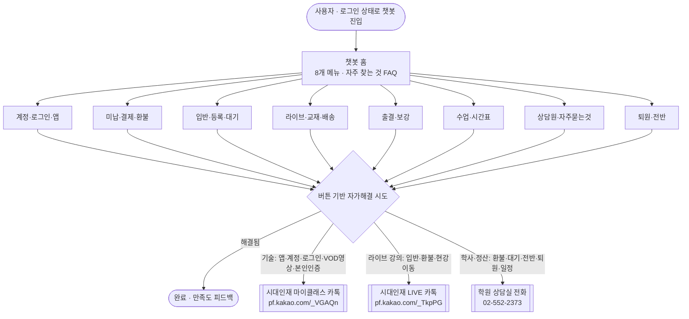

# 마이클래스 챗봇 — 최종 통합 문서 (기획 · 시나리오 · 디자인)

> **한 줄 정의**: 마이클래스 앱(시대인재) 안에서 학생·학부모가 **버튼만으로 스스로 문제를 해결**하고, 안 되면 **성격에 맞는 정확한 창구로 연결**하는 흑백 미니멀 챗봇 프로토타입.
>
> - **운영 URL**: https://sdij-wiki.vercel.app/chatbot
> - **산출물**: `analysis/myclass-chatbot/prototype.html` (단일 파일, 바닐라 HTML/CSS/JS) → 배포본 `public/myclass-chatbot.html`
> - **최종 상태 기준일**: 2026-06-17 (PR #105~#119 반영)
> - 이 문서는 **마스터(최종) 문서**입니다. 세부 근거는 §8 참고 문서 인덱스의 개별 문서를 참조하세요.

---

## 0. 한 페이지 요약

| 축 | 결론 |
|---|---|
| **기획** | "ZERO 허위정보" — 데이터로 검증된 것만 안내, 불명확하면 사람에게. 버튼 기반(입력창 없음), 흑백 미니멀, PII 마스킹. |
| **시나리오** | 8개 메뉴 · 30개 노드. 모든 가이드는 실제 상담 데이터(카카오 7,213대화·AMS 424,200행)와 **실제 앱 화면**으로 검증. |
| **라우팅** | **3채널 분기** — ① 학원 상담실 전화(학사·정산) ② 시대인재 마이클래스 카톡(앱·계정·영상 기술) ③ 시대인재 LIVE 카톡(라이브 강의). |
| **디자인** | LUMEN 디자인 시스템(흑백 #161616). 모바일·태블릿·데스크탑 Figma 원본 100% 정합. |
| **인터랙션** | 타이핑 인디케이터·칩 스태거·복사 토스트·**바텀시트 드래그로 닫기**·**조회 스켈레톤 로딩**·숫자 pop-in·iOS 이징. |
| **접근성** | 스크린리더 낭독(aria-live)·포커스 트랩·reduced-motion·장식 아이콘 aria-hidden. |
| **검증** | QA 크롤러(60개 상태·오류 0)·헤드리스 렌더(3뷰)·실제 계정 로그인 검증·운영 배포 확인. |

---

## 1. 기획 (Planning)

### 1.1 목적 · 문제
- **문제**: 학생·학부모 문의가 전화·카카오로 몰리는데, 상당수가 "앱에서 스스로 해결 가능한 것"(로그인·결제 재시도·영상 재생 등)이거나 야간(상담원 부재)에 발생.
- **목표**: ① 자가해결 가능한 문의를 챗봇이 흡수(디플렉션) ② 사람이 필요한 문의는 **정확한 창구**로 빠르게 연결 ③ 절대 틀린 정보를 주지 않음.

### 1.2 핵심 원칙 (무결성 5원칙) — 모든 의사결정의 상위 규칙
1. **ZERO 허위정보** — 데이터·실제 화면으로 검증되지 않은 절차는 단정하지 않고 상담원/채널로 라우팅.
2. **버튼 기반** — 자유 입력창 없음. 모든 분기는 칩·타일 버튼. (오답·환각 방지)
3. **흑백 미니멀** — 단색 `#161616`, 이모지 없음, 그라데이션 없음(스켈레톤 회색 shimmer만 예외).
4. **PII 마스킹** — 프로토타입은 가명(김시대)·마스킹 번호(010-****-1234). 분석 시 원문·실명·실번호 출력 금지(집계만).
5. **불명확 = 사람에게** — 잔여석·정산·규정 등 실시간·민감 사안은 자가해결로 흉내 내지 않고 핸드오프.

### 1.3 데이터 소스 (3채널 + 실측)
| 소스 | 규모 | 용도 |
|---|---|---|
| **카카오 파트너(비즈니스 채팅)** — Supabase `kakao_partner_*` | 7,213대화 · 85,063메시지 | 디지털 채널 질문 패턴·상담원 운영시간 |
| **GA4** — BigQuery `myclass-data-warehouse` | events_* | 화면별 트래픽·마찰(재시도)·결제 퍼널 |
| **AMS(전화 상담)** pickle | 424,200행 | 전통 상담 주제·해결방법 근거 |
| **실제 마이클래스 앱** (로그인 검증) | — | 메뉴명·경로·영상 위치 직접 확인 |

**핵심 분포 (카카오 디지털 채널)**: 계정·로그인·앱 36.7% · 기타(FAQ) 28.2% · 환불 8.0% · 라이브 6.0% · 교재·배송 5.3% · 입반·등록 4.2% · 미납·결제 4.1% · 대기 3.4% · 출결·보강 3.1%.
→ 전화(AMS)는 출결·보강(30.7%)·입반(22%)이 주도. **디지털은 "앱이 막혔을 때 찾는 SOS 창구"**라는 정반대 성격을 메뉴 우선순위에 반영.

### 1.4 작업 방법론 (분석 → 구축 → 검증 → 배포 루프)
1. **멀티에이전트 분석** — 디지털채널·GA4 마찰·디자인 리서치를 병렬 에이전트로 수행, 검증된 결과만 채택.
2. **실제 앱 검증** — Playwright로 로그인해 메뉴·경로 직접 확인(예: 복습영상 실제 위치).
3. **QA 크롤러** — jsdom으로 전 노드 BFS 클릭, JS오류·막다른길·미마스킹 PII 자동 점검.
4. **헤드리스 렌더** — Chrome로 모바일/태블릿/데스크탑 스크린샷, 레이아웃 회귀 점검.
5. **배포 검증** — Vercel 운영 반영(`/chatbot`)을 실제 fetch로 확인.

---

## 2. 시나리오 (Scenario)

### 2.1 정보구조 — 8개 메뉴 · 30개 노드

**시스템 플로우 맵** (홈 → 8메뉴 → 자가해결 → 3채널 분기):

| # | 메뉴(타일) | 아이콘 | 주요 노드 |
|---|---|---|---|
| 1 | **계정·로그인·앱** | key | `ac_login`(로그인·소셜 가입수단) · `ac_unify`(통합회원·자녀계정) · `ac_app`(흰화면·튕김·업데이트·설치) |
| 2 | **미납·결제·환불** | credit_card | `pay_status`·`pay_sms`·`pay_va`·`pay_cert`·`pay_fail`·`pay_refund`·`pay_etc` |
| 3 | **입반·등록·대기** | how_to_reg | `en_reg`·`en_check`·`en_wait`·`en_waitset`·`en_special`(특강 본인인증)·`en_transfer` |
| 4 | **라이브·교재·배송** | live_tv | `m_live`(입반·복습영상·배송·반납·결제·환불·현강이동) · `live_video`(영상 4갈래) |
| 5 | **출결·보강** | fact_check | `at_makeup`(동영상 보강) · 현장보강 · 결석 사전신고 |
| 6 | **수업·시간표** | calendar_month | 시간표·강의실·서바이벌 커리큘럼·종강/휴강 |
| 7 | **퇴원·전반** | logout | `m_quit`(시간·난이도·강사·라이브·계획) · `quit_refund`(2단계 확인) |
| 8 | **상담원·자주묻는것** | support_agent | `help_faq` · `help_contact` · 교재수령·연구소교재비·설명회·자습실 (사람 연결은 맨 끝에 배치) |

전체 노드(30): `home, m_account, ac_login, ac_unify, ac_app, m_pay, pay_etc, pay_status, pay_sms, pay_va, pay_cert, pay_fail, pay_refund, m_enroll, en_reg, en_check, en_wait, en_waitset, en_special, en_transfer, m_live, live_video, m_attend, at_makeup, m_time, m_help, help_contact, help_faq, m_quit, quit_refund`.

### 2.2 ⭐ 3채널 라우팅 체계 (핵심 설계)

문의 **성격**에 따라 세 창구로 분기한다. 분기 함수는 `handoff()` / `handoffTech()` / `handoffLive()`.

| 채널 | 함수 | 연결 대상 | 넘기는 케이스 |
|---|---|---|---|
| **학원 상담실 전화** | `handoff()` | 대치 캠퍼스 고3 상담실 전화 **02-552-2373** · 문자 **010-5423-2378** | 환불·입반·대기·전반(반변경)·결제정산·오입금·교재수령/반납·연구소교재비·현장보강·컨설팅·자습실·퇴원·종강/휴강 — **학사·정산** |
| **시대인재 마이클래스 카톡** | `handoffTech()` | `pf.kakao.com/_VGAQn/chat` | 앱오류·VOD영상재생·로그인·통합회원·계정연결·소셜가입·특강 본인인증 — **앱/계정 기술** |
| **시대인재 LIVE 카톡** | `handoffLive()` | `pf.kakao.com/_TkpPG/chat` | 라이브 입반·라이브 환불·현강이동·라이브센터 교재반납 — **별도 LIVE 서비스** |

- **채널 검증**: 수집 데이터의 `profile_id`를 공개 채널명과 대조 → `_VGAQn`=시대인재 마이클래스, `_TkpPG`=시대인재 LIVE(기술지원), `_xfxilXn`=시대인재 콘텐츠.
- **근거**: 카카오 채널 문의의 36.7%가 계정·앱·로그인(기술) → 기술 문의를 카톡 채널로 보내는 것이 데이터와 정합.
- **VOD vs 라이브 구분**: 복습·추가·보충 영상은 마이클래스 앱 소관(VOD) → 마이클래스 채널. 라이브 **송출 강의**는 별도 LIVE 서비스 → LIVE 채널.

### 2.3 데이터 → 기능 매핑 (각 기능의 근거)
| 기능 | 데이터 근거 |
|---|---|
| 🔑 1순위 배치 + 앱오류 세분화(흰화면·튕김·업데이트·설치) | 카카오 1위 36.7%, 앱오류 키워드 1,486건(로그인 1,269보다 많음) |
| "어느 걸로 가입했는지 모르겠어요"(카카오·구글·네이버) | 소셜 가입 810건(실제 확인은 상담원) |
| 특강 신청 본인인증 도움 + **특강 진입 배너** | GA4 6월 최대 신규 마찰 — 인증 클릭 93%가 특강 모집 화면 |
| 대기 "한 번만·순번대로 자동 문자" 안심 문구 | GA4 마감 대기등록 **2.63회** 반복 클릭(최다 재시도) |
| 결제 "재시도 마찰 완화" 톤(이탈 아님) | GA4 1인당 결제진입 3.5회·사용자 CVR 80.5% (이탈 착시) |
| 홈 '자주 찾는 것' FAQ 노출 | "기타 FAQ" 28.2%가 7순위 메뉴에 묻혀 누수 |
| 야간 안내(늦은 시간 핸드오프) | 상담원 응답 10~21시 상주, 22시 이후·새벽 무인(집계) |
| 복습·추가영상 경로 `수강 강좌 → 강좌 상세보기 → 강의 목록` | 실제 계정 로그인 후 강좌 상세(`/classes/{id}`)에서 직접 확인 |

### 2.4 선제 안내 (Proactive)
- **진입 배너**(`setBanner`): `payment`(결제 안내) · `auth`(로그인) · `recruitment`(특강 본인인증). 화면 맥락에서 챗봇을 열면 해당 도움을 먼저 제안.
- **야간 안내**(`offHours`): 22시~08시 전화 핸드오프 시 "문자로 남기면 운영 시작 시 먼저 연락" 안내(특정 운영시각은 단정하지 않음).
- **자가해결 우선**: 모든 핸드오프 전에 1회 이상 자가해결 시도(재시도·문자 재발송·업데이트/재설치 등)를 거침.

### 2.5 UX 라이팅 원칙
- 친절하되 핵심만 정확히. 결과/행동 먼저, 이유 나중.
- 단정 금지 표현: "정확한 금액·규정은 상담원이 확정해 드려요" 식으로 책임 경계 명시.
- 상세 카피는 `UX_COPY.md` 참조.

---

## 3. 디자인 (Design)

### 3.1 LUMEN 디자인 시스템 (시대인재 myclass)
- **색**: text `#161616`, helper `#1616168f`, surface `#f4f4f4`, border `#16161614`, primary `#161616`/on `#fff`. (단색 흑백)
- **폰트**: Pretendard Variable / 아이콘 Material Symbols Sharp(weight 200).
- **라디우스**: tag 2 · btn 2 · card 4 · pill 999 · bubble 16 · sheet 12.
- **그림자**: `--shadow-m`(칩) · `--shadow-2`(카드 2겹).
- 토큰 전문은 `DESIGN_TOKENS.md` 참조.

### 3.2 반응형 (Figma 원본 100% 정합)
| 뷰 | 크기 | 헤더 | 챗봇 |
|---|---|---|---|
| **모바일** | 430×932 | 2행(브랜드+아이콘 / 사용자정보) | 바텀시트(하단에서 올라옴) |
| **태블릿** | 768×1024 | 1행, 패딩 40px, macOS 크롬 프레임 | 우하단 도킹 패널(392px) |
| **데스크탑** | 1440×1024 | 1행, 좌측 세로 내비 + 2단(50:50) | 우하단 도킹 패널 |

`body[data-view="mobile|tablet|desktop"]` CSS로 전환, 상단 토글로 미리보기.

### 3.3 인터랙션 · 모션
| 요소 | 사양 |
|---|---|
| 봇 타이핑 인디케이터 | 점 3개 blink, 340ms 후 응답 |
| 칩 stagger | 45ms 간격 · 메뉴 타일 30ms |
| 바텀시트 이징 | `cubic-bezier(.32,.72,0,1)` .42s (iOS 곡선) |
| **드래그로 닫기** | 핸들·헤더 아래로 스와이프 → 높이 25% 또는 속도 0.4 초과 시 닫힘(Vaul 임계값). 헤더 버튼 탭 보존, 모바일 한정 |
| **스켈레톤 로딩** | 조회 카드(납부·가상계좌·등록·대기·배송·시간표·강의실·출결) shimmer → blur cross-fade |
| 복사 토스트 | Sonner식 하단 토스트 400ms, 성공 체크 draw-in |
| 숫자 pop-in | 금액·합계 `.big` scale(.96)→1 |
| 프레스/포커스 | `:active` translateY(1px) · `:focus-visible` 2px 아웃라인 |
| 모션 접근성 | `prefers-reduced-motion` 전체 애니메이션 무효화 |

### 3.4 접근성 (a11y)
- 대화 로그 `role=log aria-live=polite` → 봇 답변·카드 스크린리더 자동 낭독.
- 타이핑 점 `aria-hidden`(낭독 제외), 복사 토스트 `role=status`.
- 장식 아이콘(Material Symbols) 전부 `aria-hidden` → "credit_card" 노이즈 제거.
- 시트 `role=dialog aria-modal=true`, 포커스 트랩, Esc 닫기, 진입 시 `focus({preventScroll})`.

---

## 4. 검증 · 품질

| 방법 | 내용 | 최종 결과 |
|---|---|---|
| **QA 크롤러**(jsdom) | 전 노드 BFS 클릭 — JS오류·막다른길·미마스킹 PII·라벨없는 버튼 | 60개 상태 · 오류 0 · 막다른길 0 · 라벨없는 버튼 0 (노출 번호 `010-5423-2378`은 상담실 공개번호) |
| **헤드리스 렌더**(Chrome) | 모바일·태블릿·데스크탑 스크린샷 | 레이아웃 회귀 없음 |
| **실제 앱 검증**(Playwright) | 로그인 후 강좌 상세까지 진입, 복습영상 위치 확인 | `수강 강좌 → 강좌 상세보기 → 강의 목록` 확인, '내 강의실' 메뉴 부재 확인 |
| **드래그 닫기 테스트** | 프로그램 드래그 후 시트 상태 | open→closed 통과 |
| **배포 검증** | 운영 `/chatbot` fetch | 매 PR 반영 확인 |

---

## 5. 배포 이력 (PR)

| PR | 내용 |
|---|---|
| #105 | 챗봇 프로토타입 + 3채널 데이터 분석 최초 |
| #107~#109 | iOS 사파리 하드닝(버튼 색·크로스브라우저)·디자인 디테일 |
| #110~#111 | 실제 FAQ 영상 자가해결·타이핑/복사버튼/퇴원 확인 |
| #112~#113 | 상담데이터 심층 갭 보강 + 실제 앱 메뉴명 정합 + 디지털/GA4 반영 |
| #114 | 복습영상 경로 실제 앱 검증("강의 목록"까지) |
| #115 | 상담 라우팅 이원화 + 야간 안내 + 대기 마찰 완화 |
| #116 | 기술 핸드오프를 실제 '시대인재 마이클래스' 카톡 채널로 연결 |
| #117 | 라이브 강의 문의를 '시대인재 LIVE' 채널로 분리(3채널 완성) |
| #118 | 접근성(스크린리더) 보강 + 특강 진입 배너 |
| #119 | 인터랙션 마무리 — 드래그로 닫기 + 스켈레톤 로딩 + 홈 FAQ |

---

## 6. 보류 · 제외 (정직성 기록)

| 항목 | 판단 | 이유 |
|---|---|---|
| 감정(불만) 기반 우선 케어 | **보류** | 수집 데이터 감정 분류가 전부 null(85,063건). 불만 키워드도 전 카테고리 0.1~0.3%로 신호 없음 → 근거 부족 |
| Vaul식 뒤 배경 축소(scale) | **제외 유지** | 흰 배경에선 흰 여백처럼 보여 어색. 드로어 깊이 효과가 이 팔레트와 안 맞음 |
| 자유 입력(텍스트) 챗 | **설계상 제외** | 환각·오답 위험. 버튼 기반 원칙 |
| 결제 실패 → 기술채널 | **정산(전화) 유지** | 결제·정산은 학원 상담실 소관(사용자 확정) |
| 운영시간 숫자 명시 | **미표기** | 공식 게시 시각 미확인 → "늦은 시간" 조건 안내로 대체 |

---

## 7. 향후 과제 (선택)
- **감정 분류 1회 실행** → 불만 많은 주제 우선 케어(현재 데이터 null 해소 시).
- **카카오 채널 딥링크 검증** — 실제 앱 내 연결 경로(`전체메뉴 → 고객센터 → 1:1 문의`)와 채널 챗 링크의 일관성.
- **인증 성공/실패 커스텀 이벤트 계측**(GA4) → 특강 본인인증 마찰 정량화. → 설계: `MEASUREMENT_SPEC.md`
- **백엔드 연동** — 현재 조회 카드는 목업. 실제 납부·대기·배송 API 연결 시 스켈레톤이 실로딩으로 동작. → 설계: `BACKEND_INTEGRATION.md`

---

## 8. 참고 문서 인덱스 (세부 근거)

| 문서 | 내용 |
|---|---|
| `PRODUCT_OWNER.md` | 제품 비전·문제 정의·성공지표 |
| `PRD.md` | 요구사항·개발 핸드오프 패키지 |
| `CHATBOT_PLAN.md` | 케이스 유니버스·택소노미(99종)·Tier·라우팅 |
| `QUICK_MENU_SCENARIOS.md` | 8타일·시나리오(디지털 우선) |
| `UX_COPY.md` | 시나리오 마이크로카피 최종본 |
| `DATA_ANALYSIS.md` | GA4·결제 퍼널·3채널 분석 근거 |
| `RESOLUTION_EVIDENCE.md` | AMS 카테고리별 실제 해결방법 grounding |
| `DESIGN_TOKENS.md` | LUMEN 디자인 토큰 실측 |
| `QA_PLAN.md` | 품질 기준·테스트 플랜 |
| `MEASUREMENT_SPEC.md` | 측정 설계(자가해결율·핸드오프·인증 성공/실패 이벤트) |
| `BACKEND_INTEGRATION.md` | 조회 카드 목업 → 실 API 연동 명세 |
| `README.md` · `data/` | 3채널 분류·적재 데이터 |
| **`FINAL_PROCESS.md`** (본 문서) | 위 전체를 잇는 **최종 통합 문서** |

> 본 문서는 최종 상태(PR #119 기준)의 단일 진실 소스(Single Source of Truth)입니다. 이후 변경 시 본 문서의 §2(시나리오)·§3(디자인)·§5(배포 이력)를 함께 갱신하세요.
