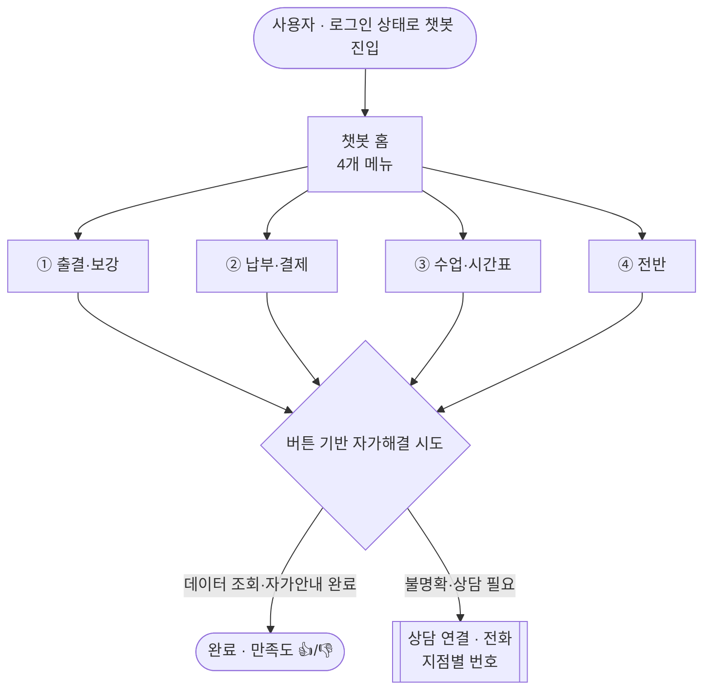

# 마이클래스 챗봇 - 최종 통합 문서 (기획 · 시나리오 · 디자인)

> ⚠️ 2026-07-02 갱신 - 정본은 v6 4메뉴. SSOT = `public/myclass-chatbot.html` + `기획서_v6_요약.md`. (옛 8메뉴 prototype.html 기록은 폐기)

> **한 줄 정의**: 마이클래스 앱(시대인재) 안에서 학생·학부모가 **버튼만으로 스스로 문제를 해결**하고, 안 되면 **상담 연결(전화)로 정확히 연결**하는 흑백 미니멀 챗봇 프로토타입. (챗봇 명칭 **"마이클래스 도우미"** · 서브 "문제를 바로 해결하도록 도와드려요")
>
> - **운영 URL**: https://sdij-wiki.vercel.app/chatbot (학생) · /chatbot-parent (학부모)
> - **산출물(SSOT)**: `public/myclass-chatbot.html`(학생) / `public/myclass-chatbot-parent.html`(학부모) - 단일 파일 바닐라 HTML/CSS/JS, v6 4메뉴 빌드. (옛 `prototype.html`·`prototype-parent.html`(8메뉴 v3)은 폐기·삭제됨.)
> - **콘텐츠 정본**: `analysis/myclass-chatbot/기획서_v6_요약.md` (원본 `마이클래스_챗봇_시나리오_v6.xlsx`, 티켓 SERP-8270).
> - **최종 상태 기준일**: 2026-07-02 (v6 4메뉴 재정비).
> - 이 문서는 **마스터(최종) 문서**입니다. 세부 근거는 8장 참고 문서 인덱스의 개별 문서를 참조하세요.

---

## 0. 한 페이지 요약

| 축 | 결론 |
|---|---|
| **기획** | "ZERO 허위정보" - 데이터로 검증된 것만 안내, 불명확하면 사람에게. 버튼 기반(입력창 없음), 흑백 미니멀, PII 마스킹. |
| **시나리오** | **4개 메뉴**(출결·보강 / 납부·결제 / 수업·시간표 / 전반, 막다른 길 0). 모든 가이드는 실제 상담 데이터(카카오 7,213대화·AMS 424,200행)와 **실제 앱 화면**으로 검증. 답변 포맷 정본 = `기획서_v6_요약.md 3장`. |
| **라우팅** | **상담 연결(전화, 지점별 번호)** 단일 창구로 단순화(SERP-8270). [상담 등록] 버튼 제거. (8메뉴 시절 3채널 라우팅은 v3 설계 기록으로 폐기.) |
| **디자인** | LUMEN 디자인 시스템(흑백 #161616). Figma 원본 100% 정합, 기준폭 400px. |
| **인터랙션** | 타이핑 인디케이터·칩 스태거·복사 토스트·**바텀시트 드래그로 닫기**·**조회 스켈레톤 로딩**·숫자 pop-in·iOS 이징. |
| **접근성** | 스크린리더 낭독(aria-live)·포커스 트랩·reduced-motion·장식 아이콘 aria-hidden. |
| **검증** | QA 크롤러(전 노드 BFS·오류 0·막다른 길 0)·헤드리스 렌더(design-audit 400px 1:1)·실제 계정 로그인 검증·운영 배포 확인. |

---

## 1. 기획 (Planning)

### 1.1 목적 · 문제
- **문제**: 학생·학부모 문의가 전화·카카오로 몰리는데, 상당수가 "앱에서 스스로 해결 가능한 것"(로그인·결제 재시도·영상 재생 등)이거나 야간(상담원 부재)에 발생.
- **목표**: ① 자가해결 가능한 문의를 챗봇이 흡수(디플렉션) ② 사람이 필요한 문의는 **정확한 창구**로 빠르게 연결 ③ 절대 틀린 정보를 주지 않음.

### 1.2 핵심 원칙 (무결성 5원칙) - 모든 의사결정의 상위 규칙
1. **ZERO 허위정보** - 데이터·실제 화면으로 검증되지 않은 절차는 단정하지 않고 상담원/채널로 라우팅.
2. **버튼 기반** - 자유 입력창 없음. 모든 분기는 칩·타일 버튼. (오답·환각 방지)
3. **흑백 미니멀** - 단색 `#161616`, 이모지 없음, 그라데이션 없음(스켈레톤 회색 shimmer만 예외).
4. **PII 마스킹** - 프로토타입은 가명(김시대)·마스킹 번호(010-****-1234). 분석 시 원문·실명·실번호 출력 금지(집계만).
5. **불명확 = 사람에게** - 잔여석·정산·규정 등 실시간·민감 사안은 자가해결로 흉내 내지 않고 핸드오프.

### 1.3 데이터 소스 (3채널 + 실측)
| 소스 | 규모 | 용도 |
|---|---|---|
| **카카오 파트너(비즈니스 채팅)** - Supabase `kakao_partner_*` | 7,213대화 · 85,063메시지 | 디지털 채널 질문 패턴·상담원 운영시간 |
| **GA4** - BigQuery `myclass-data-warehouse` | events_* | 화면별 트래픽·마찰(재시도)·결제 퍼널 |
| **AMS(전화 상담)** pickle | 424,200행 | 전통 상담 주제·해결방법 근거 |
| **실제 마이클래스 앱** (로그인 검증) | - | 메뉴명·경로·영상 위치 직접 확인 |

**핵심 분포 (카카오 디지털 채널)**: 계정·로그인·앱 36.7% · 기타(FAQ) 28.2% · 환불 8.0% · 라이브 6.0% · 교재·배송 5.3% · 입반·등록 4.2% · 미납·결제 4.1% · 대기 3.4% · 출결·보강 3.1%.
→ 전화(AMS)는 출결·보강(30.7%)·입반(22%)이 주도. **디지털은 "앱이 막혔을 때 찾는 SOS 창구"**라는 정반대 성격을 메뉴 우선순위에 반영.

### 1.4 작업 방법론 (분석 → 구축 → 검증 → 배포 루프)
1. **멀티에이전트 분석** - 디지털채널·GA4 마찰·디자인 리서치를 병렬 에이전트로 수행, 검증된 결과만 채택.
2. **실제 앱 검증** - Playwright로 로그인해 메뉴·경로 직접 확인(예: 복습영상 실제 위치).
3. **QA 크롤러** - jsdom으로 전 노드 BFS 클릭, JS오류·막다른길·미마스킹 PII 자동 점검.
4. **헤드리스 렌더** - Chrome로 모바일/태블릿/데스크탑 스크린샷, 레이아웃 회귀 점검.
5. **배포 검증** - Vercel 운영 반영(`/chatbot`)을 실제 fetch로 확인.

---

## 2. 시나리오 (Scenario)

### 2.1 정보구조 - 4개 메뉴 (v6, SERP-8270)

v5의 5개(입반·등록·대기 삭제)에서 **4개로 축소**. '입반 강좌 확인'은 **출결·보강**으로 흡수. 옛 8메뉴(v3)의 계정·로그인·앱 / 라이브·교재·배송 / 퇴원 / 상담·FAQ 는 v6 4메뉴에 **별도 메뉴로 없음**.

**시스템 플로우 맵** (홈 → 4메뉴 → 자가해결 → 상담 연결):

| # | 메뉴(타일) | 아이콘 | 주요 노드 |
|---|---|---|---|
| 1 | **출결·보강** (`attend`) | fact_check | `at_today`(오늘 출석 확인) · `at_course`(보강 확인→강좌 선택→`atAfter`→[타반보강 `atOther`/동영상보강 `atVideoMakeup`/추가영상 `atVideoExtra`]) · `en_check`(입반 강좌 확인) |
| 2 | **납부·결제** (`pay`) | credit_card | `pay_wait`(납부 현황 - 납부필요/납부대기·가상계좌 2섹션) · `pay_history`(결제 내역 - 결제완료·부분환불 + 외 N건) |
| 3 | **수업·시간표** (`time`) | calendar_today | `time_table`(내 시간표·이번주/다음주) · `time_rounds`(강좌별 전체 회차 일정) · `time_end`(종강일 확인) |
| 4 | **전반** (`overall`) | sync_alt | `m_overall`→`altResult`(전반 가능한 강좌 확인하기 · 타시간=지점단과별 노출, 옛 '시간이 안 맞아요') |

> 메뉴 타일 배열 순서(MENU): ① attend → ② pay → ③ time → ④ overall.

주요 노드(NODES 키): `home, m_attend, at_today, at_course, en_check, m_pay, pay_wait, pay_history, m_time, time_table, time_rounds, time_end, m_overall`. 여기에 강좌 선택 후 분기(`atAfter`→`atOther`/`atVideoMakeup`/`atVideoExtra`)·전반 결과(`altResult`)·회차 결과(`roundsResult`)와 헬퍼(`courseChips`/`navEnd`/`consultEnd`/`satis`/`moreBtn`/`drawWeek`/`back`)가 만드는 상태로 구성, **막다른 길 0**. 답변 포맷·문구 정본은 `기획서_v6_요약.md 3장`.

### 2.2 ⭐ 공통 UX · 상담 연결 (SERP-8270 핵심 설계)

**모든 화면 공통 UX**:
1. **2Depth 이상 = [이전] + [처음으로] 버튼 둘 다** 노출(`back()` + 처음으로).
2. **헤더 [홈] 버튼 삭제** - 헤더 우상단 = 닫기 X 한 개만.
3. **[상담 등록] 버튼 제거** → 상담은 **[상담 연결]**(전화) 하나만.
4. 아이콘 = Material Symbols Rounded, weight 300.

**상담 연결(핸드오프)** - v6는 문의 성격별 3채널 분기를 폐기하고 **전화 상담 연결 단일 창구**로 단순화. 함수 `consultEnd()` → `openConsultModal()`가 **지점별 전화번호 선택 바텀시트**를 띄우고 `tel:`로 통화 연결.

| 화면 유형 | 하단 버튼 | 만족도 |
|---|---|---|
| 데이터 조회·자가안내 완료(오늘출석·입반확인·납부현황·결제내역·시간표·전체회차·종강일·전반결과) | `[상담 연결(해당 시)][이전][처음으로]` | 👍/👎 **노출** |
| 순수 상담/전화 종료(타반보강 없음 등)·빈 상태(내역 없음)·진입/선택 화면 | `[상담 연결][이전][처음으로]` 또는 `[이전][처음으로]` | **미노출** |

- **지점별 번호(모달)**: 예) 대치 캠퍼스 = 고3 `02-552-2373` · 수학스쿨 `02-552-2378` · 고2/고1 `02-554-2373` · 특목센터 `02-565-2373` (`CAMPUSES` 컨텍스트에서 바인딩). 목동·반포·분당은 연동 예정.
- 사용자 응대 호칭은 **"상담 선생님"**(과거 '실장' 표현 폐기).

> 참고(v3 폐기 기록): 8메뉴 시절에는 문의 성격별 3채널(학원 상담실 전화 / 시대인재 마이클래스 카톡 / 시대인재 LIVE 카톡)로 라우팅했으나, v6에서 **전화 상담 연결 단일화**로 대체됨.

### 2.3 데이터 → 기능 매핑 (각 기능의 근거)

전화(AMS)는 출결·보강(30.7%)·입반(22%)이 주도 → v6 4메뉴는 **인앱에서 실제로 흡수 가능한 전화 수요**(출결·보강·결제·시간표)에 집중. 디지털 최대 수요(계정·로그인)는 **로그인 전**에 발생해 인앱 챗봇이 닿지 못하므로 별도 메뉴로 두지 않음.

| 기능 | 데이터 근거 |
|---|---|
| **출결·보강** 최상단 배치 + 보강 3갈래(타반보강/동영상보강/추가영상) | 전화(AMS) 출결·보강 30.7% 최다 - 인앱 흡수 1순위 |
| **입반 강좌 확인**을 출결·보강으로 흡수 | 전화 입반 22% - 조회는 인앱, 신청·정산은 상담 연결 |
| 강좌 선택 = **입반 완료 강좌만**(입반 예정 제외) | 조회 정확성 - 예정 강좌 오안내 방지 |
| 납부 현황 **납부필요/납부대기·가상계좌 2섹션** + "도와주기" 톤 | GA4 결제 재시도 마찰(이탈 착시) - 단정 금지·자가안내 |
| 결제 내역 **결제상태(완료·부분환불) + 외 N건** | 부분환불 등 상태 오해 방지 |
| 시간표 조회(이번주/다음주)·전체 회차 일정 | 잘 쓰는 조회 기능을 빠르게 |
| 종강일·타반보강 없음·전반 = **상담 연결**로 종료 | 휴강·반 변경·정산 등 실시간·민감 사안은 사람에게 |

### 2.4 선제 안내 (Proactive)
- **진입 배너**(`setBanner`): 화면 맥락에 맞는 도움을 먼저 제안(결제 화면에서 열면 납부 안내 등).
- **자가해결 우선**: 상담 연결 전에 조회·자가안내를 먼저 제시하고, 불명확·민감 사안만 상담 연결.
- **만족도 피드백**: 데이터 조회·자가안내 완료 화면 종료 시 `👍 해결됐어요 / 👎 아직 안 됐어요`(`satis()`). 👎 → 상담 연결로 라우팅.

### 2.5 UX 라이팅 원칙
- 친절하되 핵심만 정확히. 결과/행동 먼저, 이유 나중.
- 단정 금지 표현: "정확한 금액·규정은 상담원이 확정해 드려요" 식으로 책임 경계 명시.
- 상세 카피는 `UX_COPY.md` 참조.

---

## 3. 디자인 (Design)

### 3.1 LUMEN 디자인 시스템 (시대인재 myclass)
- **색**: text `#161616`, helper `#1616168f`, surface `#f4f4f4`, border `#16161614`, primary `#161616`/on `#fff`. (단색 흑백)
- **폰트**: Pretendard Variable / 아이콘 Material Symbols Rounded(weight 300) - v6 공통 UX.
- **라디우스**: tag 2 · btn 2 · card 14 · pill 999 · bubble 20 · sheet 16 · chip 6.
- **그림자**: `--shadow-m`(칩) · `--shadow-2`(카드 2겹).
- 토큰 전문은 `DESIGN_TOKENS.md` 참조.

### 3.2 반응형 (Figma 원본 100% 정합)
| 뷰 | 크기 | 헤더 | 챗봇 |
|---|---|---|---|
| **모바일** | 430×932 | 2행(브랜드+아이콘 / 사용자정보) | 바텀시트(하단에서 올라옴, 높이 90%) |
| **태블릿** | 768×1024 | 1행, 패딩 48px, macOS 크롬 프레임 | 우하단 도킹 패널(392×700) |
| **데스크탑** | 1440×1024 | 1행, 좌측 세로 내비 + 2단(50:50) | 우하단 도킹 패널(392×700) |

`body[data-view="mobile|tablet|desktop"]` CSS로 전환, 상단 토글로 미리보기.

### 3.3 인터랙션 · 모션
| 요소 | 사양 |
|---|---|
| 봇 타이핑 인디케이터 | 점 3개 blink, 340ms 후 응답 |
| 칩 stagger | 45ms 간격 · 메뉴 타일 30ms |
| 바텀시트 이징 | `cubic-bezier(.32,.72,0,1)` .42s (iOS 곡선) |
| **드래그로 닫기** | 핸들·헤더 아래로 스와이프 → 높이 25% 또는 속도 0.4 초과 시 닫힘(Vaul 임계값). 헤더 버튼 탭 보존, 모바일 한정 |
| **스켈레톤 로딩** | 조회 카드(납부·가상계좌·등록·대기·배송·시간표·강의실·출결) shimmer → blur cross-fade |
| 복사 토스트 | Sonner식 하단 토스트 400ms, 성공 체크 draw-in |
| 숫자 pop-in | 금액·합계 `.big` scale(.96)→1 |
| 프레스/포커스 | `:active` translateY(1px) · `:focus-visible` 2px 아웃라인 |
| 모션 접근성 | `prefers-reduced-motion` 전체 애니메이션 무효화 |

### 3.4 접근성 (a11y)
- 대화 로그 `role=log aria-live=polite` → 봇 답변·카드 스크린리더 자동 낭독.
- 타이핑 점 `aria-hidden`(낭독 제외), 복사 토스트 `role=status`.
- 장식 아이콘(Material Symbols) 전부 `aria-hidden` → "credit_card" 노이즈 제거.
- 시트 `role=dialog aria-modal=true`, 포커스 트랩, Esc 닫기, 진입 시 `focus({preventScroll})`.

---

## 4. 검증 · 품질

| 방법 | 내용 | 최종 결과 |
|---|---|---|
| **QA 크롤러**(jsdom) | 전 노드 BFS 클릭 - JS오류·막다른길·미마스킹 PII·라벨없는 버튼 | 오류 0 · 막다른길 0 · 라벨없는 버튼 0 (노출 번호는 상담실 공개번호, 가상계좌는 전용계좌 전체노출+복사) |
| **디자인 대조**(`tools/design-audit`) | 400px 로컬 폰트 렌더 → Figma 노드(1032:54) 1:1 대조(render.cjs·compare.py) | 화면별 토큰·구조 정합 확인 |
| **실제 앱 검증**(Playwright) | 로그인 후 강좌 상세까지 진입, 보강 영상 위치 확인 | `수강 강좌 → 강좌 상세보기 → 강의 목록` 확인 |
| **드래그 닫기 테스트** | 프로그램 드래그 후 시트 상태 | open→closed 통과 |
| **배포 검증** | 운영 `/chatbot`·`/chatbot-parent` fetch | 반영 확인 |

---

## 5. 배포 이력 (PR)

**현재(v6 4메뉴)**: SERP-8270 기준 4메뉴 재정비 - 메뉴 축소(입반·등록·대기 삭제→출결·보강 흡수), 공통 UX([이전]+[처음으로]·헤더 [홈] 삭제·[상담 등록] 제거→상담 연결 단일), 답변 포맷 v6화(납부 2섹션·결제 상태·동영상 보강 VOD 포맷·전반 지점단과별), 만족도 `👍/👎`, SSOT를 `public/myclass-chatbot.html`로 확정(옛 prototype.html 삭제).

**v3(8메뉴) 초기 구축 이력 (참고)**: #105 챗봇 프로토타입 + 데이터 분석 최초 · #107~#109 iOS 하드닝·디자인 디테일 · #110~#111 FAQ 영상 자가해결·타이핑/복사버튼 · #112~#114 상담데이터 갭 보강·앱 메뉴명 정합·복습영상 경로 검증 · #115~#117 상담 라우팅·야간 안내(이 3채널 라우팅은 v6에서 전화 상담 연결로 단순화됨) · #118 접근성 보강 · #119 드래그로 닫기·스켈레톤 로딩.

---

## 6. 보류 · 제외 (정직성 기록)

| 항목 | 판단 | 이유 |
|---|---|---|
| 감정(불만) 기반 우선 케어 | **보류** | 수집 데이터 감정 분류가 전부 null(85,063건). 불만 키워드도 전 카테고리 0.1~0.3%로 신호 없음 → 근거 부족 |
| Vaul식 뒤 배경 축소(scale) | **제외 유지** | 흰 배경에선 흰 여백처럼 보여 어색. 드로어 깊이 효과가 이 팔레트와 안 맞음 |
| 자유 입력(텍스트) 챗 | **설계상 제외** | 환각·오답 위험. 버튼 기반 원칙 |
| 결제·정산 문의 | **상담 연결(전화) 유지** | 결제·정산은 학원 상담실 소관(사용자 확정). v6에서 전화 상담 연결 단일 창구로 통합 |
| 3채널 라우팅(카톡 기술·LIVE) | **폐기** | v6(SERP-8270)에서 상담 연결(전화)로 단순화. 8메뉴 시절 설계 기록으로만 보존 |
| 결제 내역 카드 심화 재구조화(더 보기·전체환불 등) | **보류** | 마스터보드 일부 구조가 콘텐츠 규칙(이름만·날짜 표기)과 충돌 → 진행 시 사용자 확인 |

---

## 7. 향후 과제 (선택)
- **감정 분류 1회 실행** → 불만 많은 주제 우선 케어(현재 데이터 null 해소 시).
- **지점별 상담 번호 확정** - 상담 연결 모달의 목동·반포·분당 지점 번호 연동(현재 대치만 실번호, 나머지는 연동 예정).
- **GA4 커스텀 이벤트 계측** - `track()` 배선만 된 이벤트(메뉴 선택·만족도·상담 연결 등)를 실제 gtag로 교체해 자가해결율(북극성 지표) 정량화. → 설계: `MEASUREMENT_SPEC.md`
- **백엔드 연동** - 현재 조회 카드는 전부 목업. 실제 출결·보강 조회 API·납부·시간표 API 연결 시 스켈레톤이 실로딩으로 동작(blocker: 보강 조회 API·능동 알림 인프라 등). → 설계: `BACKEND_INTEGRATION.md`

---

## 8. 참고 문서 인덱스 (세부 근거)

| 문서 | 내용 |
|---|---|
| `PRODUCT_OWNER.md` | 제품 비전·문제 정의·성공지표 |
| `PRD.md` | 요구사항·개발 핸드오프 패키지 |
| `CHATBOT_PLAN.md` | 케이스 유니버스·택소노미(99종)·Tier·라우팅 |
| `QUICK_MENU_SCENARIOS.md` | 메뉴 타일·시나리오(초기 버전은 8타일 - 현행 4메뉴 정본은 `기획서_v6_요약.md`) |
| `기획서_v6_요약.md` | **v6 4메뉴 콘텐츠 정본**(답변 포맷·문구·공통 UX) - SERP-8270 |
| `UX_COPY.md` | 시나리오 마이크로카피 최종본 |
| `DATA_ANALYSIS.md` | GA4·결제 퍼널·3채널 분석 근거 |
| `RESOLUTION_EVIDENCE.md` | AMS 카테고리별 실제 해결방법 grounding |
| `DESIGN_TOKENS.md` | LUMEN 디자인 토큰 실측 |
| `QA_PLAN.md` | 품질 기준·테스트 플랜 |
| `MEASUREMENT_SPEC.md` | 측정 설계(자가해결율·핸드오프·인증 성공/실패 이벤트) |
| `BACKEND_INTEGRATION.md` | 조회 카드 목업 → 실 API 연동 명세 |
| `README.md` · `data/` | 3채널 분류·적재 데이터 |
| **`FINAL_PROCESS.md`** (본 문서) | 위 전체를 잇는 **최종 통합 문서** |

> 본 문서는 최종 상태(v6 4메뉴 기준)의 단일 진실 소스(Single Source of Truth)입니다. 콘텐츠 정본은 `기획서_v6_요약.md`, 구현 정본(SSOT)은 `public/myclass-chatbot.html`입니다. 이후 변경 시 본 문서의 2장(시나리오)·3장(디자인)·5장(배포 이력)를 함께 갱신하세요.
