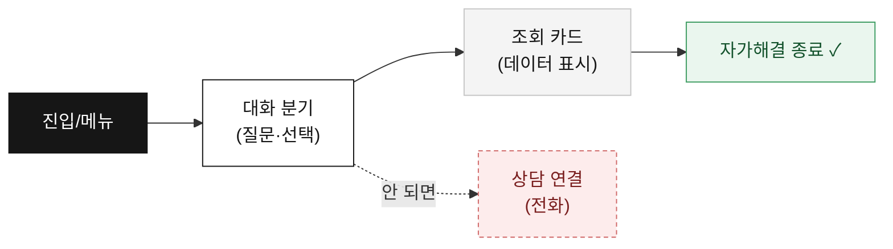
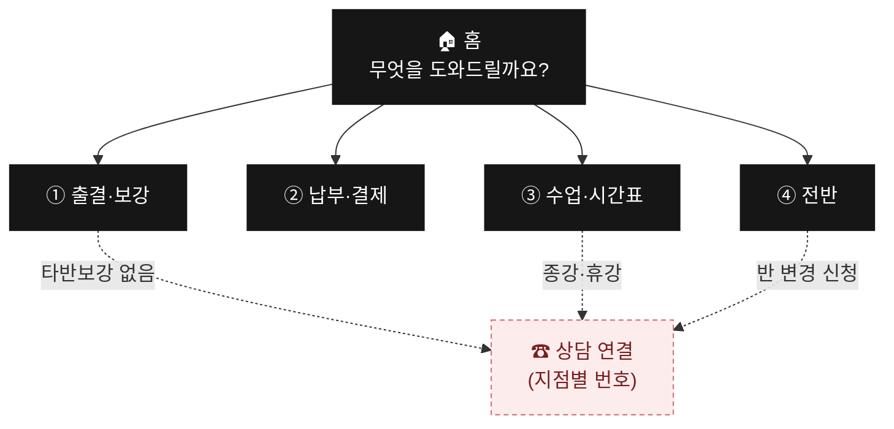
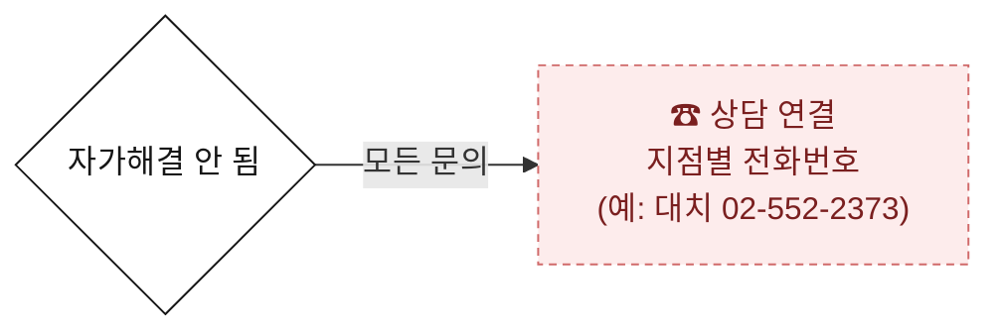
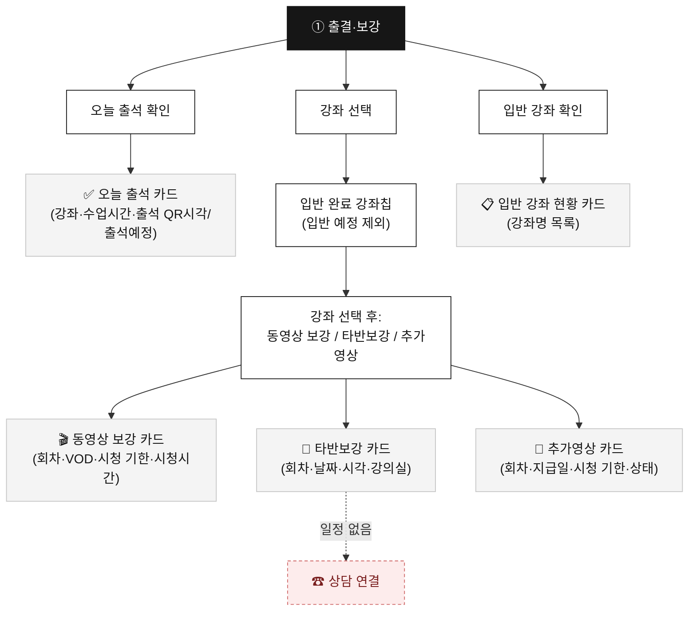
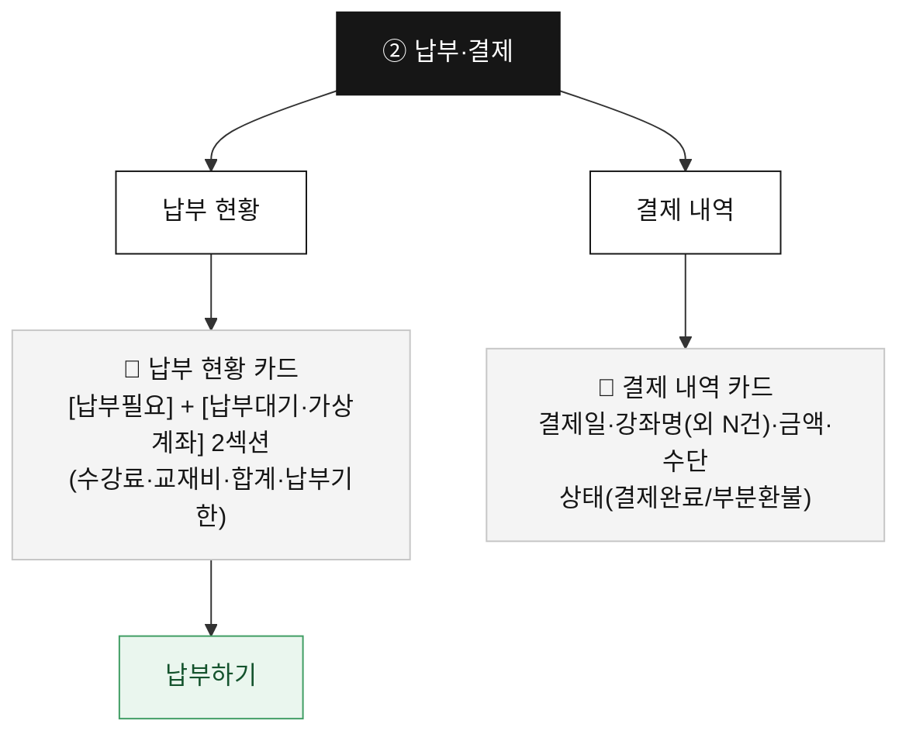
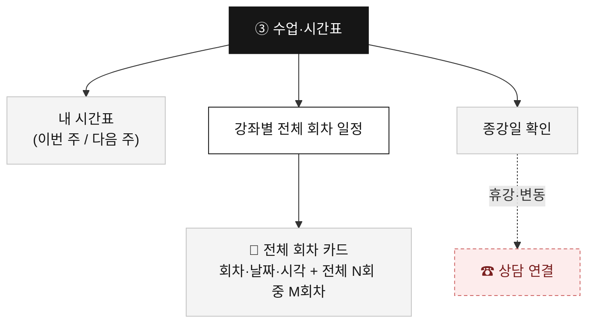
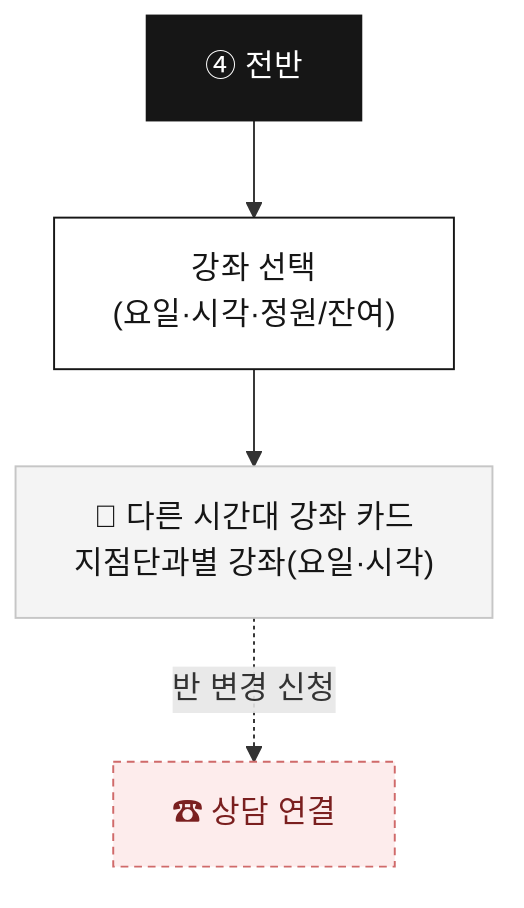
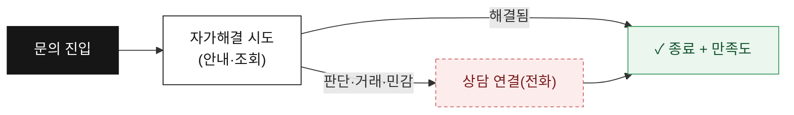

# 마이클래스 챗봇 — 시나리오 기획서 (기획자 검토용)

> ⚠️ 2026-07-02 갱신 — 정본은 v6 4메뉴. SSOT = public/myclass-chatbot.html + 기획서_v6_요약.md. (옛 8메뉴 prototype.html 기록은 폐기)

> **목적**: 챗봇의 전체 대화 시나리오를 한눈에 검토할 수 있게 **플로우(흐름도)·도표**로 정리한 문서.
> **대상 화면**: `public/myclass-chatbot.html`(학생) / `public/myclass-chatbot-parent.html`(학부모) → https://sdij-wiki.vercel.app/chatbot
> **콘텐츠 정본**: `기획서_v6_요약.md`(SERP-8270, 노드별 답변 포맷 §3).
> **원칙**: 모든 안내는 실제 상담 해결방법 근거 · **ZERO 허위정보**(불확실하면 추정 대신 사람에게 연결).

---

## 0. 한 줄 요약

학생·학부모가 **상담원 없이 스스로 문제를 해결(자가해결)** 하게 돕고, 안 되면 **상담 연결(전화)** 로 잇는 챗봇.
챗봇 명칭은 **"마이클래스 도우미"**(서브 "문제를 바로 해결하도록 도와드려요"), 사용자 호칭은 **"상담 선생님"**.
**4개 메뉴**(출결·보강 / 납부·결제 / 수업·시간표 / 전반) · 막다른 길 0 · **상담 연결(전화, 지점별 번호) 단일 채널**.

> **공통 UX(SERP-8270)**: 2Depth 이상 [이전]+[처음으로] 둘 다 · 헤더 [홈] 버튼 삭제(닫기 X만) · 상담 등록 제거→[상담 연결](전화)만.

---

## 🔖 도표 보는 법 (범례)

| 색/모양 | 의미 |
|---|---|
| ⬛ 검정 | 메뉴·진입점 |
| ⬜ 흰색 | 대화 분기(사용자 선택) |
| 🟫 회색 | 조회 카드(데이터 표시 — **실데이터 연동 필요**) |
| 🟩 초록 | 자가해결로 마무리 |
| 🟥 빨강(점선) | 상담 연결(전화) = 핸드오프 |

---

## 1. 진입점 & 종료

### 진입(Entry)
| 진입 | 트리거 | 첫 화면 |
|---|---|---|
| 일반 | 헤더 챗봇 아이콘 클릭 | 홈(4개 메뉴) |
| 결제 맥락 | 결제 화면에서 진입(배너, 선택 구현) | 납부·결제 흐름 |

> 옛 8메뉴의 로그인·특강 진입 배너는 해당 메뉴 삭제로 폐기. 결제 맥락 배너만 선택적으로 유지.

### 종료(Exit)
데이터 조회·자가안내 완료 화면 끝에서 **만족도(👍 해결됐어요 / 👎 아직 안 됐어요)** 수집 → 대화 닫기 또는 상담 연결.
만족도 미노출 = 빈 상태(내역 없음)·순수 상담/전화 종료·진입/선택 화면.

---

## 2. 전체 메뉴 맵 (4메뉴)

> v6에서 옛 계정·로그인·앱 / 라이브·교재·배송 / 입반·등록·대기 / 퇴원 / 상담원·자주묻는것 메뉴는 삭제. 입반 강좌 **확인**만 ① 출결·보강으로 이동.

---

## 3. 채널 라우팅 (상담 연결 단일)

v6는 사람 연결을 **상담 연결(전화, 지점별 번호) 하나로 단순화**(SERP-8270). [상담 등록]·카톡 채널 분기는 폐기.

| 채널 | 담당 | 연결되는 문의 |
|---|---|---|
| **상담 연결** (`handoff`, 전화) | 각 지점 상담실 (클릭 시 지점별 번호 노출) | 타반보강 없음, 종강·휴강 일정, 전반(반 변경 신청), 신규 입반·대기·환불·퇴원 등 판단·거래·민감 전반 |

> 사람 연결 시 호칭은 **"상담 선생님"**. 옛 3채널(대치 상담실 전화·마이클래스 카톡·LIVE 카톡)은 v3 설계 기록으로 폐기.

---

## 4. 메뉴별 상세 플로우 (v6 4메뉴)

> 노드별 답변 포맷·문구·하단 버튼은 `기획서_v6_요약.md §3`가 정본.

### ① 출결·보강

> **입반 강좌 확인**은 옛 '입반·등록·대기' 메뉴에서 이곳으로 이동. 강좌 선택 후 [동영상 보강][타반보강][추가영상]은 항상 3개 고정.

### ② 납부·결제

> **데이터 일관성**: 납부 현황·결제 내역은 수납 DB 단일 출처. 전체완납 시 "모든 수강료가 납부 완료됐어요.", 내역 없음 시 "결제 내역이 없어요."

### ③ 수업·시간표

### ④ 전반 (전반 가능한 강좌 확인하기)

> **설계**: 퇴원 사유 중 '시간 안 맞음'을 전반 대안(지점단과별 다른 시간대 강좌)으로 전환. 신청은 상담 연결.

---

## 5. 조회 카드(데이터) 인벤토리

현재는 **목업(예시 데이터)**. 실서비스 전환 시 아래 카드에 실데이터 연동 필요 → 상세 매핑은 `BACKEND_INTEGRATION.md`.

| 카드 | 메뉴 | 표시 내용 | 실시간 |
|---|---|---|---|
| 오늘 출석 | ① | 강좌·수업시간·출석 QR시각/출석예정 | – |
| 동영상 보강 | ① | 회차·VOD·시청 기한·시청시간 | – |
| 타반보강 | ① | 회차·날짜·시각·강의실 | ⚠ 일정 변동 |
| 추가영상 | ① | 회차·지급일·시청 기한·상태 | – |
| 입반 강좌 현황 | ① | 강좌명 목록 | – |
| 납부 현황 | ② | 납부필요/납부대기·가상계좌 2섹션 | – |
| 결제 내역 | ② | 결제일·강좌·금액·수단·상태(완료/부분환불) | – |
| 내 시간표 | ③ | 요일·강좌·강의실(주 전환) | – |
| 강좌별 전체 회차 | ③ | 회차·날짜·시각·진행 회차 | – |
| 종강일 | ③ | 강좌별 종강일 | – |
| 다른 시간대 강좌(전반) | ④ | 지점단과별 강좌·요일·시각·잔여 | ⚠ 정원 변동 |

> ⚠ **정원·잔여석·타반 일정**은 캐시 금지(분 단위로 변함). API 오류 시 추정 표시 대신 상담 연결.

---

## 6. 자가해결 vs 핸드오프 — 설계 원칙

1. **자가해결 우선** — 조회·안내는 챗봇 안에서 마무리.
2. **불확실하면 사람** — 권한·정산·개인확인이 필요하면 추정하지 않고 상담 연결(전화).
3. **ZERO 허위정보** — 검증 안 된 메뉴 경로·교재명·명칭은 단정하지 않음. 강좌명 축약 금지·실명 유지.
4. **단일 채널** — 사람 연결은 상담 연결(전화, 지점별 번호) 하나(SERP-8270).

---

## 7. 측정 포인트 (효과 검증)

North Star = **자가해결율** = `핸드오프 없이 종료 / 챗봇 오픈`. 상세 이벤트·KPI는 `MEASUREMENT_SPEC.md`.

| 지표 | 의미 |
|---|---|
| 자가해결율 | 챗봇이 실제로 일했는가(디플렉션) |
| 상담 연결율 | 어떤 노드에서 사람에게 가나 |
| 메뉴별 진입·완주 | 어떤 메뉴가 효과/막힘 |
| 이탈 노드 Top | 시나리오 구멍 |
| 만족도(👍/👎) | 체감 품질 |

---

> 본 문서는 **검토·합의용 기획서**입니다. 흐름·문구·채널은 실제 운영 정책에 맞춰 조정하며, 변경 시 SSOT(`public/myclass-chatbot.html` + `기획서_v6_요약.md`)와 본 문서를 함께 갱신합니다.
