# 마이클래스 챗봇 — 시나리오 기획서 (기획자 검토용)

> **목적**: 챗봇의 전체 대화 시나리오를 한눈에 검토할 수 있게 **플로우(흐름도)·도표**로 정리한 문서.
> **대상 화면**: `analysis/myclass-chatbot/prototype.html` (= 배포본 `public/myclass-chatbot.html` → https://sdij-wiki.vercel.app/chatbot )
> **연결 문서**: `FINAL_PROCESS.md`(SSOT) · `BACKEND_INTEGRATION.md`(API 연동) · `MEASUREMENT_SPEC.md`(측정) · `DESIGN_TOKENS.md`(디자인)
> **원칙**: 모든 안내는 실제 상담 해결방법 근거 · **ZERO 허위정보**(불확실하면 추정 대신 사람에게 연결).

---

## 0. 한 줄 요약

학생·학부모가 **상담원 없이 스스로 문제를 해결(자가해결)** 하게 돕고, 안 되면 **정확한 채널로 연결**하는 챗봇.
챗봇 명칭은 **"마이클래스 도우미"**(서브 "문제를 바로 해결하도록 도와드려요"), 사용자 호칭은 **"상담 선생님"**.
8개 메뉴 · 약 81개 대화 상태(막다른 길 0) · 3개 연결 채널로 구성.

---

## 🔖 도표 보는 법 (범례)

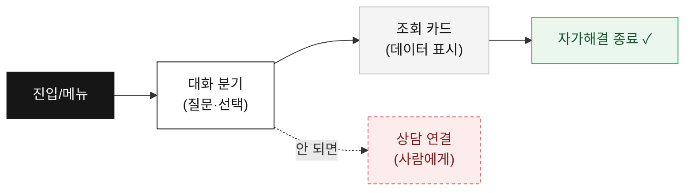

| 색/모양 | 의미 |
|---|---|
| ⬛ 검정 | 메뉴·진입점 |
| ⬜ 흰색 | 대화 분기(사용자 선택) |
| 🟫 회색 | 조회 카드(데이터 표시 — **실데이터 연동 필요**) |
| 🟩 초록 | 자가해결로 마무리 |
| 🟥 빨강(점선) | 사람(상담)에게 연결 = 핸드오프 |

---

## 1. 진입점 & 종료

### 진입(Entry)
| 진입 | 트리거 | 첫 화면 |
|---|---|---|
| 일반 | 헤더 챗봇 아이콘 클릭 | 홈(8개 메뉴 + 자주 찾는 것) |
| 결제 맥락 | 결제 화면에서 진입(배너) | "결제가 안 되시나요?" → 결제 흐름 |
| 로그인 맥락 | 로그인 실패 맥락(배너) | "로그인이 안 되시나요?" → 계정 흐름 |
| 특강 맥락 | 특강 신청 맥락(배너) | "특강 본인인증 도와드릴게요" → 인증 흐름 |

### 종료(Exit)
모든 흐름의 끝에서 **`처음으로` / `다 해결됐어요`** 제공 → '다 해결됐어요' 선택 시 **만족도(👍/👎)** 수집 → 추가 상담 또는 대화 닫기.

---

## 2. 전체 메뉴 맵

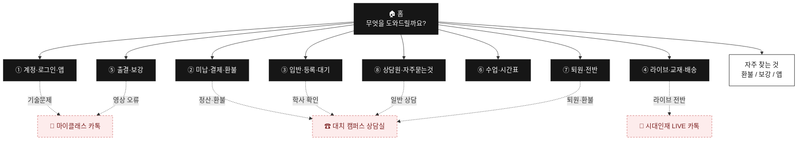

> 홈의 메뉴 노출 순서는 **상담원·자주묻는것**을 마지막에 둬, 우선 자가해결을 유도.

---

## 3. 채널 라우팅 (핸드오프 3종)

어디로 연결하느냐가 챗봇의 핵심. **문제 성격**에 따라 채널이 갈립니다.

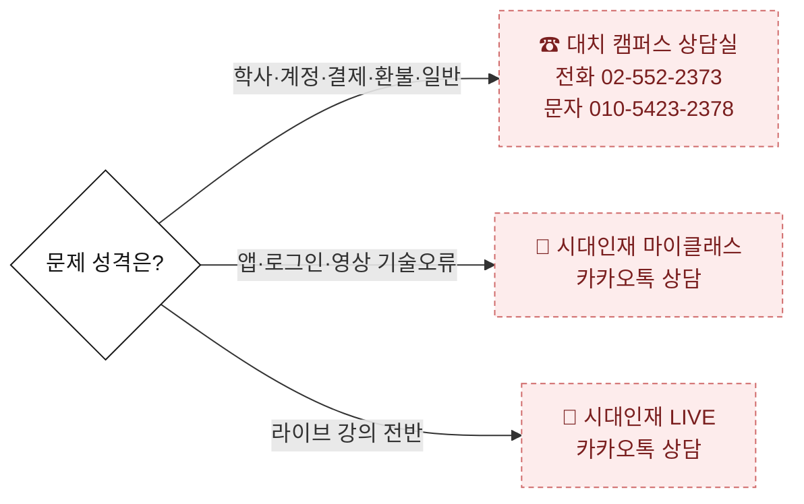

| 채널 | 담당 | 연결되는 문의 |
|---|---|---|
| **대치 캠퍼스 상담실** (`handoff`) | 대치 캠퍼스 고3 상담실 전화 02-552-2373 · 문자 010-5423-2378 | 통합회원·자녀계정, 환불(회차 기준)·오입금, 결제수단(카드) 변경, **납입증명서 발급(상담 선생님이 엑셀 .xlsx)**, 반 변경/전반, 연구소 교재비, 현장보강, 서바이벌 커리큘럼, 종강/휴강, 퇴원, 자습실, 컨설팅, 일반 상담 |
| **마이클래스 카톡** (`handoffTech`) | 기술 담당 pf.kakao.com/_VGAQn | 로그인 실패, 앱 오류(흰화면·튕김·업데이트 후·설치), 영상 재생 오류, 특강 본인인증 문자 미수신 |
| **시대인재 LIVE 카톡** (`handoffLive`) | 라이브 담당 pf.kakao.com/_TkpPG | 라이브 입반·교재 반납·환불·라→현강 이동 등 라이브 서비스 전반 (**기술지원 아닌 라이브 일반 상담**) |

> 사람 연결 시 호칭은 **"상담 선생님"**. 야간(22~08시)에는 핸드오프 시 "문자로 남겨두면 운영 시작 시 먼저 연락" 안내가 자동 추가됨.

---

## 4. 메뉴별 상세 플로우

### ① 계정·로그인·앱

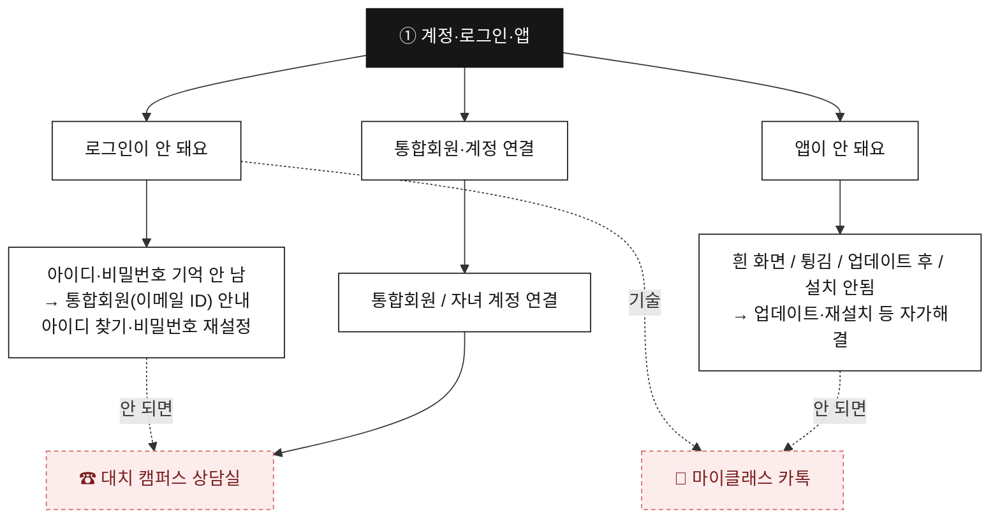

> **정직성 포인트**: 로그인은 **시대인재 통합회원(아이디=이메일+비밀번호)** 기준으로 안내(소셜 로그인 아님).

### ② 미납·결제·환불

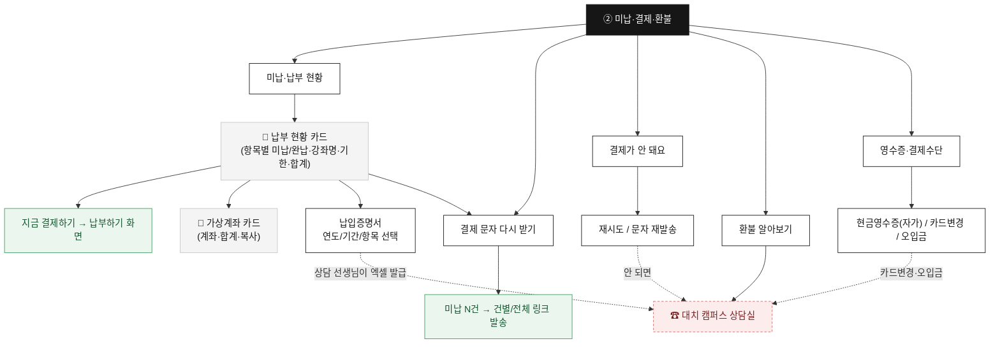

> **데이터 일관성**: 납부 현황·결제 문자·가상계좌는 **하나의 미납 목록(SSOT)** 을 공유 → 미납 여러 건을 모두 동일하게 표시.

### ③ 입반·등록·대기

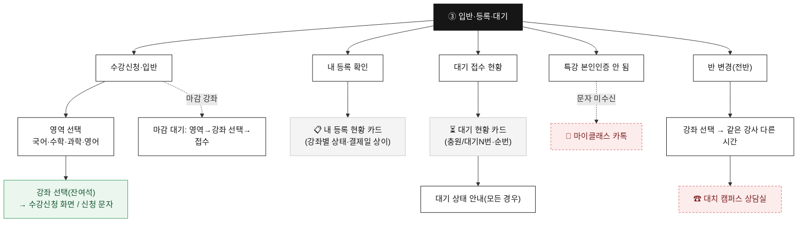

### ④ 라이브·교재·배송

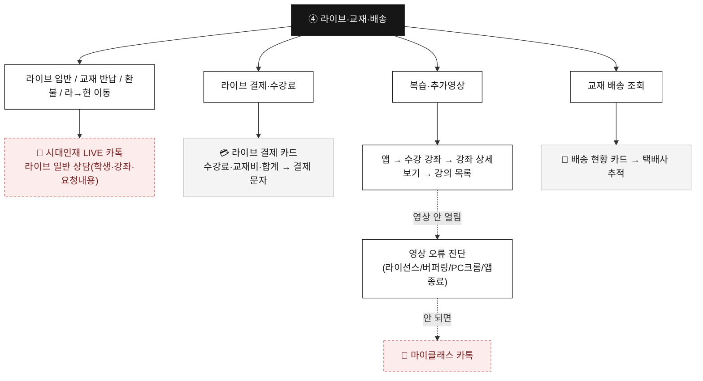

> **정직성 포인트**: 라이브 입반·반납·환불은 **기술지원이 아니라 라이브 일반 상담**으로 연결(요청내용 중심).

### ⑤ 출결·보강

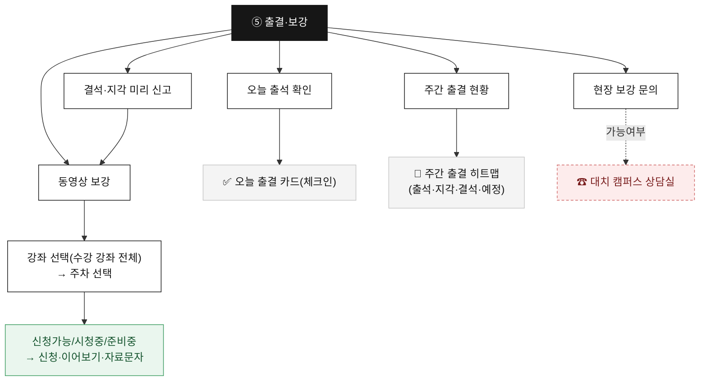

### ⑥ 수업·시간표

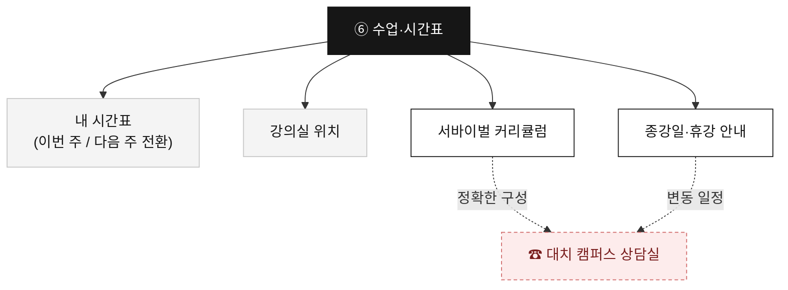

### ⑦ 퇴원·전반 (리텐션)

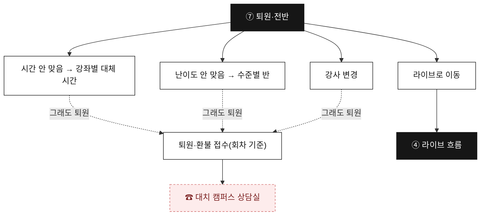

> **리텐션 설계**: 퇴원 의사 → 곧바로 접수하지 않고 **대안(시간·난이도·강사·라이브)** 을 먼저 제시.

### ⑧ 상담원·자주묻는것

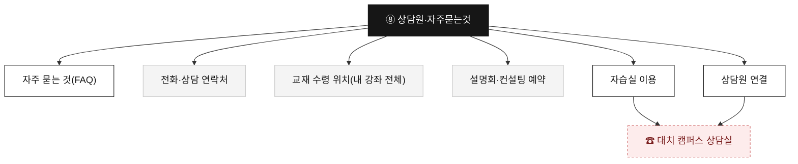

---

## 5. 조회 카드(데이터) 인벤토리

현재는 **목업(예시 데이터)**. 실서비스 전환 시 아래 카드에 실데이터 연동 필요 → 상세 매핑은 `BACKEND_INTEGRATION.md`.

| 카드 | 메뉴 | 표시 내용 | 실시간 |
|---|---|---|---|
| 납부 현황 | ② | 항목별 미납/완납·강좌명·기한·합계 | – |
| 가상계좌 | ② | 은행·계좌·합계·복사 | – |
| 내 등록 현황 | ③ | 강좌별 상태·결제일 | – |
| 대기 접수 현황 | ③ | 충원/대기순번 | ⚠ 분 단위 변동 |
| 교재 배송 | ④ | 상태·택배사·송장 | – |
| 오늘/주간 출결 | ⑤ | 체크인·6주 히트맵 | – |
| 동영상 보강 | ⑤ | 주차별 상태·진도율 | – |
| 내 시간표 | ⑥ | 요일·강좌·강의실(주 전환) | – |
| 강의실/교재 위치 | ⑥⑧ | 강좌별 위치 | – |

> ⚠ **대기순번·잔여석**은 캐시 금지(충원·마감이 분 단위로 변함). API 오류 시 추정 표시 대신 상담 연결.

---

## 6. 자가해결 vs 핸드오프 — 설계 원칙

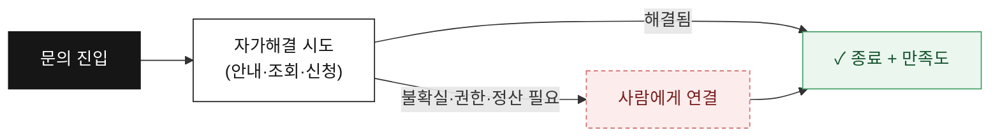

1. **자가해결 우선** — 조회·안내·신청은 챗봇 안에서 마무리.
2. **불확실하면 사람** — 권한·정산·개인확인이 필요하면 추정하지 않고 정확한 채널로.
3. **ZERO 허위정보** — 검증 안 된 메뉴 경로·교재명·명칭은 단정하지 않음.
4. **맥락에 맞는 채널** — 학사=대치 캠퍼스 상담실(상담 선생님) / 앱·영상=마이클래스 카톡 / 라이브=LIVE 카톡.

---

## 7. 측정 포인트 (효과 검증)

North Star = **자가해결율** = `핸드오프 없이 종료 / 챗봇 오픈`. 상세 이벤트·KPI는 `MEASUREMENT_SPEC.md`.

| 지표 | 의미 |
|---|---|
| 자가해결율 | 챗봇이 실제로 일했는가(디플렉션) |
| 채널별 핸드오프율 | 어디로·왜 사람에게 가나 |
| 메뉴별 진입·완주 | 어떤 메뉴가 효과/막힘 |
| 이탈 노드 Top | 시나리오 구멍 |
| 만족도(👍/👎) | 체감 품질 |

---

> 본 문서는 **검토·합의용 기획서**입니다. 흐름·문구·채널은 실제 운영 정책에 맞춰 조정하며, 변경 시 SSOT(`FINAL_PROCESS.md`)와 본 문서를 함께 갱신합니다.
