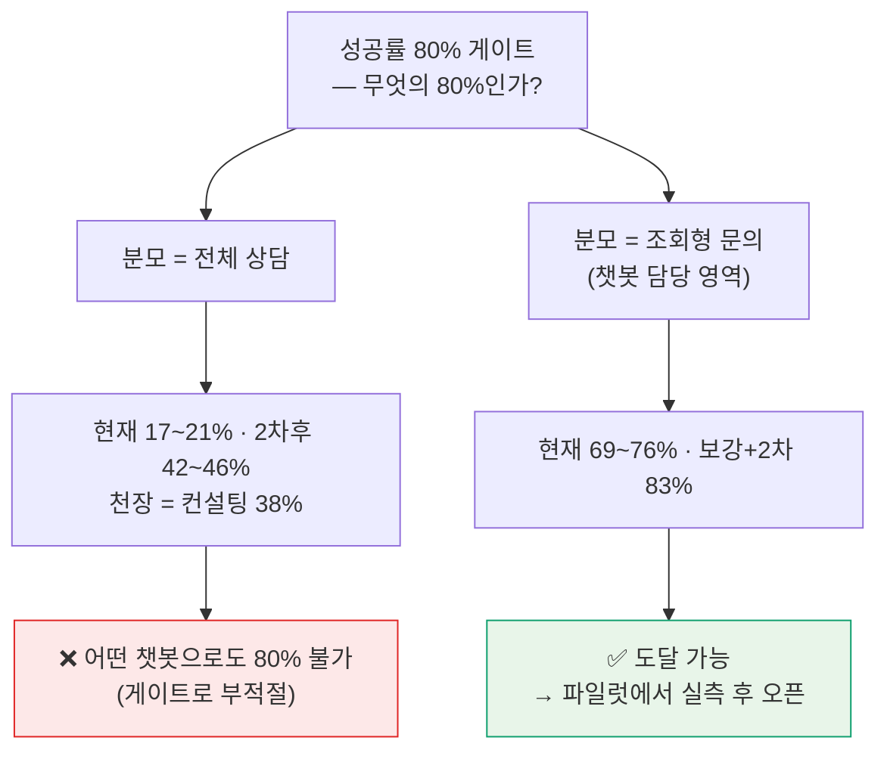
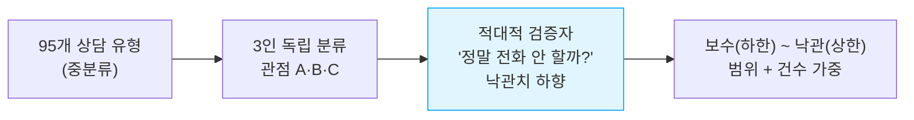
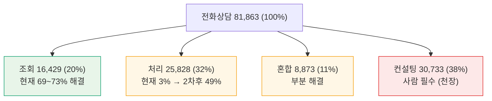
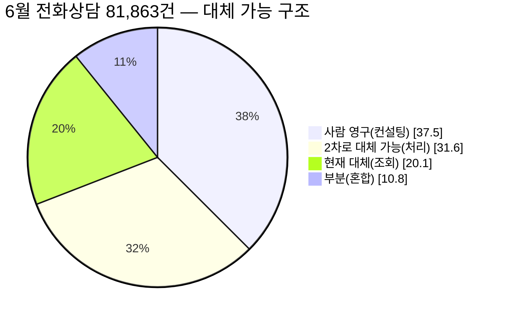
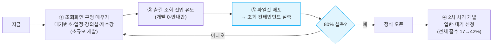
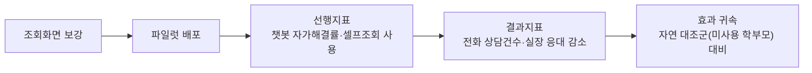

# 마이클래스 챗봇 도입 효과 — 2026년 6월 상담 빅데이터 심층 분석

> **한 줄 요약** — 2026년 6월 한 달간 발생한 **상담 82,025건**(AMS 전화상담 81,863 + 카카오 채팅 162)을 전수 분석한 결과, **현재 챗봇이 다루는 "조회형 문의"에서는 추정 해결률 69~76%**(보강 시 80%대 도달 가능)에 이르지만, **전체 상담 기준으로는 17~23%에 그친다.** 이 격차의 원인은 챗봇 성능이 아니라 **상담의 38%가 사람의 판단이 필요한 "컨설팅"**이라는 구조에 있다. 따라서 정식 오픈의 성공률 게이트(80%)는 **"전체 상담"이 아니라 "챗봇이 담당하는 조회형 문의"를 분모로 정의**하고, **소규모 파일럿에서 실측**해 판정할 것을 권고한다. 또한 이 프로젝트의 목적인 **"상담 실장·채널 대체"** 관점에서는, 챗봇이 현실적으로 가져갈 수 있는 **대체 상한이 전체 상담의 약 42~46%**(2차 완성 시)이며 나머지 38%(컨설팅)는 사람 몫으로 남는다 — **완전 대체가 아니라 반복 상담의 업무 이전**으로 설계해야 한다.

> **이 문서의 신뢰성 원칙(메타인지)** — 본 보고서의 모든 숫자에는 **출처 등급**이 붙어 있다. `[측정]` = 원본에서 직접 집계해 2중 검증한 사실, `[추정]` = 가정 위에 세운 투영치(범위로 제시), `[미측정]` = 현 데이터로는 답할 수 없어 후속 검증이 필요한 항목. **이 셋을 섞지 않는 것**이 이 분석의 가장 중요한 규율이며, 의사결정자는 등급을 함께 읽어야 한다.

| 문서 정보 | |
|---|---|
| **목적** | 마이클래스 챗봇(학생·학부모 등 일반 사용자향)이 **기존 상담 실장·상담 채널을 어디까지 대체**할 수 있는지 데이터로 추정 → **정식 오픈 시점·마일스톤 결정**의 기초자료 |
| **프로젝트 전제** | 챗봇은 **기존 상담 운영(전화·카카오)을 대체**할 수 있어야 의미가 있다. 따라서 성공의 본질 = **"상담 운영을 몇 %까지 가져가는가(대체 범위)"** |
| **독자** | 프로젝트 전 구성원 — PO·PM·디자이너·개발자·운영 |
| **분석 단위** | 2026년 6월 1개월 / 대치단과 단일 지점 / 채널별 분리(전화·카카오) |
| **데이터 성격** | **표본 추출이 아닌 전수(census)** — 해당 기간·지점의 모든 상담 |
| **작성** | 데이터 분석 관점 · 2026-06-30 |
| **어려운 용어** | 본문에서 처음 등장 시 괄호로 풀이 + **별첨 A 용어집** |

---

## 0. 한눈에 보기 (Executive Summary)

| 질문 | 답 | 등급 |
|---|---|---|
| 6월 상담은 몇 건인가? | **82,025건** (전화 81,863 · 카카오 162) | `[측정]` |
| 무엇을 가장 많이 묻나? | **입반(등록) 31.6%** > 출결 26.7% — 6월은 입반 시즌(전월比 +54%) | `[측정]` |
| 상담은 어떤 성격인가? | 조회 20% / 처리 32% / **컨설팅 38%** / 혼합 11% | `[측정·분류]` |
| 현재 챗봇이 전체 상담의 몇 %를 해결하나? | **17.5~21%** (전화) · 23% (카카오) | `[추정]` |
| 챗봇이 담당하는 조회형 문의만 보면? | **69~73%** (전화) · 76% (카카오) | `[추정]` |
| 2차(신청·처리)까지 구현하면? | 전체 42~46% · 조회형 83% | `[추정]` |
| 전체 상담의 80%를 챗봇이 해결 가능한가? | **불가능** — 컨설팅 38%가 구조적 천장 | `[추정·구조]` |
| 그럼 80% 게이트는 어떻게? | **"조회형 컨테인먼트 80%"로 정의 + 파일럿 실측** | 권고 |

### 의사결정 한 장 (분모를 먼저 정하라)

> **핵심 통찰**: "성공률이 몇 %냐"는 질문은 **"무엇을 분모로 두느냐"를 정하기 전에는 답이 없다.** 같은 데이터가 17%도 되고 76%도 된다. 이 보고서의 절반은 그 분모를 올바르게 세우는 일에 관한 것이다.

---

## 1. 이 분석은 무엇을 답하려 하는가 (질문의 정의)

프로젝트는 지금 **"챗봇을 정식 오픈할 때가 됐는가?"** 를 결정해야 한다. 그 판단의 핵심 지표로 **"성공률 80%"** 가 제시됐다. 그래서 이 분석이 답해야 할 질문은:

1. **(현황)** 학원에 실제로 들어오는 상담은 무엇이고, 얼마나 되며, 어떤 성격인가?
2. **(역량)** 현재 개발이 끝난 챗봇은 그 상담을 **얼마나 해결할 수 있는가?**
3. **(게이트)** "80%"는 **무엇을 분모로** 측정해야 의미가 있고, 도달 가능한가?
4. **(레버)** 80%에 닿으려면 **무엇을 더 만들어야** 하는가?

### 메타인지 — 답할 수 있는 질문 / 없는 질문

| 질문 | 이 데이터로 | 이유 |
|---|---|---|
| 6월에 어떤 상담이 얼마나 왔나 | ✅ **답 가능(측정)** | 상담 원장(原帳)을 전수 집계 |
| 각 상담이 챗봇으로 끝날 "성격"인가 | 🟡 **추정 가능** | 상담 분류 라벨로 의도를 판정(분류 오차 존재) |
| 챗봇을 실제로 띄웠을 때의 **진짜 성공률** | ❌ **답 불가(미측정)** | **6월에 챗봇은 배포되지 않았다** → 실제 행동 관측 불가 |

> ⚠️ **세 번째 줄이 이 분석의 가장 중요한 한계다.** "성공률"은 본래 **사용자가 챗봇만으로 문의를 끝낸 비율(= 컨테인먼트)** 을 뜻하며, 이는 **챗봇을 배포해 로그를 봐야만 측정**된다. 6월 데이터로 낼 수 있는 것은 그 성공률의 **"이론적 상한과 구조"** 이지, 측정된 성공률이 아니다. 이 구분을 흐리면 그것이 곧 "허위 분석"이다.

---

## 2. 분석 설계와 신뢰성 (방법론)

### 2-1. 데이터 출처와 처리

| 채널 | 원본 | 규모 | 처리 |
|---|---|---|---|
| **AMS 전화상담**(상담실장 기록) | 암호화 엑셀 2개(6/1\~15, 6/15\~30) | **81,863건** | 복호화 → **번호(고유 상담ID) 중복제거** → 비PII 집계 |
| **카카오 채팅** | 비즈니스 채팅 수집 CSV(원본부터 PII 마스킹) | 1,468 메시지 / **162 대화** | 채팅ID로 대화 묶음 → 의도 1개로 분류 |

- **PII(개인식별정보, Personally Identifiable Information = 이름·전화·상담 원문)는 저장소에 반입하지 않는다.** 로컬에서만 처리 후 폐기하고, 산출물은 **집계·빈도뿐**이다.

### 2-2. 측정값의 검증 (신뢰도: 높음)

`[측정]` 등급 수치는 **서로 다른 2개 코드 경로(openpyxl·pandas)로 독립 재집계해 1건 단위까지 일치**함을 확인했다. 예: 총 81,863건·입반 25,867건·전화 94.9% 등 16개 핵심 항목이 양쪽에서 동일. 또한 6월 대분류·총건수는 이전 스냅샷의 독립 생성 집계와도 교차 일치한다.

### 2-3. 추정값의 산출 (신뢰도: 중간, 범위로 제시)

"챗봇이 이 문의를 해결하는가"는 판단이 개입하므로, **단일 추정치 대신 다음 절차로 범위를 만든다.**

1. **3인 독립 분류** — 보수적 운영자·제품 PM·데이터 분석가의 세 관점이 각 유형을 챗봇 실제 화면에 대조해 `현재 해결률`·`2차후 해결률`을 0~100으로 추정(서로 모름).
2. **적대적 검증(adversarial review)** — *"조회 전용 봇이 정말 사람 없이 끝낼까? 학부모가 정보만 보고 진짜 전화를 안 할까?"* 를 기준으로 **부풀려진 낙관치를 강제 하향**.
3. **최종 = `min(분류 중앙값, 적대검증치)`(보수) ~ 분류 중앙값(낙관)** 의 범위, 건수 가중 평균.
4. **챗봇 역량 기준** = v6 기획서. 현재 챗봇은 **100% 조회(lookup) 전용**이며, 신청·결제·취소·변경·접수 등 "처리 액션"은 전부 미구현(2차 예정).

> **왜 이렇게까지 하나(메타인지)** — 이 숫자는 오픈 시점을 좌우한다. 분석자 1인의 낙관이 80%를 만들어내면 잘못된 오픈으로 이어진다. 그래서 **일부러 깎는 검증자**를 붙이고 **범위로** 제시한다. 분류 산출물 전체는 `data/2026-06_AMS_성공률_분류.csv`로 공개해 **누구나 감사**할 수 있다.

### 2-4. 분류 신뢰도의 한계

- 같은 중분류 라벨 안에도 조회·처리가 섞일 수 있다(예: "미납상담"엔 단순 조회와 분납 협의가 공존) → 그래서 단일값이 아닌 **범위**로 제시했다.
- 카카오는 표본이 작아(162) 비중 ±1~2%p는 유의미하지 않다. **순위·구조 파악용**이다.

---

## 3. 데이터 개요 — 6월 상담의 규모 `[측정]`

| 지표 | AMS 전화상담 | 카카오 채팅 |
|---|---|---|
| 총량 | **81,863건** | 162 대화 (1,468 메시지) |
| 기간 | 6/1 ~ 6/30 (30일, 전수) | 6월 전수 |
| 접수 채널 | 전화 **94.9%** · 방문 3.3% · 문자 1.8% | 100% 카카오 |
| 상담 대상 | 학부모 **92.9%** · 학생 7.1% | 본문 정황상 학부모 多 |
| 처리 상태 | **100% 처리완료** (적체 0) | — |
| 응대 인력 | 상담 실장 **158명**(상위 5명 11.6%로 부하 분산) | 상담원 |

> **규모 감각(비유)** — 전화 상담만 **하루 평균 2,729건**. 158명의 실장이 1인당 하루 약 17건을 받아 그날 100% 소화한다. 적체는 없으나(운영 품질 양호), **볼륨 자체가 비용**이다. 챗봇의 가치는 "밀린 일을 푸는 것"이 아니라 **"반복 조회를 사람에게서 떼어내는 것"** 에 있다.

> **두 채널은 30배 규모 차이**다(전화 81,863 vs 카카오 162). 따라서 **효과 측정의 주 무대는 전화 채널**이며, 카카오는 "디지털 접점에서 무엇이 터지는가"를 보는 보조 렌즈다. **두 채널은 끝까지 분리해 읽는다.**

---

## 4. 다각(多角) 분석 — 다섯 개의 렌즈

### 4-1. 무엇을 묻는가 — 카테고리 `[측정]`

| 순위 | 대분류 | 건수 | 비중 |
|---|---|---:|---:|
| 1 | **입반 상담**(등록) | 25,867 | **31.6%** |
| 2 | **출결 관리** | 21,852 | **26.7%** |
| 3 | 대기자 관리 | 9,658 | 11.8% |
| 4 | LIVE | 7,289 | 8.9% |
| 5 | 정산·수납 | 6,962 | 8.5% |
| 6 | 퇴원 상담 | 4,175 | 5.1% |
| 7~ | 설명회·재원·기타·교재·마이클래스·컴플레인 | 6,060 | 7.4% |

→ **입반 + 대기 = 35,525건(43.4%)** 이 6월 최대 덩어리. 이는 다음 렌즈(시계열)와 결합해 "입반 시즌"으로 해석된다.

### 4-2. 어떤 성격인가 — 의도 구조 `[측정·분류]` ★ 성공률의 토대

상담을 "챗봇이 다룰 수 있는 성격"으로 나누면:

| 의도 유형 | 건수 | 비중 | 정의 | 챗봇 관계 |
|---|---:|---:|---|---|
| **조회** | 16,429 | **20.1%** | 정보만 보여주면 끝 | ✅ 현재 챗봇의 본령 |
| **처리** | 25,828 | **31.6%** | 신청·등록·결제·취소·접수 등 **액션 필요** | 🟡 2차 구현 시 |
| **컨설팅** | 30,733 | **37.5%** | 사람의 판단·영업·컴플레인 | ❌ 구조적으로 사람 |
| **혼합** | 8,873 | **10.8%** | 조회+처리 공존 | 부분 |

> **이 표 하나가 성공률의 천장을 결정한다.** 챗봇이 아무리 완벽해도 **컨설팅 37.5%(입반 상담의 "어느 반·자리·레벨이 맞나" 같은 판단)는 떼어낼 수 없다.** 그래서 "전체 상담의 80% 해결"은 **데이터 구조상 불가능**하다. 이것은 추정의 불확실성 문제가 아니라 **구조의 문제**다.

### 4-3. 언제 묻는가 — 시계열 `[측정]`

**(가) 전월 대비(MoM, Month-over-Month = 직전 달 같은 기준과 비교)**

| 대분류 | 5월(전체) | 6월(전체) | 변화 |
|---|---:|---:|---:|
| 전체 | 68,939 | 81,863 | **+18.7%** |
| 입반 상담 | 16,834 | 25,867 | **+54%** |
| 대기자 관리 | 3,116 | 9,658 | **+210%** |
| 출결 관리 | 21,804 | 21,852 | +0.2% |
| LIVE | 9,206 | 7,289 | −21% |
| 퇴원 상담 | 6,402 | 4,175 | −35% |

→ **입반·대기 폭증 + LIVE·퇴원 급감** = 여름 정규 시즌 등록기 진입의 전형. 6월의 상담 구조는 "기존 수강 정리"에서 "신규 등록"으로 무게중심이 옮겨갔다.

**(나) 요일 패턴 — 주말이 평일의 1.5배**

| 월 | 화 | 수 | 목 | 금 | **토** | **일** |
|---:|---:|---:|---:|---:|---:|---:|
| 12,323 | 11,511 | 9,760 | 9,331 | 10,083 | **14,825** | **14,030** |

→ **토·일이 가장 바쁘다.** 학부모가 주말에 상담을 몰아서 한다. 사람 상담실은 주말 응대에 한계가 있는 반면 **챗봇은 24시간** → 주말이 챗봇 가치가 가장 큰 구간이다.

### 4-4. 누가 묻는가 — 대상·학년 `[측정]`

- **학부모 92.9%** : 학생 7.1% → **학부모용 챗봇 UX가 핵심**(이미 학부모 버전 보유).
- 학년: **고2 30.7%** · 고3 27.3% · 고1 18.5% · N수 14.5% · 중3 6.5%. 전(全)기간 1위는 고3이나 **6월은 고2가 1위** → 예비 고3(현 고2) 여름 등록이 6월 입반 폭증의 실체.

### 4-5. 어디서 묻는가 — 채널 비교 `[측정+추정]`

| | AMS 전화 | 카카오 채팅 |
|---|---|---|
| 6월 볼륨 | 81,863 | 162 |
| 1위 문의 | 입반 31.6% | 입반·등록 17.3% |
| 고유 통증 | 컨설팅 비중 큼(38%) | **계정·번호 꼬임 22%** |
| 조회형 추정 성공률 | 69~73% | 76% |

→ 두 채널 모두 **1위가 입반**으로 일치(시즌성 공통). 그러나 **막는 지점이 다르다**: 전화는 컨설팅이 천장이고, 카카오는 "앱이 나를 못 알아봄(계정 꼬임)"이 천장이다(아래 5-3).

---

## 5. 핵심 분석 — 챗봇 해결가능률(성공률) `[추정]`

### 5-1. 분모별 성공률 (전화 채널)

**"무엇을 분모로 두느냐"에 따라 숫자가 완전히 달라진다.** 이것이 80% 게이트 판정의 전부다.

| 분모 | 건수 | 현재(추정) | 2차후(추정) | 의미 |
|---|---:|---:|---:|---|
| **A. 전체 상담** | 81,863 | **17.5~21%** | **42~46%** | 전화 콜 전체를 챗봇이 흡수하는 비율 |
| B. 비(非)컨설팅 | 51,130 | 26~30% | 60~63% | 자동화 가능 영역 기준 |
| **C. 조회 전용**(설계 핵심) | 16,429 | **69~73%** | **83%** | 챗봇이 담당하는 조회 문의의 컨테인먼트 |

### 5-2. 정직한 해석

- **전체 기준(A)**: 현재 추정 17.5~21%. 2차(처리)를 모두 만들어도 **42~46%가 천장** — 컨설팅 38%는 챗봇이 못 한다. → **전체 콜의 80% 해결은 불가능.**
- **조회 기준(C)**: 챗봇이 잘하는 영역(출결·동영상보강·시간표·출석부 조회)에서는 현재도 **69~73%**, 미구현 조회화면 보강 시 **83%**. → **"챗봇 담당 영역의 컨테인먼트 80%"는 도달 가능선.**
- 조회 영역이 아직 69%인 이유 = **일부 조회 화면이 미구현**(대기 번호 확인 1,335건, 설명회/컨설팅 일정 287건, 강의실 안내 171건, 재수강 확인 360건). **이것만 메워도 조회 컨테인먼트가 80%대로 올라간다.**

### 5-3. 카카오 채널 (별도) `[추정]`

| 분모 | 대화 | 현재 | 2차후 |
|---|---:|---:|---:|
| 전체 | 162 | 23% | 49% |
| 조회 전용 | 25 | **76%** | 85% |

> **카카오 고유의 천장 — 계정·번호 꼬임 22%(36 대화).** 조회 챗봇의 전제는 "앱이 사용자를 알아보고 내 데이터를 보여준다"인데, 이 22%는 **바로 그 전제가 깨진 사람들**("앱에서 내 정보가 안 보여요")이다. → 이들에겐 **챗봇을 띄워도 보여줄 데이터가 없어 실패**하고, **2차로도 못 고친다.** 원인은 챗봇이 아니라 **가입·접수 단계의 번호 매칭**이다. **이 22%의 레버는 챗봇이 아니라 접수 프로세스 수정**이다.

### 5-4. ★ 대체 가능 범위 (Replacement Ceiling) — 이 프로젝트의 본질

이 프로젝트의 목적은 챗봇이 **기존 상담 실장·상담 채널을 대체**하는 것이다. 그러므로 가장 중요한 질문은 *"챗봇이 사람 상담 운영을 **몇 %까지 가져갈 수 있는가**"* 이다. 위 분석을 이 질문으로 다시 읽으면:

| 단계 | 챗봇이 대체하는 상담(전화 기준) | 비중 | 남는 사람 몫 |
|---|---|---:|---|
| **현재(조회 전용)** | 조회형 일부 | **17.5~21%** | 79~82% |
| **2차(처리)까지 구현** | 조회 + 신청·접수·결제 처리 | **42~46%** | 54~58% |
| **이론적 상한** | 위 + 혼합 일부 | **약 50%** | 컨설팅 38%는 영구히 사람 |

> **정직한 결론(이 보고서에서 가장 중요한 한 문장)** — **챗봇은 상담 실장을 "완전 대체"할 수 없다.** 상담의 **약 38%(컨설팅)는 사람의 판단**이라 어떤 챗봇으로도 대체 불가다. 챗봇이 현실적으로 가져갈 수 있는 **대체 상한은 전체의 약 42~46%**(2차 완성 시)다.
>
> → 따라서 프로젝트 성공 기준을 **"상담 운영의 완전 대체"로 잡으면 달성 불가**, **"반복 조회·처리(전체의 ~45%)를 챗봇으로 이전해 실장이 컨설팅(고부가 상담)에 집중하게 한다"로 잡으면 달성 가능**하다. 이는 **인력 감축이 아니라 업무 이전(workload shift)** 으로 읽는 것이 정확하다 — 158명의 실장이 반복 조회에서 풀려나 38%의 컨설팅에 집중하는 구조.
>
> **카카오 채널도 동일**: 조회는 대체 가능하나, 고유 통증인 계정·번호 꼬임 22%는 챗봇이 아니라 접수 프로세스가 대체해야 한다.

---

## 6. 80% 오픈 게이트 — 판정과 시나리오

| 80%의 정의(분모) | 현재 추정 | 도달 경로 | 판정 |
|---|---|---|---|
| 전체 전화상담의 80% | 17~21% | 2차 다 만들어도 42% 천장 | **❌ 구조적 불가** |
| 비컨설팅 문의의 80% | 26~30% | 2차후 60%대 | 🟡 어려움 |
| **조회형 컨테인먼트 80%** | 69~73% | 조회화면 보강 + 2차 → 83% | **✅ 권고 — 도달 가능** |

### 권고 (게이트 정의 + 검증 설계)
1. **오픈 게이트 = "조회형 문의 컨테인먼트 80%"로 정의.** "전체 콜 80%"는 챗봇 한 제품으로 불가능하므로 게이트로 부적절하다.
2. **미구현 조회 화면 보강**(§5-2) → 조회 컨테인먼트 추정 80%+ 확보.
3. **소규모 파일럿 배포 → 실제 컨테인먼트를 로그로 실측**(이게 `[미측정]`을 `[측정]`으로 바꾸는 유일한 길) → 80% 확인 시 정식 오픈.
4. **2차(입반·대기 신청 처리)는 별도 마일스톤** — 전체 흡수율을 17%→42%로 끌어올리는 진짜 레버(인프라 홀딩 해소 후 착수).

---

## 7. 포지션별 시사점 (다층·多層)

> 같은 분석을 각 역할이 "내 일"로 번역할 수 있도록 정리한다.

| 포지션 | 이 데이터가 말하는 것 | 다음 행동 |
|---|---|---|
| **PO** | 챗봇은 상담 운영을 **완전 대체 불가**(컨설팅 38%는 사람), **대체 상한 ~45%**. 성공 기준을 "완전 대체"가 아니라 **"반복 상담 업무 이전"** 으로 정의해야 함. 전체 콜 80%는 불가, 조회 컨테인먼트 80%는 가능. | 성공 기준·게이트 분모 확정, 파일럿 범위·KPI 승인 |
| **PM** | 6월 최대는 입반(시즌). 단기 ROI = **출결 조회 진입 유도**(개발 0). 조회 컨테인먼트 80% 차이는 **미구현 조회화면 4종**이 만든다. | 조회화면 보강 백로그 우선순위화, 파일럿 일정 |
| **디자이너** | 학부모 93%·주말 피크·전화 95%. 조회 결과를 **"전화 대신 챗봇으로 끝나게"** 만드는 종료 설계가 성공률의 본질. 카카오는 **계정 꼬임 셀프해결 동선**이 별도 과제. | 학부모·주말 맥락 종료 플로우, 계정복구 안내 UX |
| **개발자** | 챗봇은 100% 조회 전용. 성공률 천장을 올리는 건 **(a) 미구현 조회화면 (b) 2차 처리(신청/접수/결제) 인프라**. 측정엔 **컨테인먼트 로그(세션 종료·핸드오프 이벤트)** 가 필요. | 조회화면 구현, 컨테인먼트 계측 이벤트 설계 |

---

## 8. 권고 로드맵 (레버·우선순위)

| 레버 | 효과 | 비용 | 시점 |
|---|---|---|---|
| ① 조회화면 보강 | 조회 컨테인먼트 69→80%대 | 소 | 오픈 전 |
| ② 출결 조회 진입 유도 | 출결 콜 즉시 분산 | 0(안내) | 즉시 |
| ③ 파일럿 실측 | 게이트 판정 | 소 | 오픈 직전 |
| ④ 2차 처리 개발 | 전체 흡수 17→42% | 대 | 오픈 후 |

---

## 9. 한계와 다음 단계 (메타인지)

### 이 분석이 보지 못한 것 / 틀릴 수 있는 조건
1. **성공률은 추정이다.** 챗봇 미배포라 실제 컨테인먼트는 `[미측정]`. → **파일럿이 유일한 검증.**
2. **단일 지점(대치단과)·1개월.** 타 지점·계절(시험기간 등)에선 카테고리 구성이 달라질 수 있다.
3. **분류 오차**: 중분류 라벨 기반이라 같은 라벨 내 조회/처리 혼재 → 범위로 완화했으나 ±존재.
4. **상담 원문 미사용**(PII) → 의도를 라벨로만 추정. 원문 기반 정밀 분류 시 수치가 일부 이동할 수 있다.
5. **카카오 표본 작음(162)** → 구조 파악용, 절대수치 과신 금지.

### 다음 단계 (측정 사슬)

- **게이트 KPI 제안** = "조회형 세션 컨테인먼트율"(사람 핸드오프 없이 종료한 비율). 이 값이 파일럿에서 80%면 오픈.
- 배포 후 **선행지표→결과지표** 사슬로 실제 콜 감소를 측정하고, **챗봇 미사용군과 비교**해 효과를 귀속한다(자연 대조군).

---

## 별첨 A. 용어집

| 용어 | 풀이 |
|---|---|
| **AMS** | 학원 운영 시스템(Academy Management System). 상담 실장이 전화·방문 상담을 기록하는 원장(原帳). |
| **컨테인먼트(containment)** | 챗봇 세션이 **사람 상담원에게 넘기지 않고 챗봇 안에서 종료된 비율**. 챗봇 성공률의 표준 지표. |
| **흡수/전환(deflection)** | 사람 상담으로 갈 문의를 챗봇이 대신 처리해 **전화·상담을 줄이는 효과**. |
| **조회 / 처리 / 컨설팅** | 상담 의도 3분류. 조회=정보만 보면 끝, 처리=신청·결제·취소 등 액션 필요, 컨설팅=사람 판단·상담. |
| **1차 / 2차** | 챗봇 범위 단계. 1차=내 정보 조회(구현 완료), 2차=조회 후 직접 신청·변경 처리(미구현·예정). |
| **MoM** | Month-over-Month. **직전 달 동일 기준 대비** 증감. |
| **대분류 / 중분류** | 상담 카테고리 2단계. 대분류 12종(입반·출결 등), 중분류 95종(동영상보강 문의 등). |
| **PII** | 개인식별정보(Personally Identifiable Information) = 이름·전화·이메일·상담 원문. 본 분석은 미반입. |
| **적대적 검증(adversarial review)** | 추정치를 **일부러 반박·하향**시켜 낙관 편향을 제거하는 검증 방식. |
| **중앙값 / 보수·낙관** | 여러 추정의 가운데 값. 보수=하한(적대검증 반영), 낙관=상한(분류 중앙값). |
| **전수(census) / 표본(sample)** | 전수=대상 전체를 다 봄(본 분석), 표본=일부만 추출. 전수라 표본오차가 없다. |
| **파일럿(pilot)** | 정식 오픈 전 **소규모로 먼저 배포**해 실제 지표를 측정하는 시범 운영. |
| **선행지표 / 결과지표** | 선행=원인 가까운 조기 신호(챗봇 사용률), 결과=최종 목표(콜 감소). |
| **자연 대조군** | 실험을 위해 인위로 나누지 않고, **자연히 챗봇을 안 쓴 집단**을 비교군으로 삼는 것. |
| **입반 / 전반 / 대기 / 보강** | 입반=강좌 등록, 전반=반 변경, 대기=정원 초과 시 대기 등록, 보강=결석분 동영상·타반 수업 보충. |
| **VOD / 가상계좌** | VOD=주문형 영상(동영상 보강). 가상계좌=입금 전용 계좌(납부 대기). |

## 별첨 B. 의도 분류 기준 (조회/처리/컨설팅)

- **조회(R)**: 챗봇이 본인 데이터를 보여주면 끝나는 문의. 예) 출석 현황, 동영상보강 시청기한, 시간표, 종강일, 결제 내역, 납부 현황, 입반된 강좌 확인.
- **처리(P)**: 사용자가 **무언가를 실행**해야 끝나는 문의. 예) 신규 입반 신청, 대기 접수·취소, 환불·취소, 결제 실행, 반 변경 신청. → 현재 챗봇은 조회만 가능하므로 결국 사람에게 감(2차 구현 시 해결).
- **컨설팅(C)**: 사람의 판단·상담·영업·컴플레인. 예) "어느 반·레벨이 맞나", 난이도·강사 상담, 설명회·컨설팅 예약, 불만 접수. → 챗봇 부적합.
- **혼합(M)**: 한 유형 안에 조회와 처리가 공존(예: 미납상담 = 금액 조회 + 분납 협의).

## 별첨 C. 재현 방법 & 데이터 사전

| 항목 | 값 |
|---|---|
| AMS 복호화 | 암호 → `msoffcrypto` 복호화 → 번호 중복제거 → 비PII 집계 |
| 측정 검증 | openpyxl·pandas **2중 독립 재집계**, 16개 항목 1:1 일치 |
| 성공률 분류 | 95개 중분류 × (3인 독립분류 + 적대검증), 산출물 `data/2026-06_AMS_성공률_분류.csv` |
| AMS 주요 열 | 번호·접수일·접수형태·상담대상·대분류·중분류·학년·상품명·처리상태·접수자 (PII 열 미사용) |
| 연계 문서 | [AMS 상담 분석](2026-06_AMS상담_분석리포트.md) · [카카오 상담 분석](../kakao-collect/2026-06_상담분석_리포트.md) |

---

*본 문서의 모든 `[측정]` 수치는 2중 검증을 거쳤고, `[추정]` 수치는 범위와 가정을 함께 명시했다. 진짜 성공률(`[미측정]`)은 파일럿 배포 후 실측으로만 확정된다. — 데이터 분석 관점, 2026-06.*
