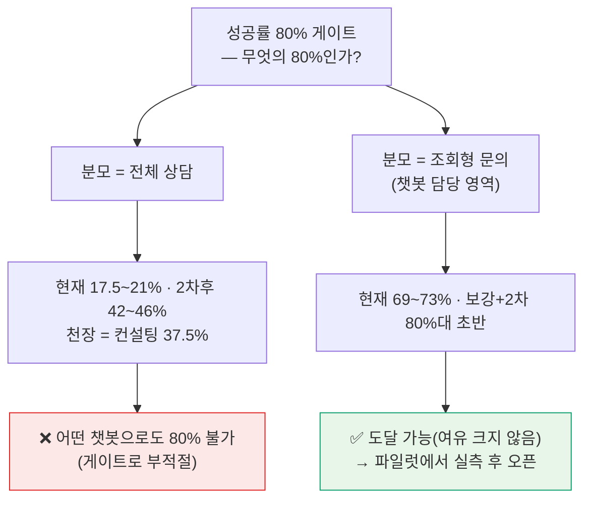
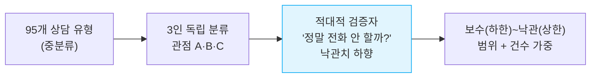
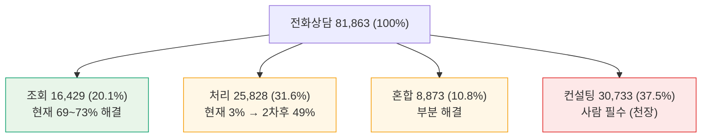
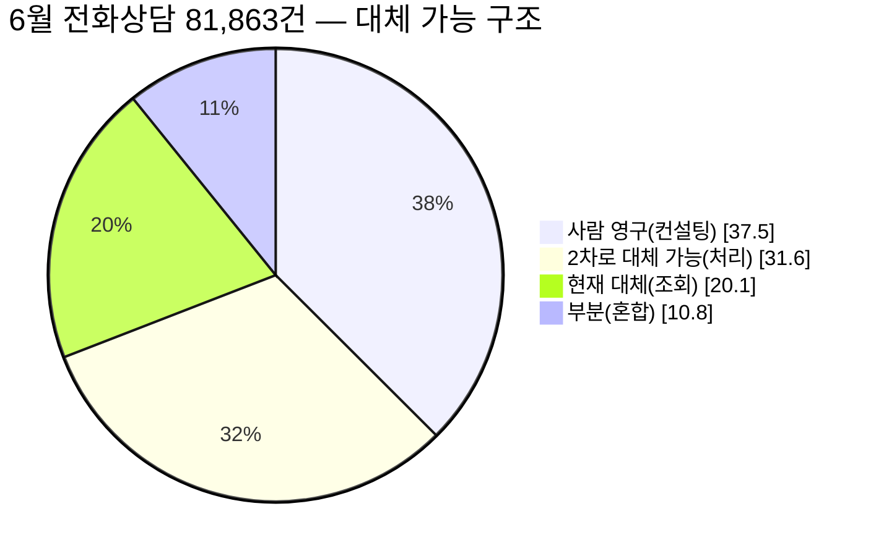
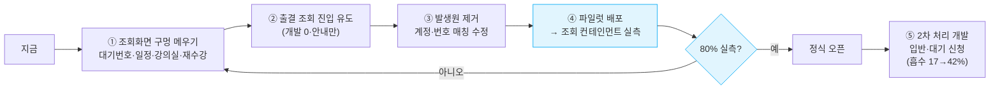
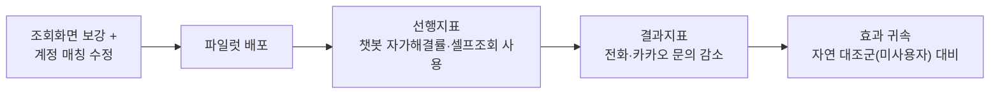

# 마이클래스 챗봇 도입 효과 — 2026년 6월 상담 빅데이터 심층 분석

> **한 줄 요약** — 2026년 6월 상담을 전수 분석했다(**AMS 전화 81,863건 + 카카오 채팅 162대화**, 단위가 달라 합산하지 않음). 챗봇은 **상담 실장의 컨설팅(전화 상담의 37.5%)을 대체할 수 없다** — 사람의 판단 영역이다. 따라서 이 프로젝트의 진짜 관건은 **"카카오톡 기술지원 채널을 챗봇이 어디까지 대체하느냐"** 다. 카카오 채널은 컨설팅 비중이 낮아 **제품(챗봇+계정수정)으로 대체 가능한 비율이 전화보다 구조적으로 높지만**, 그 채널 통증의 절반(계정·번호 꼬임 22%)은 챗봇이 아니라 **가입·접수 프로세스 수정**이 담당해야 한다. 정식 오픈의 80% 게이트는 **"전체 상담"이 아니라 "챗봇이 담당하는 조회형 문의"를 분모로 정의**하고 **소규모 파일럿에서 실측**해 판정할 것을 권고한다.

> **이 문서의 신뢰성 원칙(메타인지)** — 모든 숫자에 **출처 등급**을 붙인다. `[측정]`=원본에서 직접 집계해 2중 검증한 사실, `[추정]`=가정 위에 세운 투영치(범위로 제시), `[미측정]`=현 데이터로 답할 수 없어 후속 검증이 필요한 항목. **이 셋을 섞지 않는 것**이 이 분석의 가장 중요한 규율이다.

| 문서 정보 | |
|---|---|
| **목적** | 마이클래스 챗봇(학생·학부모 등 일반 사용자향)이 **기존 상담 채널을 어디까지 대체**할 수 있는지 추정 → **정식 오픈 시점·마일스톤 결정** 기초자료 |
| **프로젝트 전제** | 챗봇은 **상담 운영을 대체**할 수 있어야 의미가 있다. 단 **상담실장 컨설팅 대체는 불가**(사람 판단) → 관건은 **카카오톡 기술 채널 대체율** |
| **독자** | 프로젝트 전 구성원 — PO·PM·디자이너·개발자·운영 |
| **분석 단위** | 2026년 6월 1개월 / 대치단과 단일 지점 / **채널별 분리**(전화·카카오) |
| **데이터 성격** | **표본이 아닌 전수(census)** — 해당 기간·지점의 모든 상담 |
| **작성** | 데이터 분석 관점 · 2026-06-30 · 어려운 용어는 **별첨 A 용어집** |

---

## 0. 한눈에 보기 (Executive Summary)

| 질문 | 답 | 등급 |
|---|---|---|
| 6월 상담량은? | **전화 81,863건** + **카카오 162대화** (단위 상이, 합산 불가) | `[측정]` |
| 무엇을 가장 많이 묻나? | 전화: **입반 31.6%** > 출결 26.7% — 6월은 입반 시즌(전월比 +54%) | `[측정]` |
| 전화 상담의 성격은? | 조회 20.1% / 처리 31.6% / **컨설팅 37.5%** / 혼합 10.8% | `[측정·분류]` |
| 챗봇이 전화 상담 전체의 몇 %를 해결? | **17.5~21.0%**(2차후 42.3~45.6%) | `[추정]` |
| 챗봇이 담당하는 조회형만 보면? | **69.3~73.1%**(2차후 82.9~83.5%) | `[추정]` |
| 카카오 기술 채널은 얼마나 대체? | 조회형 컨테인먼트 76% / 단 계정 22%는 프로세스 수정 必 | `[추정]`·표본 n=162 |
| 전체 상담의 80%를 챗봇이 해결 가능? | **불가** — 컨설팅 37.5%가 구조적 천장 | `[추정·구조]` |
| 그럼 80% 게이트는? | **"조회형 컨테인먼트 80%"로 정의 + 파일럿 실측** | 권고 |
| 챗봇 실제 준비도는? | **론칭 블로커 0** · 1차 조회 4메뉴 동작 · 경미 5건 수정 후 1차 론칭 가능 | `[측정·QA]` |

> ⚠️ 위 표의 카카오 수치(76%)는 **표본 162대화(조회전용 25대화) 기반**이라 ±오차가 크다. **전화 수치와 동급으로 비교하지 말 것**(구조·순위 참고용). 상세는 §5-3.

### 의사결정 한 장 (분모를 먼저 정하라)

> **핵심 통찰**: "성공률 몇 %"는 **분모를 정하기 전에는 답이 없다.** 같은 데이터가 17%도 되고 73%도 된다.

---

## 1. 이 분석은 무엇을 답하려 하는가

정식 오픈 판단의 지표로 **"성공률 80%"** 가 제시됐다. 이 분석이 답할 질문:

1. **(현황)** 실제로 들어오는 상담은 무엇이고 얼마이며 어떤 성격인가? `[측정]`
2. **(역량)** 현재 챗봇은 그 상담을 얼마나 해결할 수 있는가? `[추정]`
3. **(대체)** 챗봇은 **어느 채널을 어디까지 대체**할 수 있는가? — 특히 **카카오 기술 채널**
4. **(게이트)** "80%"는 무엇을 분모로 해야 의미가 있고 도달 가능한가?
5. **(대안)** 한계(천장)를 **어떻게 넘거나 우회**할 것인가?

### 메타인지 — 답할 수 있는 질문 / 없는 질문

| 질문 | 이 데이터로 | 이유 |
|---|---|---|
| 6월에 어떤 상담이 얼마나 왔나 | ✅ 답 가능 `[측정]` | 상담 원장(原帳)을 전수 집계 |
| 각 상담이 챗봇으로 끝날 "성격"인가 | 🟡 추정 가능 `[추정]` | 분류 라벨로 의도 판정(±오차) |
| 챗봇 배포 시의 **진짜 성공률** | ❌ 답 불가 `[미측정]` | **6월에 챗봇 미배포** → 실제 행동 관측 불가 |

> ⚠️ **세 번째 줄이 가장 중요한 한계다.** "성공률"은 **사용자가 챗봇만으로 끝낸 비율(컨테인먼트)** 이며 **배포 후 로그로만 측정**된다. 6월 데이터가 주는 것은 그 성공률의 **상한과 구조**이지 측정된 값이 아니다. 이 구분을 흐리면 그것이 "허위 분석"이다.

---

## 2. 분석 설계와 신뢰성

### 2-1. 데이터 출처

| 채널 | 원본 | 규모 | 처리 |
|---|---|---|---|
| **AMS 전화상담** | 암호화 엑셀 2개(6/1\~15, 6/15\~30) | **81,863건** | 복호화 → 번호(고유 상담ID) 중복제거 → 비PII 집계 |
| **카카오 채팅** | 비즈니스 채팅 수집 CSV(원본부터 PII 마스킹) | 1,468 메시지 / **162 대화** | 채팅ID로 대화 묶음 → 의도 1개 분류 |

- **PII(개인식별정보 = 이름·전화·상담원문)는 저장소에 반입하지 않는다.** 로컬 처리 후 폐기, 산출물은 **집계·빈도뿐**.

### 2-2. 측정값 검증 (신뢰도: 높음)
`[측정]` 수치는 **서로 다른 2개 코드(openpyxl·pandas)로 독립 재집계해 1건 단위까지 일치**함을 확인했다(16개 핵심 항목 동일). 6월 대분류·총건수는 이전 스냅샷의 독립 집계와도 교차 일치.

### 2-3. 추정값 산출 (신뢰도: 중간, 범위 제시)

1. **3인 독립 분류** — 보수적 운영자·제품 PM·데이터 분석가 관점이 각 유형을 챗봇 실제 화면에 대조해 `현재`·`2차후` 해결률을 추정(서로 모름).
2. **적대적 검증(adversarial review = 일부러 반박·하향)** — *"조회 전용 봇이 정말 사람 없이 끝낼까?"* 로 낙관치를 강제 하향.
3. **최종 = `min(분류 중앙값, 적대검증치)`(보수) ~ 분류 중앙값(낙관)** 범위, 건수 가중.
4. 챗봇 역량 기준 = v6 기획서. 현재 챗봇은 **100% 조회 전용**, 처리 액션 전부 미구현(2차 예정).

> **왜 이렇게까지 하나** — 이 숫자가 오픈 시점을 좌우한다. 분석자 1인의 낙관이 80%를 만들면 잘못된 오픈으로 이어진다. 그래서 **일부러 깎는 검증자**를 붙이고 **범위로** 제시하며, 분류 산출물 전체를 `data/2026-06_AMS_성공률_분류.csv`로 공개해 누구나 감사하게 했다.

### 2-4. 분류 신뢰도 한계
- 같은 중분류 라벨 안에도 조회·처리가 섞일 수 있다 → 단일값이 아닌 **범위**로 제시.
- **카카오는 표본 162로 작다** → 비중 ±1~2%p는 무의미, **순위·구조 파악용**(절대수치 과신 금지).

---

## 3. 데이터 개요 `[측정]`

| 지표 | AMS 전화상담 | 카카오 채팅 |
|---|---|---|
| 총량 | **81,863건** | 162 대화 (1,468 메시지) |
| 기간 | 6/1 ~ 6/30 (30일, 전수) | 6월 전수 |
| 접수 채널 | 전화 **94.9%** · 방문 3.3% · 문자 1.8% | 100% 카카오 |
| 상담 대상 | 학부모 **92.9%** · 학생 7.1% | 본문 정황상 학부모 多 |
| 처리 상태 | **100% 처리완료** (적체 0) | — |
| 응대 인력 | 상담 실장 **158명**(상위 5명 11.6% — 부하 분산) | 상담원 |
| 채널 성격 | 등록·출결·컨설팅 종합 | **앱 기술지원**(계정·로그인 비중 큼) |

> **규모 감각(비유)** — 전화 상담만 **하루 평균 2,729건**(81,863÷30). 158명 실장이 1인당 하루 약 17건을 받아 그날 100% 소화. 적체는 없으나(운영 양호) **볼륨 자체가 비용**이다.

> **두 채널은 30배 규모 차이**(전화 81,863건 vs 카카오 162대화)이며 **단위도 다르다(건 vs 대화)** → 합산하지 않고 **끝까지 분리**해 읽는다. 효과 측정의 주 무대는 전화이고, 카카오는 "디지털 기술지원 채널에서 무엇이 터지는가"를 보는 별도 렌즈다.

---

## 4. 다각(多角) 분석 — 다섯 개의 렌즈

### 4-1. 무엇을 묻는가 — 카테고리(전화) `[측정]`

| 순위 | 대분류 | 건수 | 비중 |
|---|---|---:|---:|
| 1 | **입반 상담**(등록) | 25,867 | **31.6%** |
| 2 | **출결 관리** | 21,852 | **26.7%** |
| 3 | 대기자 관리 | 9,658 | 11.8% |
| 4 | LIVE | 7,289 | 8.9% |
| 5 | 정산·수납 | 6,962 | 8.5% |
| 6 | 퇴원 상담 | 4,175 | 5.1% |
| 7~ | 설명회·재원·기타·교재·마이클래스·컴플레인 | 6,060 | 7.4% |
| | **합계** | **81,863** | **100%** |

→ **입반 + 대기 = 35,525건(43.4%)** 이 6월 최대. 다음 렌즈(시계열)와 결합해 "입반 시즌"으로 해석된다.

### 4-2. 어떤 성격인가 — 의도 구조 `[측정·분류]` ★ 성공률의 토대

| 의도 유형 | 건수 | 비중 | 정의 | 챗봇 관계 |
|---|---:|---:|---|---|
| **조회** | 16,429 | **20.1%** | 정보만 보여주면 끝 | ✅ 현재 챗봇의 본령 |
| **처리** | 25,828 | **31.6%** | 신청·등록·결제·취소·접수 등 액션 | 🟡 2차 구현 시 |
| **컨설팅** | 30,733 | **37.5%** | 사람 판단·영업·컴플레인 | ❌ 구조적으로 사람 |
| **혼합** | 8,873 | **10.8%** | 조회+처리 공존 | 부분 |

> **이 표가 성공률의 천장을 결정한다.** 챗봇이 완벽해도 **컨설팅 37.5%(입반의 "어느 반·자리·레벨" 판단)는 못 떼어낸다.** "전체 상담의 80% 해결"이 불가능한 이유는 추정 불확실성이 아니라 **구조**다.

### 4-3. 언제 묻는가 — 시계열 `[측정]`

**(가) 전월 대비(MoM = 직전 달 동일 기준 대비 증감)**

| 대분류 | 5월(전체) | 6월(전체) | 변화 |
|---|---:|---:|---:|
| 전체 | 68,939 | 81,863 | **+18.7%** |
| 입반 상담 | 16,834 | 25,867 | **+54%** |
| 대기자 관리 | 3,116 | 9,658 | **+210%** |
| 출결 관리 | 21,804 | 21,852 | +0.2% |
| LIVE | 9,206 | 7,289 | −21% |
| 퇴원 상담 | 6,402 | 4,175 | −35% |

→ **입반·대기 폭증 + LIVE·퇴원 급감** = 여름 정규 시즌 등록기 진입.

**(나) 요일 패턴 — 주말이 가장 바쁘다**

| 월 | 화 | 수 | 목 | 금 | **토** | **일** |
|---:|---:|---:|---:|---:|---:|---:|
| 12,323 | 11,511 | 9,760 | 9,331 | 10,083 | **14,825** | **14,030** |

→ **주말 평균이 평일 평균의 약 1.36배**(피크 토요일은 최저 평일 목요일의 1.59배). 학부모가 주말에 상담을 몰아서 한다. 사람 상담실은 주말 응대에 한계가 있으나 **챗봇은 24시간** → 주말이 챗봇 가치가 가장 큰 구간.

### 4-4. 누가 묻는가 — 대상·학년(전화) `[측정]`
- **학부모 92.9%** : 학생 7.1% → **학부모용 챗봇 UX가 핵심**(이미 보유).
- 학년: **고2 30.7%** · 고3 27.3% · 고1 18.5% · N수 14.5% · 중3 6.5%. 전(全)기간 1위는 고3이나 **6월은 고2가 1위** → 예비 고3(현 고2) 여름 등록이 6월 입반 폭증의 실체.

### 4-5. 어디서 묻는가 — 채널 비교 `[측정+추정]`

| | AMS 전화 | 카카오 채팅 |
|---|---|---|
| 6월 볼륨 | 81,863건 | 162대화 |
| 1위 문의 | 입반 31.6% `[측정]` | 입반·등록 17.3% `[측정]`(카카오 §2 분류) |
| 채널 성격 | 등록·컨설팅 종합 | **앱 기술지원** |
| 고유 천장 | 컨설팅 37.5%(사람 판단) | **계정·번호 꼬임 22.2%**(접수 프로세스) |
| 조회형 추정 컨테인먼트 | 69.3~73.1% | 76%(n=25, 참고용) |

> 두 채널 모두 **1위가 입반**(시즌성 공통). 그러나 **막는 지점이 다르다**: 전화는 컨설팅, 카카오는 "앱이 나를 못 알아봄(계정 꼬임)"이 천장(§5-3·§7).

---

## 5. 핵심 — 챗봇 해결가능률(성공률) `[추정]`

### 5-1. 분모별 성공률 (전화 채널)

**"무엇을 분모로 두느냐"가 80% 게이트 판정의 전부다.**

| 분모 | 건수 | 현재(추정) | 2차후(추정) | 의미 |
|---|---:|---:|---:|---|
| **A. 전체 상담** | 81,863 | **17.5~21.0%** | **42.3~45.6%** | 전화 콜 전체 흡수율 |
| B. 비(非)컨설팅 | 51,130 | 26.1~30.3% | 59.6~63.0% | 자동화 가능 영역 |
| **C. 조회 전용**(설계 핵심) | 16,429 | **69.3~73.1%** | **82.9~83.5%** | 챗봇 담당 조회 문의 컨테인먼트 |

### 5-2. 정직한 해석
- **전체 기준(A)**: 현재 17.5~21%. 2차까지 다 만들어도 **42.3~45.6%가 천장** — 컨설팅 37.5%는 챗봇이 못 한다. → **전체 콜의 80% 해결은 불가능.**
- **조회 기준(C)**: 챗봇이 잘하는 영역에서 현재 **69.3~73.1%**, 미구현 조회화면 보강 시 **82.9~83.5%**(80% 턱걸이, 여유 크지 않음).
- 조회가 아직 69%대인 이유 = **일부 조회화면 미구현**(대기 번호 확인 1,335건, 설명회·컨설팅 일정 287건, 강의실 안내 171건, 재수강 확인 360건). **이것만 메워도 조회 컨테인먼트가 80% 선으로 올라간다**(§7-2).

### 5-3. 카카오 기술 채널 — 별도 분석 (★ 이 프로젝트의 관건) `[추정]`

> **왜 카카오가 관건인가** — 전화는 컨설팅(37.5%)이 많아 챗봇 대체 상한이 낮다. 반면 **카카오는 "앱 기술지원" 채널**이라 사람 판단 컨설팅 비중이 낮고, **제품(챗봇+계정 수정)으로 대체 가능한 비율이 구조적으로 더 높다.** 그래서 챗봇의 진짜 대체 무대다.

| 분모 | 대화 | 현재 | 2차후 | 출처 |
|---|---:|---:|---:|---|
| 전체 | 162 | 23% | 49% | 카카오 §6 분류 |
| 조회 전용(출결·시간표) | 25 | **76%** | 85% | 카카오 §6 분류 |

> ⚠️ 표본 162(조회전용 25)라 ±오차 큼 — **구조 파악용**.

**카카오 채널을 셋으로 나누면(대체 주체가 다름):**
1. **챗봇이 대체 가능 — 조회/처리**: 출결·시간표·미납·대기 조회(현재 76% 컨테인먼트) + 입반·환불 등 처리(2차 후).
2. **챗봇이 대체 불가 — 계정·번호 꼬임 22%(36대화)**: "앱에서 내 정보가 안 보여요"는 **조회 챗봇의 전제(앱이 사용자를 알아봄)가 깨진 사람들**이라, 챗봇을 띄워도 **보여줄 데이터가 없어 실패**하고 2차로도 못 고친다. → **가입·접수 단계 번호 매칭 수정**이 대체 주체(§7-3).
3. **노이즈 — 기타 10.5%**: 인사·의미불명.

> **카카오 채널 대체 결론**: 챗봇 단독으로는 **현재 ~23% → 2차후 ~49%** 대체. 채널의 절반에 가까운 **계정·번호 꼬임(22%)은 챗봇이 아니라 접수 프로세스가 대체**해야 한다. **즉 "카카오 기술 채널 대체"는 [챗봇] + [계정 프로세스 수정] 두 축을 함께 가야 완성된다.** 둘을 합치면 카카오 채널은 전화보다 **제품으로 대체 가능한 상한이 높다**(컨설팅이 적으므로).

### 5-4. ★ 대체 가능 범위 (Replacement Ceiling)

이 프로젝트의 목적은 챗봇이 **기존 상담 채널을 대체**하는 것이다. 그러므로 핵심 질문은 *"챗봇이 사람 상담 운영을 **몇 %까지 가져가는가**"* 이다.

**(가) 전화 채널 — 대체는 "완전 대체"가 아니라 "업무 이전"**

| 단계 | 챗봇이 대체하는 상담(전화) | 비중 | 남는 사람 몫 |
|---|---|---:|---|
| 현재(조회 전용) | 조회형 일부 | **17.5~21%** | 79~82% |
| 2차(처리)까지 | 조회 + 신청·접수·결제 | **42.3~45.6%** | 54~58% |
| 이론적 상한 | 위 + 혼합 일부 | **약 50%** | 컨설팅 37.5%는 영구 사람 |

> **이 보고서에서 가장 중요한 한 문장** — **챗봇은 상담 실장의 컨설팅을 대체할 수 없다**(전화 상담의 37.5%는 사람 판단). 챗봇이 전화 채널에서 현실적으로 가져갈 수 있는 **대체 상한은 2차 완성 시 약 42~46%, 혼합 일부 포함 이론상한 약 50%**다. → 성공 기준을 **"완전 대체"가 아니라 "반복 조회·처리의 업무 이전(workload shift)"** 으로 잡아야 한다. **인력 감축이 아니라 158명 실장이 반복 조회에서 풀려나 컨설팅(고부가)에 집중하는 구조.**

**(나) 카카오 채널 — 여기가 진짜 대체 타깃**: 컨설팅이 적어 제품 대체 상한이 높음. 단 절반은 챗봇(조회/처리), 절반은 계정 프로세스 수정이 나눠 담당(§5-3).

### 5-5. QA 검증으로 본 실제 준비도 (추정의 정박) `[측정·QA]`

> 위 성공률 추정(§5-1)은 **"챗봇 화면이 설계대로 동작한다"** 는 가정 위에 있다. 2026-06-30 dev 환경 **1차 QA(품질검증)** 가 이 가정을 실측했다(`09_챗봇_QA결과_리포트.md`).

- **론칭 블로커 0** — 1차(조회) 4메뉴 핵심 플로우 모두 동작. **1차 범위(조회 전용) 준수 확인**(납부하기=외부 결제 연결, 처리성=상담 연결, 챗봇 내 실행 없음). → 추정의 **기본 가정(조회 화면 동작)이 QA로 검증됨**.
- **남은 결함 = 경미·중 5건 + 재검수 3건**(블로커 아님): ① 빈 화면 만족도 오노출 4곳 ② 전체 회차 "N회 중 M회차" 문구 없음·정렬·중복(✗) ③ 내 시간표 수업시간 빈칸 ④ 전반 안내문 어색 ⑤ 납부기한 표기 불일치. + 데이터 부재로 출석·타반보강·동영상보강 형식 **재검수 3건**.
- **정박 효과(메타인지)**: 이 결함들이 일부 조회 화면(전체회차·시간표)의 완결성을 떨어뜨리므로, **현재 실측 컨테인먼트는 추정 범위(69.3~73.1%)의 하한에 가깝다.** 5건 수정·재검수 후 상한으로 수렴할 것으로 본다.
- **결론(두괄식)**: 챗봇은 **"거의 다 된" 다듬기 단계** — 블로커가 아니라 경미 수정이 남았다. **이 5건이 곧 파일럿 전 준비(M1) 항목**(측정설계 문서 참조).

---

## 6. 80% 오픈 게이트 — 판정

| 80%의 정의(분모) | 현재 추정 | 도달 경로 | 판정 |
|---|---|---|---|
| 전체 전화상담의 80% | 17.5~21% | 2차 다 만들어도 42% 천장 | **❌ 구조적 불가** |
| 비컨설팅 문의의 80% | 26.1~30.3% | 2차후 60%대 | 🟡 어려움 |
| **조회형 컨테인먼트 80%** | 69.3~73.1% | 조회화면 보강 + 2차 → 82~83% | **✅ 권고 — 도달 가능(여유 작음)** |

### 권고
1. **오픈 게이트 = "조회형 문의 컨테인먼트 80%"로 정의.** "전체 콜 80%"는 챗봇 한 제품으로 불가능.
2. **미구현 조회화면 보강**(§7-2) → 조회 컨테인먼트 추정 80% 선 확보.
3. **소규모 파일럿 배포 → 실제 컨테인먼트를 로그로 실측**(`[미측정]`을 `[측정]`으로 바꾸는 유일한 길) → 80% 확인 시 정식 오픈.
4. **2차(처리)는 별도 마일스톤** — 전체 흡수율 17%→42%, 카카오 23%→49%로 끌어올리는 진짜 레버.

---

## 7. 한계를 넘는 대안 (Beyond the Ceiling)

> 한계를 "천장"으로만 두지 않는다. **각 한계를 낮추거나 우회하는 대안**을 제시한다. 핵심 전환: **"챗봇이 직접 대체"** 한 길만 보면 상한이 ~45%지만, **"발생원 제거 + 사람·봇 협업"** 까지 더하면 더 멀리 간다.

### 7-1. 대체의 두 경로
- **경로 ① 직접 대체** — 챗봇이 조회·처리를 가져감. 전화 상한 ~45%.
- **경로 ② 우회** — (a) **발생원 제거**(근본 수정으로 문의 자체를 줄임) + (b) **사람·봇 협업**(봇 1차 + 사람 확정)으로 사람 생산성↑.
→ 두 경로를 합쳐야 "대체"의 의미가 산다.

### 7-2. 한계별 대안 매트릭스

| 한계(천장) | 챗봇이 직접 못 하는 이유 | 대안 (우회·돌파) |
|---|---|---|
| **컨설팅 37.5%** (입반 상담·난이도·강사) | 사람의 판단·맥락 | ① **LLM(대형언어모델) 상담 어시스트**: 학년·과목·목표 입력 → 추천 반 1차 제시, 사람은 확정만 → 컨설팅의 "정보수집·후보압축"을 봇이 흡수 ② **자가진단 추천기**(셀프) ③ 반복 컨설팅 질문 **FAQ·가이드 콘텐츠화** ④ **상담 예약·콜백 신청**을 챗봇이 받아 주말 피크를 비동기 분산 |
| **계정·번호 꼬임 22%** (카카오) | 로그인 전·접수 단계 문제 | ① 가입·접수 화면에서 **학생/학부모 번호 매칭 강제** ② "이미 등록된 번호" **셀프 해결 동선**(어느 계정에 묶였는지 안내 + 본인인증 병합) ③ 챗봇 조회 실패 시 **"계정 문제 해결" fallback(대체) 플로우** → 근본원인 제거 = 문의 발생 자체 감소 |
| **처리 31.6%** (신청·결제·취소) | 액션 실행 미구현(2차) | ① **2차 처리 개발**(정공법) ② 단기 반자동: 챗봇이 **신청 양식 자동 작성 → 상담원 1클릭 승인**(완전자동 전 단계) |
| **조회 구멍** (69→80%) | 일부 조회화면 미구현 | 대기 번호·설명회/컨설팅 일정·강의실·재수강 **조회화면 추가**(소규모 개발) |
| **대체 상한 ~45% 자체** | 구조적 | ① **하이브리드**(봇 1차 + 사람 에스컬레이션)로 "대체"를 "협업 효율"로 전환 ② **발생원 차단**(번호 매칭 등 제품 개선)으로 분모 자체를 축소 ③ **LLM 도입**으로 컨설팅 일부 흡수해 천장을 위로 |

### 7-3. 가장 큰 천장(컨설팅)을 깎는 법 — 상세
전화 상담의 37.5%인 컨설팅을 "사람 몫"으로만 두지 않는 길:
- **LLM 상담 어시스트**(2차 협의 대상, 현재 인프라 홀딩): 입반 컨설팅의 "어느 반?"을 봇이 **후보 2~3개로 좁혀** 제시하고, 사람은 **확정·설득만** 한다. → 컨설팅 1건당 사람 시간 단축 = 실질 대체 효과(완전 대체는 아님). *단, 흡수율은 LLM 배포 후 실측 필요 `[미측정]`.*
- **자가진단·추천기**: 학년·목표·과목 입력 → 추천 강좌 리스트(셀프). 사람 상담 전 선택지를 좁혀 컨설팅 진입 자체를 줄임.
- **예약·콜백 전환**: 컨설팅은 사람이 하되, **챗봇이 예약·콜백을 받아** 주말 전화 폭주(§4-3)를 평일·비동기로 분산.

### 7-4. 발생원 제거 — 분모 자체를 줄이기
- **계정·번호 매칭 강제**(가입·접수) → 카카오 22% 발생 자체 감소(챗봇이 못 푸는 문의를 "안 생기게").
- **납부·결제 사전 안내 강화** → 미납·결제 문의 감소.
→ "해결률을 올리는 것"보다 "**문의를 안 생기게 하는 것**"이 더 근본적인 대체 전략이다.

---

## 8. 포지션별 시사점 (다층·多層)

| 포지션 | 이 데이터가 말하는 것 | 다음 행동 |
|---|---|---|
| **PO**(제품 총괄) | 챗봇은 컨설팅(37.5%) **완전 대체 불가**, 전화 대체 상한 ~45%. **카카오 기술 채널이 진짜 대체 타깃**(단 절반은 계정 프로세스 몫). 성공 기준 = "완전 대체"❌ → **"반복 상담 업무 이전 + 발생원 제거"**✅. | 성공 기준·게이트 분모 확정, 파일럿 범위·KPI(=핵심 성과지표) 승인 |
| **PM**(제품 관리) | 6월 최대는 입반(시즌). 단기 ROI(=투자 대비 효과) = **출결 조회 진입 유도**(개발 0). 조회 컨테인먼트 80% 차이 = **미구현 조회화면 4종**. | 조회화면 보강 백로그(=개발 대기 작업) 우선순위화, 파일럿 일정 |
| **디자이너** | 학부모 93%·주말 피크·전화 95%. 조회 결과를 **"전화 대신 챗봇으로 끝나게"** 하는 종료 설계가 성공률의 본질. 카카오는 **계정 꼬임 셀프해결 동선**이 별도 과제. | 학부모·주말 맥락 종료 플로우, 계정복구 UX |
| **개발자** | 챗봇은 100% 조회 전용. 천장을 올리는 건 **(a) 미구현 조회화면 (b) 2차 처리 인프라 (c) 계정 매칭 수정**. 측정엔 **컨테인먼트 로그(세션 종료·핸드오프 이벤트)** 필요. | 조회화면 구현, 컨테인먼트 계측 이벤트 설계 |

> 용어: **KPI**=핵심 성과지표, **ROI**=투자 대비 효과, **백로그**=개발 대기 작업 목록, **핸드오프**=사람 상담원에게 넘김. (별첨 A 참조)

---

## 9. 권고 로드맵

| 레버 | 효과 | 비용 | 시점 |
|---|---|---|---|
| ① 조회화면 보강 | 조회 컨테인먼트 69→80%선 | 소 | 오픈 전 |
| ② 출결 조회 진입 유도 | 출결 콜 즉시 분산 | 0(안내) | 즉시 |
| ③ 계정·번호 매칭 수정 | 카카오 22% **발생 차단** | 중 | 병행 |
| ④ 파일럿 실측 | 게이트 판정 | 소 | 오픈 직전 |
| ⑤ 2차 처리 개발 | 전체 흡수 17→42% | 대 | 오픈 후 |

---

## 10. 한계와 다음 단계 (메타인지)

### 이 분석이 보지 못한 것 / 틀릴 수 있는 조건
1. **성공률은 추정이다.** 챗봇 미배포라 실제 컨테인먼트는 `[미측정]` → **파일럿이 유일한 검증.** (단 화면 동작 가정은 QA로 정박됨 — §5-5, 블로커 0.)
2. **단일 지점(대치단과)·1개월.** 타 지점·시험기간 등에선 카테고리 구성이 달라질 수 있다.
3. **분류 오차**: 중분류 라벨 기반이라 라벨 내 조회/처리 혼재 → 범위로 완화했으나 ±존재.
4. **상담 원문 미사용**(PII) → 의도를 라벨로만 추정. 원문 기반 정밀 분류 시 일부 이동 가능.
5. **카카오 표본 작음(162)** → 구조 파악용, 절대수치 과신 금지.

### 다음 단계 (측정 사슬)

- **게이트 KPI 제안** = "조회형 세션 컨테인먼트율"(사람 핸드오프 없이 종료한 비율). 파일럿에서 80%면 오픈.
- 배포 후 **선행지표→결과지표** 사슬로 실제 문의 감소를 측정하고, **챗봇 미사용군과 비교**해 효과를 귀속(자연 대조군).

---

## 별첨 A. 용어집

| 용어 | 풀이 |
|---|---|
| **AMS** | 학원 운영 시스템(Academy Management System). 실장이 전화·방문 상담을 기록하는 원장. |
| **컨테인먼트(containment)** | 챗봇 세션이 **사람 상담원에게 넘기지 않고 챗봇 안에서 종료된 비율**. 챗봇 성공률의 표준 지표. |
| **흡수/전환(deflection)** | 사람 상담으로 갈 문의를 챗봇이 대신 처리해 **전화·상담을 줄이는 효과**. |
| **조회 / 처리 / 컨설팅** | 상담 의도 3분류. 조회=정보만 보면 끝, 처리=신청·결제·취소 등 액션 필요, 컨설팅=사람 판단·상담. |
| **1차 / 2차** | 챗봇 범위 단계. 1차=내 정보 조회(완료), 2차=조회 후 직접 신청·변경 처리(미구현·예정). |
| **MoM** | Month-over-Month. **직전 달 동일 기준 대비** 증감. |
| **대분류 / 중분류** | 상담 카테고리 2단계. 대분류 12종, 중분류 95종. |
| **PII** | 개인식별정보(Personally Identifiable Information) = 이름·전화·이메일·상담 원문. 본 분석 미반입. |
| **적대적 검증(adversarial review)** | 추정치를 **일부러 반박·하향**시켜 낙관 편향을 제거하는 검증 방식. |
| **전수(census) / 표본(sample)** | 전수=대상 전체(본 분석), 표본=일부 추출. 전수라 표본오차 없음. |
| **파일럿(pilot)** | 정식 오픈 전 **소규모로 먼저 배포**해 실제 지표를 측정하는 시범 운영. |
| **KPI** | 핵심 성과지표(Key Performance Indicator) — 목표 달성을 재는 핵심 숫자. |
| **ROI** | 투자 대비 효과(Return on Investment) — 들인 비용 대비 얻는 가치. |
| **핸드오프(handoff)** | 챗봇이 해결 못 해 **사람 상담원에게 넘기는 것**. |
| **백로그(backlog)** | **개발 대기 작업 목록**(우선순위로 정렬된 할 일). |
| **LLM** | 대형언어모델(Large Language Model) — ChatGPT류의 생성형 AI. 여기선 상담 보조용. |
| **선행지표 / 결과지표** | 선행=원인 가까운 조기 신호(챗봇 사용률), 결과=최종 목표(문의 감소). |
| **자연 대조군** | 인위로 나누지 않고 **자연히 챗봇을 안 쓴 집단**을 비교군으로 삼는 것. |
| **입반 / 전반 / 대기 / 보강** | 입반=강좌 등록, 전반=반 변경, 대기=정원 초과 시 대기 등록, 보강=결석분 동영상·타반 보충. |
| **VOD / 가상계좌** | VOD=주문형 영상(동영상 보강). 가상계좌=입금 전용 계좌(납부 대기). |

## 별첨 B. 의도 분류 기준
- **조회(R)**: 본인 데이터를 보여주면 끝. 예) 출석 현황·동영상보강 시청기한·시간표·종강일·결제 내역·납부 현황·입반된 강좌 확인.
- **처리(P)**: 사용자가 **무언가를 실행**해야 끝남. 예) 신규 입반 신청·대기 접수/취소·환불·결제 실행·반 변경 신청. → 현재 챗봇은 조회만 가능 → 결국 사람에게 감(2차 구현 시 해결).
- **컨설팅(C)**: 사람의 판단·상담·영업·컴플레인. 예) "어느 반·레벨", 난이도·강사 상담, 설명회·컨설팅 예약, 불만 접수.
- **혼합(M)**: 한 유형에 조회·처리 공존(예: 미납상담 = 금액 조회 + 분납 협의).

## 별첨 C. 재현 방법 & 데이터 사전

| 항목 | 값 |
|---|---|
| AMS 복호화 | 암호 → `msoffcrypto` 복호화 → 번호 중복제거 → 비PII 집계 |
| 측정 검증 | openpyxl·pandas **2중 독립 재집계**, 16개 항목 1:1 일치 |
| 성공률 분류 | 95개 중분류 × (3인 독립분류 + 적대검증), 산출물 `data/2026-06_AMS_성공률_분류.csv` |
| 카카오 분류 | 162대화 채팅ID 묶음 → 의도 1개 분류, 산출물 `../kakao-collect/2026-06_상담분석_리포트.md` §6 |
| 연계 문서 | [AMS 상담 분석](2026-06_AMS상담_분석리포트.md) · [카카오 상담 분석](../kakao-collect/2026-06_상담분석_리포트.md) |

---

*모든 `[측정]` 수치는 2중 검증을 거쳤고, `[추정]` 수치는 범위와 가정을 함께 명시했다. 진짜 성공률(`[미측정]`)은 파일럿 배포 후 실측으로만 확정된다. 본 문서는 3-렌즈 적대 검증(수치정합·무결성·가독성)을 거쳐 정정했다. — 데이터 분석 관점, 2026-06.*
