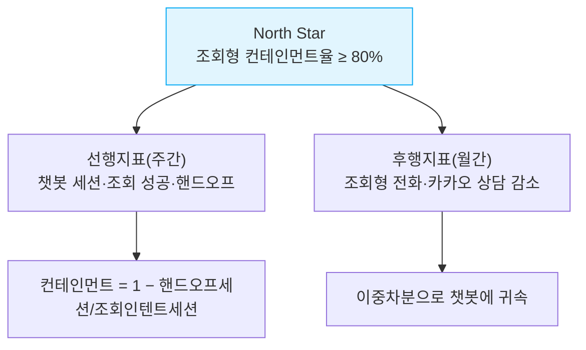
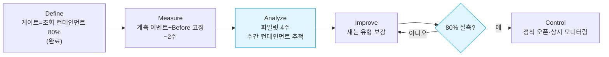

# 마이클래스 챗봇 파일럿 측정 설계 — "조회형 컨테인먼트 80%" 게이트

> **결론 (두괄식)** — 정식 오픈 가부는 **"조회형 세션 컨테인먼트율 ≥ 80%"** 를 **4주 파일럿에서 실측**해 판정한다. 이 한 숫자가 게이트다. 단, 측정이 반박당하지 않으려면 **세 가지를 오픈 전에 못 박아야** 한다 — ① **컨테인먼트 계측 이벤트**(세션 시작·핸드오프)를 먼저 심고, ② **Before(6월 조회형 상담량)를 지금 고정**하고, ③ **챗봇이 안 닿는 유형(입반 컨설팅)을 자연 대조군**으로 둔다. 이 셋이 없으면 나중에 "원래 그 정도였다 / 시즌 덕이다"를 막지 못한다. 효과(상담 감소)는 **이중차분(Difference-in-Differences)** 으로 챗봇에 귀속한다.

| 문서 정보 | |
|---|---|
| **목적** | 오픈 게이트(조회형 컨테인먼트 80%)를 **증명 가능하게 측정**하는 설계 + 마일스톤 |
| **방법론** | CRISP-DM · DMAIC · 가설검정 · 이중차분 인과추론 · KPI 트리 · 피라미드 원칙 · RICE · 민감도 분석 (§1, 풀이는 별첨) |
| **선행 결정** | 게이트 분모 = "조회형 문의"(전체 콜 아님) — 확정됨 |
| **근거 데이터** | 2026-06 AMS 81,863건 · 카카오 162대화 (측정·검증 완료) |
| **작성** | 데이터 분석 관점 · 2026-06-30 |

---

## 0. 결정 한 장 (Decision One-Pager)

| 항목 | 값 |
|---|---|
| **게이트 지표(North Star)** | 조회형 세션 **컨테인먼트율 ≥ 80%** (사람 핸드오프 없이 종료한 비율) |
| **측정 창** | 파일럿 4주 중 **마지막 2주 평균** (학습·안정화 후) |
| **통과 → 행동** | ≥80% → **정식 오픈** / 미달 → 갭(어느 유형이 새는가) 분석 → 보강 후 재측정 |
| **효과 증명** | 이중차분: 챗봇 노출군의 조회형 상담 감소 − 대조군 변화 |
| **선결 조건(블로커)** | (a) 컨테인먼트 계측 이벤트 구현 (b) Before 고정 (c) 대조군 지정 (d) **QA 경미 5건 수정·재검수 3건** |
| **현재 컨테인먼트** | **0%** `[측정]` (챗봇 미배포) → 파일럿이 0을 실측치로 바꾼다 |
| **QA 준비도** | **론칭 블로커 0** `[측정·QA 6/30]` · 1차 조회 4메뉴 동작 · 경미 5건 수정 후 1차 론칭 가능 |

> 산출물은 보고서가 아니라 **결정**이다. 위 표가 그 결정의 전부이며, 아래는 이 결정을 반박 불가능하게 만드는 설계다.

---

## 1. 적용 방법론 (의사결정 지원 빅데이터 프레임)

분석을 "골고루 많네"로 끝내지 않기 위해, 검증된 프레임을 **명시적으로** 차용한다.

| 방법론 | 한 줄 풀이 | 이 설계에서의 역할 |
|---|---|---|
| **CRISP-DM** | 데이터 분석 표준 6단계(비즈니스 이해→데이터 이해→준비→모델링→평가→배포) | 프로젝트는 지금 **"평가→배포"** 단계. 파일럿 = 배포 전 평가 게이트 |
| **DMAIC** | 식스시그마 개선 루프(정의-측정-분석-개선-관리) | 파일럿 운영 루프(§7)의 골격 |
| **가설검정 + 이중차분(DiD)** | 개입군·대조군의 **전후 변화 차이**로 인과를 추정 | "챗봇 덕에 줄었다"를 시즌·우연과 분리(§5) |
| **KPI 트리 / North Star** | 성공을 대표하는 **단일 핵심지표** + 그 아래 선행·후행지표 | 컨테인먼트(게이트) 중심 지표 체계(§3) |
| **피라미드 원칙(Minto)** | 결론을 맨 위, 근거를 아래로(=두괄식) | 본 문서·모든 보고의 구조 |
| **RICE 우선순위** | 도달·임팩트·확신·노력 점수로 레버 정렬 | 무엇을 먼저 만들지(§7-레버) |
| **민감도/시나리오 분석** | **분모·가정을 바꿔** 결과가 얼마나 흔들리는지 | 80% 게이트의 분모 선택(이미 적용) |

---

## 2. 가설 한 줄 (Hypothesis)

> 나는 **반복적인 조회형 문의(출결·시간표·동영상보강·납부조회)** 가 전화·카카오 상담량의 큰 축을 만든다고 보고, **챗봇 셀프조회 배포 + 미구현 조회화면 보강 + 진입 유도**를 하면 **해당 유형의 상담 건수가 의미 있게 줄고**, 동시에 **조회형 컨테인먼트율이 80%에 도달**할 것으로 본다.

- 근거 `[측정]`: 6월 전화 상담의 **조회 의도 20.1%(16,429건)**, 그중 동영상보강·동보자료·출석부 등은 챗봇 화면과 1:1 대응(추정 해결 75~85%).
- 측정 기간: 사전 2주(계측·Before) → 파일럿 4주.

---

## 3. KPI 트리 (North Star + 페어 증명)

> **박미혜 KPI 공식 = "질문량 감소 + 챗봇 사용량 증가"를 페어(pair)로.** 한 축만으로는 증명이 안 된다(질문이 준 게 챗봇 덕인지, 그냥 비수기인지 구분 불가).

| 축 | 지표 | 정의 | 소스 | 주기 |
|---|---|---|---|---|
| **게이트(선행)** | 조회형 컨테인먼트율 | 1 − (핸드오프 세션 ÷ 조회 인텐트 세션) | 챗봇 이벤트 로그 | 주 |
| 사용량(선행) | 챗봇 진입·조회 성공 수 | 메뉴 진입·조회 완료 이벤트 | 챗봇 이벤트 로그 | 주 |
| **효과(후행)** | 조회형 상담 건수 | 출결·시간표·동영상보강·납부조회 유형 | AMS·카카오 | 월 |

---

## 4. Before 고정 (측정 시작 전 필수) `[측정]`

> Before를 나중에 정하면 "원래 그 정도였다"에 반박 못 한다. **개입 전에 못 박는다.** 아래는 6월 실측치로 이미 고정 가능.

| 지표 | BEFORE 값(2026-06) | 출처 |
|---|---|---|
| 조회형 컨테인먼트율 | **0%** (챗봇 미배포) | — |
| 전화 조회 의도 총량 | **16,429건/월** (전체의 20.1%) | AMS 분류 CSV |
| └ 동영상보강 문의 | 4,996 | 〃 |
| └ 동보자료수령 | 6,563 | 〃 |
| └ 복습·추가영상 | 1,002 | 〃 |
| └ 출석부 확인 | 859 | 〃 |
| └ 단순 시간표 | 556 | 〃 |
| └ 보강 4종(WS-B) | 2,153 | 대기번호·재수강·강의실·설명회/컨설팅 |
| └ 기타 조회 | ~300 | (위 합계 16,429) |
| 카카오 조회형 | **25대화/월** (출결·보강 19 + 시간표 6) | 카카오 §6 |

> ⚠️ **시즌 보정**: 6월은 입반 폭증기라 입반·대기는 시즌 영향이 크다. **조회형(출결·시간표)은 상시성이 높아** 시즌 영향이 작지만, 안전하게 **전년 동월·비중(%)** 으로도 함께 본다(절대건수만 보면 시즌에 오염).

---

## 5. 대조군 설계 — 이중차분(DiD)으로 인과 귀속

> **한 번에 하나만 + 대조군.** 여러 변화가 같은 창에 겹치면 "무엇 덕분"을 말할 수 없다.

**(가) 노출 대조군(권장)** — 챗봇을 **일부 세그먼트에만** 노출(예: 일부 학년·코호트), 나머지는 미노출 대조군. 두 군의 조회형 상담 변화 **차이**가 챗봇 순효과.

**(나) 토픽 대조군(병행)** — 챗봇이 다루는 **조회형(출결·시간표)** vs 안 다루는 **컨설팅(입반 상담)**. 챗봇 배포 후 **출결은 줄고 입반은 그대로**면 → 감소가 챗봇 덕임을 강하게 시사(시즌은 둘 다 똑같이 영향).

| | 개입(챗봇 노출) | 대조(미노출/컨설팅) |
|---|---|---|
| Before | 조회형 상담 X₀ | 대조 상담 Y₀ |
| After | 조회형 상담 X₁ | 대조 상담 Y₁ |
| **DiD 순효과** | colspan: **(X₁−X₀) − (Y₁−Y₀)** | |

> **겹치는 다른 개입 분리**: "계정·번호 매칭 수정"(§발생원 제거)을 같은 창에 하면 카카오 계정 문의 감소가 챗봇/프로세스 어느 쪽인지 섞인다 → **계정 수정과 챗봇 파일럿은 시차를 두거나 채널을 분리**해 측정.

---

## 6. 측정 사슬 점검 (끊긴 고리 찾기)

배포 → **노출·핸드오프 이벤트** → 사용량 축 + 질문량 축 → 페어 비교 → 월간보고. 자주 끊기는 곳과 방어:

- [ ] **핸드오프(전화연결 클릭) 이벤트가 쌓이나?** → **컨테인먼트의 분자**다. 미구현이면 게이트 측정 자체가 불가 = **최우선 개발**. 차선책: 딥링크에 `?src=chatbot_출결` 등을 박아 위키·AMS 유입 출처라도 살림(개발 0).
- [ ] **Before 채널이 측정 중 소멸하지 않나?** → 전화·카카오 모두 유지되므로 OK. 챗봇으로 흡수된 건은 **챗봇 세션 수**로 함께 잡는다.
- [ ] **컨테인먼트 정의가 공중에 뜨지 않나?** → 분모="조회 인텐트로 분류된 세션", 분자="핸드오프 없이 종료". 정의를 코드·대시보드에 고정.
- [ ] **월 단위와 누적창이 섞이지 않나?** → 환산표로 통일.
- [ ] **시즌 보정했나?** → 조회형은 상시성↑, 그래도 전년 동월·비중 병행.

---

## 7. 기간·마일스톤 (DMAIC 루프)

| 단계 | 기간 | 산출물 | 비고 |
|---|---|---|---|
| **M0 정의** | 완료 | 게이트·분모 확정 | 본 결정 |
| **M1 측정 준비** | ~2주 | 컨테인먼트 이벤트 구현 + 미구현 조회화면 4종 보강 + **QA 경미 5건 수정·재검수 3건** + Before 고정 | 블로커 해소 |
| **M2 파일럿** | 4주 | 세그먼트 노출, 주간 컨테인먼트·DiD 추적 | 마지막 2주로 판정 |
| **M3 판정** | — | ≥80% → 오픈 / 미달 → 보강 재시도 | 게이트 |
| **M4 오픈 후** | 이후 | 2차 처리 개발 + 계정 매칭 수정 병행 | 흡수율 17→42% |

**레버 우선순위 (RICE)** — 효과 큰 레버부터:

| 레버 | Reach | Impact | Confidence | Effort | 메모 |
|---|---|---|---|---|---|
| 계정·번호 매칭 수정(발생원 제거) | 카카오 39% | 높음 | 중 | 중 | 문의 발생 자체 차단(1순위 레버, 전수분류 정본) |
| 미구현 조회화면 보강 | 조회 11%p | 높음 | 높음 | 소 | 게이트 직결 |
| 출결 조회 진입 유도 | 출결 27% | 중 | 높음 | 0 | 안내만 |
| 2차 처리 개발 | 처리 32% | 매우 높음 | 중 | 대 | 오픈 후 |

---

## 8. 반박 방어 (이 설계가 "줄었다"를 증명하는 이유)

| 예상 반박 | 이 설계의 방어 |
|---|---|
| "원래 그 정도였다" | **Before를 개입 전에 고정**(§4) |
| "시즌(입반) 덕이다" | 조회형은 상시성↑ + **전년 동월·비중** 병행, **토픽 대조군**(입반은 안 줌)으로 분리(§5) |
| "챗봇 말고 다른 게 줄였다" | **노출 대조군 + 이중차분**으로 순효과만 추출(§5) |
| "성공률 80%는 추정 아니냐" | 파일럿은 **추정이 아니라 실측**(컨테인먼트 로그) → `[미측정]`을 `[측정]`으로 전환 |
| "한 달 반짝이다" | **매달 같은 자리에 누적**(DMAIC Control), 선행지표로 조기 관측 |

---

## 별첨. 방법론 용어집

| 용어 | 풀이 |
|---|---|
| **CRISP-DM** | Cross-Industry Standard Process for Data Mining. 데이터 분석 표준 6단계(비즈니스 이해→데이터 이해→준비→모델링→평가→배포). |
| **DMAIC** | 식스시그마 개선 루프: Define(정의)-Measure(측정)-Analyze(분석)-Improve(개선)-Control(관리). |
| **컨테인먼트(containment)** | 챗봇 세션이 **사람 상담원에게 안 넘기고 챗봇 안에서 끝난 비율**. 챗봇 성공의 표준 지표. |
| **핸드오프(handoff)** | 챗봇이 해결 못 해 사람 상담원/전화로 넘기는 것. 컨테인먼트의 반대. |
| **이중차분(DiD, Difference-in-Differences)** | 개입군과 대조군의 **전후 변화 차이**로 인과 효과를 추정하는 방법. 시즌·추세를 상쇄. |
| **자연 대조군** | 인위로 나누지 않고, 자연히 챗봇을 안 쓴 집단·안 다룬 토픽을 비교군으로 삼는 것. |
| **North Star(북극성 지표)** | 제품 성공을 대표하는 단일 핵심지표. 여기선 조회형 컨테인먼트율. |
| **KPI 트리** | 핵심지표 아래 선행(원인 가까운)·후행(결과) 지표를 가지처럼 연결한 체계. |
| **선행/후행지표** | 선행=조기 신호(챗봇 사용률), 후행=최종 목표(상담 감소, 한 달 뒤 보임). |
| **피라미드 원칙(Minto)** | 결론을 맨 위, 근거를 아래로 배치하는 보고 구조(=두괄식). |
| **RICE** | 우선순위 점수 = Reach(도달)·Impact(임팩트)·Confidence(확신)·Effort(노력). |
| **민감도/시나리오 분석** | 가정·분모를 바꿔 결과가 얼마나 흔들리는지 보는 것(80% 게이트 분모 선택에 적용). |
| **Before 고정** | 개입 전에 비교 기준값을 못 박는 것. 사후에 정하면 반박당함. |

---

*본 설계는 `measurement-design` 방법론(가설→선행지표→대조군→Before고정→사슬점검)에 CRISP-DM·DMAIC·이중차분·KPI트리·RICE를 결합했다. 게이트 지표는 파일럿에서 실측(`[측정]`)으로 확정된다. 연계: [심층분석](마이클래스챗봇_6월상담_심층분석_컨플루언스.md) · [AMS](2026-06_AMS상담_분석리포트.md) · [카카오](../kakao-collect/2026-06_상담분석_리포트.md).*
